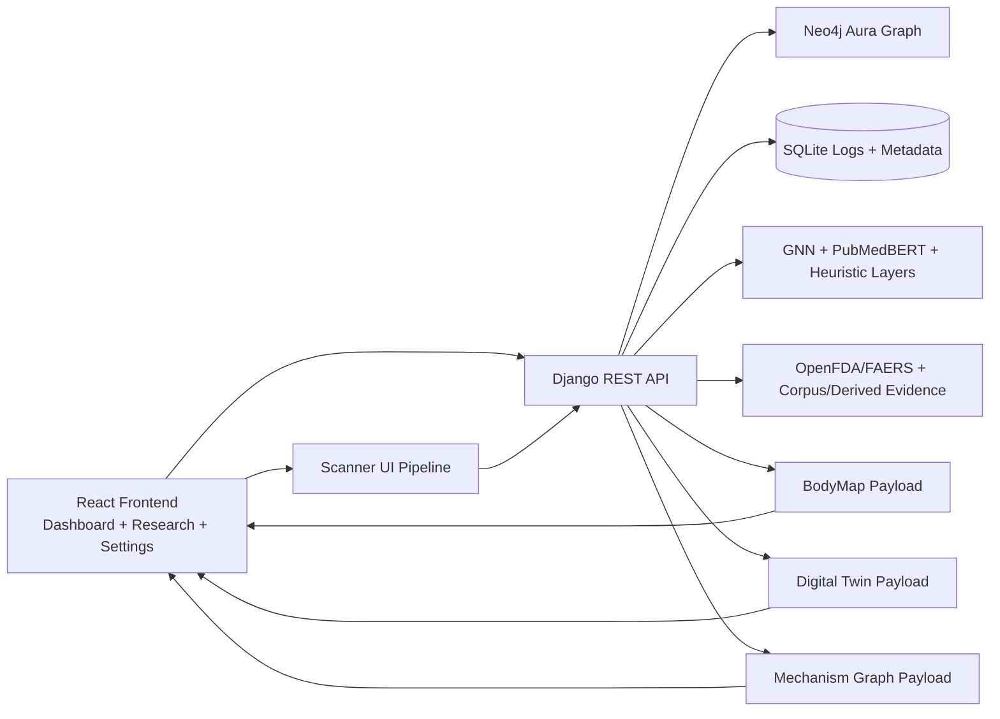
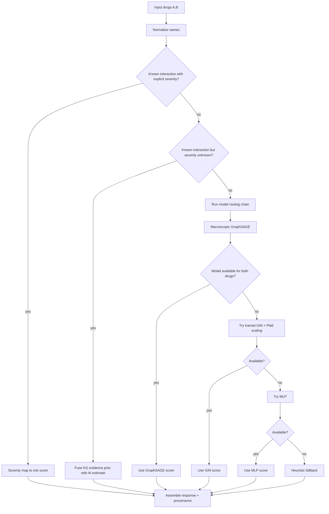
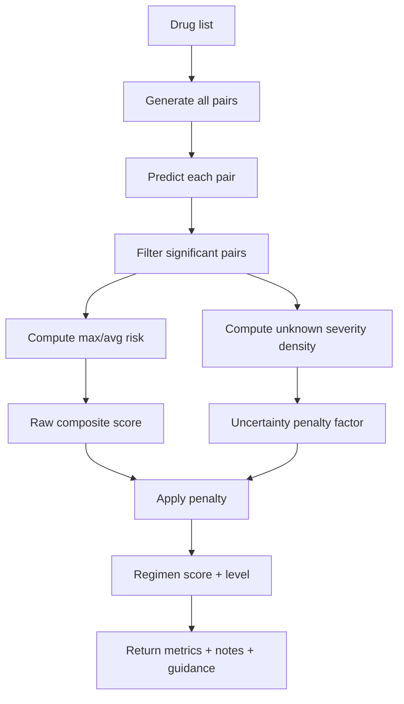
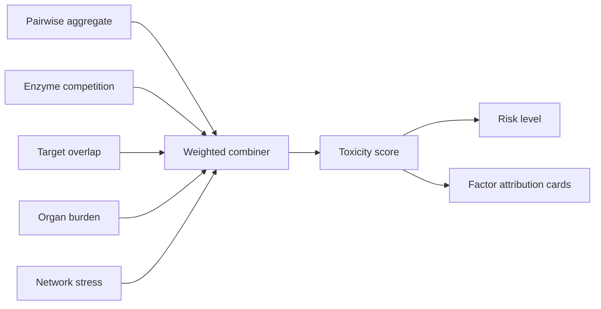
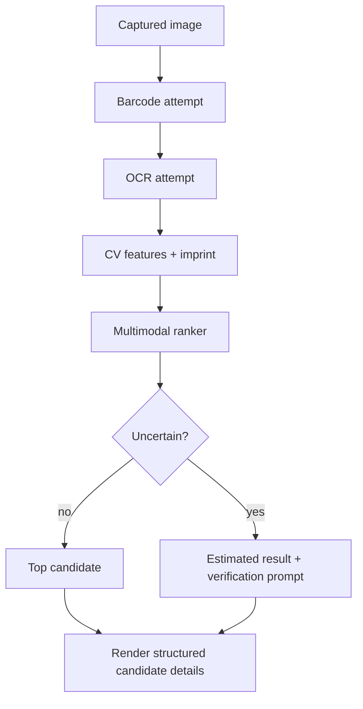
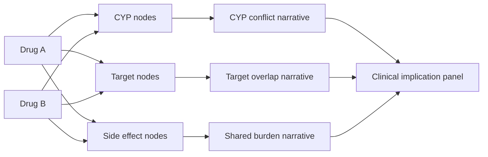
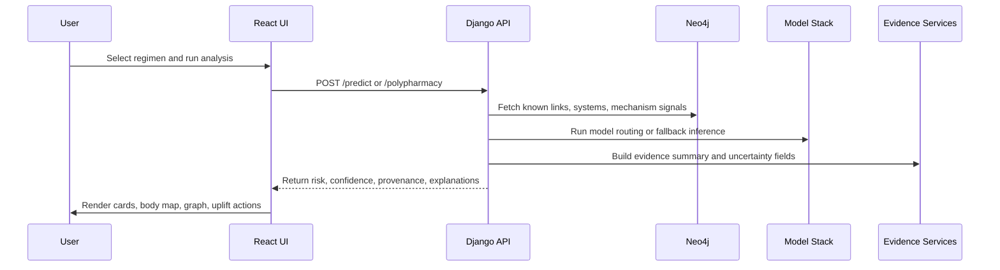

# Project Aegis Deep Dive

Implementation-grounded reference for architecture, inference behavior, uncertainty policies, explainability pathways, and interactive surfaces.

## 1. Why This Document Exists

Project Aegis is not one model and one score. It is a layered decision support platform that combines:
- deterministic evidence paths,
- graph-aware prediction,
- fallback model routing,
- uncertainty penalties,
- and explainability overlays that are rendered in the UI.

This document is intentionally code-aligned and avoids speculative claims.

## 2. High-Level System Topology

## 3. Frontend Surfaces and Role Separation

### 3.1 Route map
- `/` provides product entry and launch surfaces.
- `/dashboard` is operational: run analysis, scanner, body map, digital twin, knowledge graph, uncertainty panels, and what-if.
- `/research` is narrative and tooling-oriented research workspace.
- `/settings` handles app-level toggles and preferences.

### 3.2 Major frontend modules
- `Dashboard`: orchestrates pairwise and polypharmacy analyses and result cards.
- `DrugScanner`: camera/file capture, CV feature extraction, multimodal backend calls, and confidence-aware result rendering.
- `BodyMap`: organ risk rendering with confidence and uncertainty decomposition.
- `KnowledgeGraph`: pair explorer, mechanism overlays, conflict narratives, and per-node detail drill-down.
- `PolypharmacyDigitalTwin`: weighted N-order toxicity factors with explicit formula presentation.

## 4. Pairwise DDI Prediction (`POST /api/v1/predict/`)

### 4.1 Decision stack

### 4.2 Known-severity mapping
If severity is explicit:
- `no_interaction -> 0.05`
- `minor -> 0.40`
- `moderate -> 0.65`
- `severe -> 0.92`
- `critical -> 0.97`

### 4.3 Unknown-severity fusion policy
When interaction exists but severity is missing, backend uses a conservative fusion:

`fused_score = min(0.59, max(model_estimate, 0.30))`

Constants:
- `UNKNOWN_SEVERITY_EVIDENCE_PRIOR = 0.30`
- `UNKNOWN_SEVERITY_MAX_FUSED_SCORE = 0.59`

Safety behavior:
- if AI emits `unknown`/`no_interaction` but fused score `>= 0.3`, severity is raised to `moderate`.
- confidence is damped and clamped to `[0.55, 0.85]`.

### 4.4 Risk label thresholds
- `critical` at `>= 0.8`
- `high` at `>= 0.6`
- `medium` at `>= 0.3`
- `low` below `0.3`

### 4.5 Model routing thresholds
Macroscopic GraphSAGE bucket mapping:
- `< 0.30`: no interaction
- `< 0.60`: minor/advisory
- `< 0.85`: moderate/effect
- `>= 0.85`: severe/mechanism

Trained GIN bucket mapping:
- `< 0.30`: none
- `< 0.50`: minor
- `< 0.70`: moderate
- `>= 0.70`: severe

Heuristic fallback buckets (structural similarity):
- `> 0.7`: risk `0.6`, confidence `0.5`
- `> 0.4`: risk `0.3`, confidence `0.4`
- otherwise: risk `0.1`, confidence `0.3`

### 4.6 Provenance and observability
Pairwise responses include provenance metadata, and logs capture raw versus calibrated behavior where schema allows.

## 5. Polypharmacy Engine (`POST /api/v1/polypharmacy/`)

### 5.1 Pair expansion and significance filter
Given N drugs, evaluate all unordered pairs:

`pair_count = N * (N - 1) / 2`

A pair is significant if:
- risk score `>= 0.25`, or
- severity is not `no_interaction` and not `unknown`.

### 5.2 Composite scoring equations

`pairwise_baseline_score = min(1.0, 0.70 * max_pair_risk + 0.30 * average_pair_risk)`

`raw_regimen_composite_score = min(1.0, 0.75 * max_pair_risk + 0.25 * significant_pair_density)`

`uncertainty_penalty_factor = max(0.60, 1.0 - 0.40 * unknown_severity_pair_density)`

`regimen_composite_score = min(1.0, raw_regimen_composite_score * uncertainty_penalty_factor)`

### 5.3 Returned policy constants
- `unknown_severity_evidence_prior = 0.30`
- `unknown_severity_max_fused_score = 0.59`
- `regimen_unknown_severity_penalty_weight = 0.40`
- `regimen_min_uncertainty_factor = 0.60`

### 5.4 Why this matters clinically
The endpoint intentionally separates:
- peak acute signal (`max_risk_score`), and
- uncertainty-adjusted regimen burden (`regimen_risk_score`).

This prevents a single confident high-risk pair from being interpreted the same way as a regimen dominated by many unknown-severity edges.

### 5.5 Polypharmacy pipeline diagram

## 6. Polypharmacy Digital Twin (`POST /api/v1/polypharmacy-digital-twin/`)

### 6.1 Purpose
The Digital Twin is an N-order toxicity explainer. It integrates pairwise risk plus mechanistic context and network structure into a weighted score with factor attribution.

### 6.2 Fixed factor weights
- `pairwise_baseline: 0.40`
- `enzyme_competition: 0.25`
- `target_overlap: 0.15`
- `organ_burden: 0.10`
- `network_stress: 0.10`

Total score:

`toxicity_score = min(1.0, sum(weight_i * factor_i))`

### 6.3 Factor details
- Pairwise baseline: weighted max/mean risk behavior.
- Enzyme competition: CYP substrate/inhibitor/inducer conflict structure.
- Target overlap: overlap ratio and shared target load.
- Organ burden: concentration of system-level burden signals.
- Network stress: edge density, high-risk edge concentration, hub pressure.

Network stress formula:

`network_stress = min(1, 0.40 * edge_density + 0.35 * high_risk_density + 0.25 * hub_pressure)`

Target overlap formula:

`target_overlap = min(1, 0.70 * overlap_ratio + 0.30 * min(avg_shared_targets / 3.0, 1.0))`

### 6.4 Confidence tiers
- `evidence-backed`: strong overlap/enzyme evidence.
- `graph-supported`: partial graph evidence with meaningful risk.
- `heuristic`: sparse evidence and approximation-heavy inference.

### 6.5 Digital twin diagram

## 7. Evidence Chain and Uncertainty Core

### 7.1 Source weighting model
Evidence summary calculations apply source weights:
- `knowledge_graph = 1.00`
- `ddi_corpus = 0.90`
- `twosides = 0.78`
- `openfda_faers = 0.62`
- `normalization_layer = 0.35`
- `evidence_aggregator = 0.20`

### 7.2 Summary outputs
From weighted source evidence, the service derives:
- support score
- uncertainty score
- disagreement signal
- confidence band (high/moderate/low)
- uncertainty reasons list

Confidence band policy:
- high if support `>= 0.72` and no conflict
- moderate if support `>= 0.45`
- low otherwise

### 7.3 Dashboard guardrail semantics
The uncertainty panel translates signals into actions:
- manual review required
- clinical review recommended
- auto-triage eligible

These are not static labels; they are tied to disagreement, confidence, support, and coverage thresholds.

### 7.4 Uplift execution path
Uplift actions trigger concrete orchestration keys:
- `real-world-enrichment`
- `source-coverage`
- `clinical-signal-density`
- `resolve-disagreement`
- `refresh-recency`

Priority execution runs high then medium actions, then computes before/after deltas.

## 8. BodyMap Risk Translation Layer

### 8.1 Layered enrichment order
BodyMap data composes from multiple sources in sequence:
1. prediction affected systems,
2. polypharmacy body map signals,
3. generic-system fallback mapping,
4. side effects,
5. interaction evidence and FAERS,
6. CYP liver-load augmentation.

### 8.2 Generic mapping behavior
When upstream systems are generic (for example `Systemic/Categorical`), the service maps them into concrete organs with weighted distribution to avoid empty or misleading visuals.

### 8.3 CYP liver-load heuristic
Per-enzyme load additions:
- `+0.3` if at least two substrates
- `+0.4` if substrate + inhibitor
- `+0.2` if substrate + inducer
- `+0.3` if inhibitor + inducer

Total is clamped at `1.0`, then used to increase liver severity.

### 8.4 Confidence and certainty equations

`confidenceScore = support*0.45 + coverage*0.18 + severity*0.12 + evidenceDensity*0.09 + sourceReliability*0.10 + recency*0.06 - uncertainty*0.35 - disagreementPenalty`

`certaintyScore = (1 - uncertainty)*0.80 + sourceReliability*0.12 + recency*0.08`

Band thresholds:
- high at `>= 0.75`
- medium at `>= 0.45`
- low below `0.45`

### 8.5 Uncertainty decomposition
The body map panel breaks uncertainty into:
- data sparsity,
- source disagreement,
- recency risk,
- cross-source variance,
- real-world evidence gaps.

This decomposition drives top uncertainty driver cards and uplift recommendation previews.

## 9. Drug Scanner Multimodal Stack

### 9.1 Frontend fallback chain
Order of operations for an image scan:
1. barcode read,
2. OCR read,
3. CV pill analysis,
4. backend multimodal ranking,
5. model-label lookup fallback,
6. feature search fallback,
7. upload-based fallback,
8. CV-only estimated result.

### 9.2 CV internals
The CV stage performs:
- grayscale conversion,
- Otsu thresholding,
- morphological opening,
- connected component extraction,
- shape and color feature derivation,
- imprint extraction attempt.

### 9.3 Backend ranking weights (`POST /api/v1/scanner/identify-pill/`)
Base score starts at `0.05`, then accumulates weighted evidence:
- color exact `+0.22`, partial `+0.12`
- shape exact `+0.18`, partial `+0.10`
- imprint exact `+0.45`, contains `+0.35`, subset `+0.25`, fuzzy `+0.20`
- model-label strong `+0.25`, soft `+0.14`, plus confidence-weighted increment
- detector-label strong `+0.20`, soft `+0.10`, plus confidence-weighted increment

Candidate selection:
- keep only `score >= 0.22`
- cap final score at `0.99`

Conservative uncertainty gate:
- uncertain if top confidence `< 0.46`
- uncertain if top-2 margin `< 0.08`

### 9.4 Scanner diagram

## 10. Knowledge Graph Explorer

### 10.1 Retrieval strategy with cache and fallback
The biology service uses staged retrieval with cache TTL:
1. call dedicated biology/mechanism endpoints,
2. fallback to legacy interaction/drug endpoints,
3. fallback to offline CYP profiles.

### 10.2 Graph primitives
Nodes:
- drugs
- CYP enzymes
- protein targets
- side effects

Edges:
- mechanism/evidence links carrying confidence and source metadata.

### 10.3 Conflict derivation
Conflicts are produced from both backend response and local graph reasoning:
- CYP role collisions,
- shared target pressure,
- overlapping side-effect burden.

### 10.4 Interactive controls
- pair explorer for multi-drug navigation,
- filters by type and conflict status,
- node detail drawer with connected evidence,
- explainability metrics panel,
- freshness badges and retry states.

### 10.5 Conflict visualization diagram

## 11. Therapeutic Alternatives (`GET /api/v1/alternatives/`)

### 11.1 Behavior
- resolve therapeutic class,
- retrieve class peers,
- if an interacting comparator is supplied, score each peer against that comparator.

### 11.2 Safety scoring
Severity to numeric:
- `no_interaction = 0`
- `unknown = 1`
- `minor = 1`
- `moderate = 2`
- `severe = 3`

`safety_score = 100 - severity_score * 25`

`is_safer` is true for no interaction, minor, or unknown.

## 12. Calibration QA (`POST /api/v1/calibration/metrics/`)

The calibration service computes:
- Brier score,
- Expected Calibration Error,
- Maximum Calibration Error,
- bootstrap confidence intervals.

Dashboard research tools can ingest CSV and compare raw versus calibrated distributions with reliability diagnostics.

## 13. Degraded Modes and Reliability Design

### 13.1 Prediction resilience
Pairwise and polypharmacy paths continue operating even if one inference layer is unavailable by routing to next fallback tier.

### 13.2 Scanner resilience
If high-certainty identification is not possible, scanner emits uncertain/estimate state instead of forced overconfidence.

### 13.3 Explainability resilience
If preferred biology endpoint data is unavailable, graph explorer falls back to legacy/offline sources with explicit badges.

## 14. Known Technical Debt and Risks

1. The featurizer in the model layer still contains unresolved merge conflict markers in the SMILES pipeline (`<<<<<<<`, `=======`, `>>>>>>>`).
2. Multiple fallback paths improve uptime but increase interpretation complexity for non-technical users.
3. Some research-page content is explanatory and should not be treated as live runtime telemetry unless tied to active endpoint outputs.

## 15. End-to-End Request Lifecycle

## 16. Practical Reading Guide

If you want to understand behavior quickly, read in this order:
1. Pairwise decision stack (Section 4)
2. Polypharmacy formulas (Section 5)
3. Digital Twin factor attribution (Section 6)
4. Evidence and uncertainty guardrails (Section 7)
5. BodyMap translation math (Section 8)
6. Scanner uncertainty gate (Section 9)
7. Knowledge graph conflicts (Section 10)

This order mirrors how uncertainty and explainability propagate from backend logic into user-visible risk decisions.