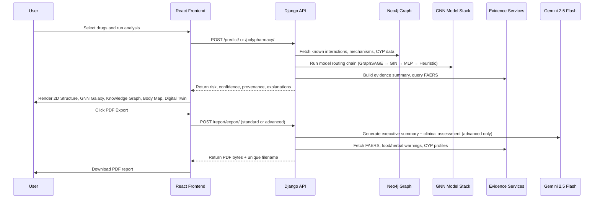

# Project Aegis — Comprehensive Feature Deep Dive

A detailed technical and clinical reference covering every major system, AI model, interactive visualization, and data pipeline in the Project Aegis Drug-Drug Interaction Intelligence Platform.

---

## 1. Introduction and Purpose

Project Aegis is a full-stack clinical intelligence platform that predicts drug-drug interactions, scores polypharmacy regimen risk, and delivers explainable pharmaceutical intelligence through multiple AI models and five interactive visualization surfaces. This document provides an exhaustive, implementation-grounded reference for every feature, model, formula, and visualization in the system — intended to serve as the definitive technical companion for final project reporting, academic submission, and portfolio presentation.

The platform was designed to solve a fundamental gap in existing drug interaction tools: the inability to explain *why* a risk exists. Traditional systems produce binary alerts ("interaction detected") with no visibility into model confidence, evidence provenance, or mechanistic reasoning. Project Aegis addresses this by combining deterministic evidence paths with graph-aware AI prediction, layered uncertainty tracking, and five distinct visual surfaces that translate abstract risk scores into clinical intuition.

---

## 2. AI/ML Model Architecture

### 2.1 Macroscopic GraphSAGE — Primary Prediction Model

The core prediction engine is a Macroscopic Graph Neural Network built on GraphSAGE (Graph Sample and Aggregate) convolutions, implemented in PyTorch with PyTorch Geometric. This architecture represents a fundamental departure from molecular-level (microscopic) GNN approaches.

**Why Macroscopic beats Microscopic:**

Traditional molecular GNNs analyze individual drug molecules — treating atoms as nodes and bonds as edges within a single molecule. This approach has a critical limitation: it has zero knowledge of how the human body processes drugs or how other drugs in the database behave. It can only reason about chemical structure in isolation.

The Macroscopic approach instead treats the entire drug interaction database as a single giant graph:
- **Nodes** are drugs (not atoms), featurized with both molecular descriptors and biological class information
- **Edges** are known interactions sourced from DrugBank, the DDI Corpus, and TWOSIDES
- **Message passing** propagates biological relationship signals between drugs across 3 GraphSAGE layers

This means the model captures transitive interaction patterns: if Drug A interacts with Drug B, and Drug C is biologically/structurally similar to Drug B (as determined by the graph neighborhood), the model can intuitively predict an A-C interaction based on graph proximity — even if that specific pair was never seen in training data.

**Architecture Details:**

```python
class MacroscopicDDIGNN(nn.Module):
    # 3-layer GraphSAGE with 128-dim hidden channels, 64-dim output embeddings
    # SAGEConv layers with ReLU activation and 0.3 dropout
    # Dot-product link prediction decoder
```

- **Input features**: SMILES-derived molecular descriptors (Morgan fingerprints, atom counts, physicochemical properties) concatenated with biological class encodings
- **GraphSAGE layers**: 3 layers with 128-dimensional hidden channels and 64-dimensional output embeddings. SAGEConv was chosen over GCNConv because SAGE samples local neighborhoods effectively, preventing the "oversmoothing" problem where all node embeddings converge to the same vector in highly connected graphs
- **Link prediction**: dot product between the learned embeddings of Drug A and Drug B produces a scalar interaction probability
- **Dropout**: 0.3 for regularization during training
- **Training data**: 1,500+ drug nodes and 50,000+ interaction edges from DrugBank, DDI Corpus, and TWOSIDES
- **Calibration**: raw model scores are mapped to severity buckets via threshold-based calibration

**Embedding Space:**

Each drug is encoded as a 64-dimensional vector in the GNN's latent space. These embeddings capture the drug's "neighborhood context" — drugs that participate in similar interaction patterns cluster together. The GNN Galaxy visualization (Section 3.2) renders these embeddings in 3D space via t-SNE dimensionality reduction, making the model's internal representation directly visible and interpretable.

### 2.2 Trained GIN — Secondary Model

A Graph Isomorphism Network (GIN) serves as the secondary fallback model when the primary GraphSAGE cannot produce embeddings for a given drug pair (e.g., the drug was not present in the training graph). The GIN model uses Platt scaling for score calibration and maps raw logits to severity categories:
- `< 0.30`: no interaction
- `< 0.50`: minor
- `< 0.70`: moderate
- `>= 0.70`: severe

### 2.3 PubMedBERT — NLP Classifier (Replaced as Primary)

The original prediction approach used a fine-tuned PubMedBERT model — a domain-specific BERT variant pre-trained on PubMed abstracts and fine-tuned on the DDI Corpus (~19,000 annotated drug interaction sentences from biomedical literature).

**Classification categories:**
- `no_interaction`: No known interaction
- `mechanism`: Explains HOW drugs interact (CYP450 inhibition, protein binding displacement)
- `effect`: Describes WHAT happens clinically (increased bleeding, toxicity, reduced efficacy)
- `advise`: Clinical guidance (monitor closely, adjust dose, avoid combination)
- `int`: Generic interaction mention

**Why it was replaced:** While PubMedBERT excels at extracting interaction information from text, it operates on individual drug pair sentences without network context. The GraphSAGE model captures system-level interaction patterns across the entire drug graph, enabling predictions for drug pairs that have no literature mentions. PubMedBERT remains available as an ensemble component and NLP fallback.

### 2.4 MLP Fallback

A Multi-Layer Perceptron provides a final AI-based fallback when neither GNN model can produce predictions. It uses concatenated molecular feature vectors (Morgan fingerprints + physicochemical descriptors) to produce basic risk estimates with lower confidence.

### 2.5 Heuristic Fallback

When no AI model is available for a drug pair (e.g., missing SMILES data), a structural similarity heuristic using Tanimoto similarity on Morgan fingerprints provides conservative baseline estimates:
- Similarity > 0.7: risk 0.6, confidence 0.5
- Similarity > 0.4: risk 0.3, confidence 0.4
- Otherwise: risk 0.1, confidence 0.3

### 2.6 Ensemble Predictor

An ensemble layer can combine predictions from all available sources — GNN, PubMedBERT, CYP450 database, OpenFDA FAERS, and Knowledge Graph — using weighted consensus. Each source produces a `SourcePrediction` with interaction type, severity, confidence, risk score, and mechanism. The ensemble generates:
- Final consensus prediction with agreement level (high/medium/low)
- Combined mechanism hypothesis
- Clinical recommendations
- Evidence summary showing which sources agree and disagree

### 2.7 Gemini 2.5 Flash — Large Language Model

Google Gemini 2.5 Flash provides the LLM backbone for three distinct capabilities:

1. **Research Assistant**: RAG-powered chatbot that queries the Knowledge Graph for local context, retrieves supporting literature from PubMed, and generates evidence-cited clinical responses
2. **PDF Report Narratives**: generates executive summaries and clinical assessment sections for the Advanced (Super) report tier
3. **Slash Command Processing**: interprets and routes 10+ structured clinical query commands

The Gemini client is configured with environment variables and gracefully degrades — all features that depend on the LLM produce alternative outputs (template-based responses, "AI narrative unavailable" notices) when the API key is not configured.

### 2.8 Molecular Featurization Pipeline (RDKit)

Drug molecules are featurized from SMILES strings using RDKit, producing multi-level representations consumed by various models:

**Atom-level features (40 dimensions per atom):**
- Element symbol (13 types: C, N, O, S, F, Cl, Br, I, P, Si, B, Se + other)
- Degree (0-5 + other)
- Formal charge (-2 to +2 + other)
- Number of hydrogens (0-4 + other)
- Hybridization (SP, SP2, SP3, SP3D, SP3D2 + other)
- Aromaticity (boolean)
- Ring membership (boolean)

**Bond-level features (8 dimensions per bond):**
- Bond type (single, double, triple, aromatic + other)
- Conjugation (boolean)
- Ring membership (boolean)
- Stereochemistry (boolean)

**Molecular-level descriptors:**
- Morgan fingerprints (2048-bit circular fingerprints at radius 2)
- Molecular weight, LogP, TPSA, rotatable bonds
- These are used for the MLP fallback and Tanimoto similarity heuristic

### 2.9 Model Routing Chain

The prediction service follows a deterministic routing chain that prioritizes reliability and calibration:

```
Step 1: Check Knowledge Graph for known interaction
  ├── Known with explicit severity → map to calibrated risk score
  │     (no_interaction→0.05, minor→0.40, moderate→0.65, severe→0.92, critical→0.97)
  ├── Known but severity unknown → fuse KG evidence prior with AI estimate
  │     fused_score = min(0.59, max(model_estimate, 0.30))
  │     confidence clamped to [0.55, 0.85]
  └── Unknown → proceed to AI models

Step 2: Run Macroscopic GraphSAGE
  ├── Both drugs in graph → produce calibrated score
  └── Drug(s) missing → fallback to GIN

Step 3: Run Trained GIN + Platt scaling
  ├── Available → produce calibrated score
  └── Unavailable → fallback to MLP

Step 4: Run MLP
  ├── Available → produce basic score
  └── Unavailable → fallback to heuristic

Step 5: Heuristic (Tanimoto similarity)
  └── Always available (produces conservative estimate)
```

Every prediction includes provenance metadata documenting which step produced the final score, enabling full traceability.

---

## 3. Interactive Visualization Features

### 3.1 2D Structure Viewer

**Purpose:** Renders organic chemistry skeletal formulas for each drug being analyzed, giving clinicians and researchers immediate visual recognition of the molecular structures involved.

**Technical Implementation:**

The 2D Structure Viewer uses the SmilesDrawer JavaScript library to parse SMILES notation and render publication-quality structural diagrams on HTML5 Canvas elements. Each drug in the analyzed pair or regimen gets its own canvas panel.

**Rendering features:**
- **Heteroatom coloring**: Carbon (gray), Oxygen (red), Nitrogen (blue), Sulfur (yellow), Phosphorus (orange), Fluorine/Chlorine (green), Bromine (red), Iodine (purple), Hydrogen (gray)
- **Bond visualization**: single, double, triple, and aromatic bonds with proper angle and length normalization following IUPAC drawing conventions
- **Stereochemistry**: isomeric SMILES are respected, showing wedge/dash bonds where applicable
- **Layout optimization**: overlap resolution, compact drawing mode, configurable padding and font sizes
- **Theme support**: full dark and light theme color palettes

**Clinical Value:**

The 2D structure view enables researchers to:
- Identify shared functional groups that may cause pharmacodynamic interactions (e.g., both drugs containing carboxylic acid groups competing for protein binding sites)
- Recognize structural similarity between drugs that may explain cross-reactivity
- Verify that the correct drug is being analyzed by visual confirmation of the molecular structure
- Compare the structural complexity and size of interacting molecules

**Data Source:** SMILES strings are retrieved from the offline drug database (`offline_training_data.py`) and the Neo4j Knowledge Graph. The viewer handles invalid or missing SMILES gracefully with error state rendering.

### 3.2 GNN Galaxy

**Purpose:** Visualizes the entire drug interaction knowledge graph as an immersive 3D space environment, making the GNN model's internal representation directly visible and explorable.

**Technical Implementation:**

The GNN Galaxy is built with React Three Fiber (a React renderer for Three.js), using WebGL for hardware-accelerated 3D rendering. It renders the drug interaction graph using real GNN-learned embeddings projected into 3D coordinates via t-SNE dimensionality reduction.

**Core rendering architecture:**
- **InstancedMesh nodes**: Instead of creating individual Three.js meshes for each drug (which would be prohibitively slow at scale), the Galaxy uses `InstancedMesh` to render thousands of drug nodes in a single draw call. Each instance gets its own position, color, and scale from a shared geometry
- **InstancedMesh edges**: Similarly, interaction edges are rendered as instanced line segments for GPU-efficient batch rendering
- **Post-processing stack**: `EffectComposer` applies Bloom glow (making high-risk nodes emanate light), star field backgrounds (`Stars` component from drei), and Vignette for cinematic depth
- **Camera system**: `CameraController` provides smooth orbit, zoom, and animated fly-to transitions when selecting nodes

**Layout modes:**
1. **Radial Layout**: centers the graph on a selected drug with concentric rings based on hop distance. Drug A sits at the center, 1-hop neighbors form the first ring, 2-hop neighbors form the second ring, etc.
2. **Cluster Layout**: groups drugs by therapeutic class into color-coded spatial clusters, revealing class-level interaction patterns
3. **Path Layout**: computes and highlights the shortest path between two selected drugs, arranging the graph to make the path visually prominent

**Interactive features:**
- **Search Bar**: type-ahead drug search with instant camera fly-to
- **Hop Slider**: controls the neighborhood depth around a selected drug (1-hop to N-hop)
- **Node Detail Panel**: click any drug node to see full drug information, interaction count, risk profile, class, and all connected edges
- **Edge Detail Panel**: click any edge to see risk score, severity, mechanism, confidence, and evidence sources
- **Drug Comparison Panel**: select two drugs to see side-by-side comparison with shared neighbors, interaction overlap, and embedding distance metrics
- **Filter Panel**: filter visible nodes by drug class, risk level, minimum degree, or custom criteria
- **Hop Shells**: translucent concentric spheres around the selected drug showing neighborhood boundaries
- **Cluster Bubbles**: translucent spherical boundaries around drug class clusters
- **Path Particles**: animated particles flowing along the shortest path between two drugs

**Embedding Insights Panel:**

This panel provides quantitative analysis of the GNN latent space:
- **Distance metrics**: Euclidean distance between selected drugs in embedding space — closer drugs are more pharmacologically similar
- **K-nearest neighbors**: lists the K drugs most similar to the selected drug based on embedding proximity
- **Statistical analysis**: mean distance, standard deviation, and distribution of embedding distances for selected drug neighborhoods
- **CSV export**: download embedding data for external analysis

**Data Source:** The Galaxy loads graph data dynamically from Neo4j AuraDB via the `/graph/nodes/` and `/graph/edges/` API endpoints, with enrichment from drug info and interaction endpoints. A caching layer prevents redundant API calls.

**Clinical Value:**

The Galaxy viewer transforms the GNN from a "black box" into an interpretable tool. Researchers can:
- See why the model predicts an interaction: drugs that are close in embedding space share similar interaction profiles
- Identify drug classes that cluster together, revealing pharmacological relationships learned by the GNN
- Discover unexpected groupings that may indicate novel interaction risks
- Explore the network topology to understand hub drugs and critical interaction pathways

### 3.3 Knowledge Graph Explorer

**Purpose:** Maps the biological mechanism pathways between drugs, showing *why* an interaction occurs at the pharmacological level through CYP enzymes, biological targets, and shared side effects.

**Technical Implementation:**

The Knowledge Graph Explorer is a 2D SVG-based graph visualization using a force-directed radial layout computed by the `mechanismGraphEngine`. It renders four types of nodes with specialized visual components:

- **DrugNode**: primary entities with pill-shaped styling and drug name labels
- **EnzymeNode**: CYP450 metabolic enzymes (CYP3A4, CYP2D6, CYP2C19, etc.) with hexagonal styling
- **TargetNode**: biological protein targets and receptors with crosshair styling
- **SideEffectNode**: adverse outcomes with warning-triangle styling

Edges are rendered as `BiologyEdge` components carrying typed relationships:
- `substrate_of`: drug is metabolized by this enzyme
- `inhibits`: drug inhibits this enzyme's activity
- `induces`: drug increases this enzyme's activity
- `causes`: drug causes this side effect
- `shares_target`: two drugs bind to the same biological target

**Data retrieval chain:**

The explorer uses a staged retrieval strategy with cache and fallback:
1. Biology API endpoint (`/graph/drug-biology/`) — richest data, preferred source
2. Mechanism API endpoint (`/graph/mechanism-map/`) — mechanism-focused view
3. Drug Info API endpoint (`/drug-info/`) — basic drug properties
4. Interaction Info API endpoint (`/interaction-info/`) — pairwise interaction details
5. Offline CYP fallback (`cyp450_database.py`) — static CYP450 profiles from curated database

Each data source is tracked with explicit freshness badges showing which source provided the data currently being displayed.

**Conflict Detection:**

The explorer automatically identifies three categories of pharmacological conflicts:

1. **CYP Role Collisions**: when Drug A is a substrate of CYP3A4 while Drug B is a CYP3A4 inhibitor, the system flags a metabolic conflict — Drug B may increase Drug A's plasma concentration by blocking its metabolism
2. **Shared Target Pressure**: when both drugs bind to the same biological target (e.g., both acting on serotonin receptors), creating risk of additive or synergistic effects
3. **Overlapping Side-Effect Burden**: when both drugs independently cause the same adverse effect (e.g., both causing QT prolongation), amplifying the clinical risk

**Conflict Panel:**

Detected conflicts are presented in a narrative panel with:
- Natural language explanation of the clinical implication
- Severity classification
- Source evidence and confidence level
- Specific enzymes/targets/effects involved

**Interactive controls:**
- Pair Explorer: navigate between all drug pairs in a multi-drug regimen
- Type filters: show/hide enzyme, target, or side-effect nodes
- Node Detail Drawer: click any node for connected evidence and properties
- Fullscreen mode for detailed exploration
- Refresh with cache invalidation

### 3.4 Body Map

**Purpose:** Projects drug interaction effects onto a full human body anatomical visualization, translating abstract risk scores into organ-level physiological impact that clinicians can immediately understand.

**Technical Implementation:**

The Body Map uses a layered rendering architecture:

1. **HeatMapCanvas** (bottom layer): renders a severity gradient background using HTML5 Canvas, with warm colors (red/orange) radiating from affected organ regions
2. **CirculatoryOverlay**: animated SVG overlay showing the circulatory system, representing systemic drug distribution
3. **SegmentedBodyFigure** (top layer): anatomical SVG with clickable organ regions, each colored by severity score

**Organ systems tracked:**
Brain, Heart, Liver, Kidneys, Lungs, GI Tract, Blood/Hematological, Musculoskeletal, Skin/Dermatological, Endocrine, Immune, and Systemic/Categorical

**Data enrichment pipeline:**

Body map data is composed from multiple sources in sequence:
1. Prediction `affected_systems` — direct output from the DDI prediction
2. Polypharmacy `body_map` signals — aggregated organ impact from multi-drug analysis
3. Generic-system fallback mapping — when upstream systems are generic (e.g., "Systemic/Categorical"), the service maps them into concrete organs with weighted distribution
4. Side effects — adverse effects mapped to organ systems
5. Interaction evidence and FAERS — real-world adverse event data mapped to organs
6. CYP liver-load augmentation — calculated hepatic burden from CYP enzyme competition

**CYP Liver-Load Heuristic:**

The liver receives special augmented scoring based on CYP450 enzyme competition:
- +0.3 if at least two drugs are substrates of the same enzyme
- +0.4 if one drug is a substrate and another is an inhibitor of the same enzyme
- +0.2 if one drug is a substrate and another is an inducer of the same enzyme
- +0.3 if one drug is an inhibitor and another is an inducer of the same enzyme

The total load is clamped at 1.0 and used to increase liver severity.

**Organ Detail Panel:**

Clicking any organ opens a detailed panel showing:
- Severity score with color-coded severity badge
- Contributing side effects from both drugs
- Drug contribution breakdown (which drug contributes how much to this organ's risk)
- CYP-mediated liver load details (for liver)
- Uncertainty decomposition: data sparsity, source disagreement, recency risk, cross-source variance, real-world evidence gaps

**Confidence and Certainty Equations:**

```
confidenceScore = support×0.45 + coverage×0.18 + severity×0.12
                + evidenceDensity×0.09 + sourceReliability×0.10 + recency×0.06
                - uncertainty×0.35 - disagreementPenalty

certaintyScore = (1 - uncertainty)×0.80 + sourceReliability×0.12 + recency×0.08
```

Bands: high >= 0.75, medium >= 0.45, low < 0.45

### 3.5 Polypharmacy Digital Twin (Poly Twin)

**Purpose:** Decomposes multi-drug polypharmacy risk into five weighted mechanistic factors, providing a transparent "digital twin" of the patient's drug regimen that explains exactly where risk originates.

**Technical Implementation:**

The Digital Twin receives data from the `POST /api/v1/polypharmacy-digital-twin/` endpoint and renders an interactive factor breakdown panel. Each of the five factors is displayed as an expandable card with:
- Factor name and description
- Raw score (0-1) with gradient progress bar
- Weight contribution to final toxicity score
- Explicit formula showing the calculation
- Drill-down details with specific data (e.g., which CYP enzymes have conflicts, how many shared targets)

**Factor 1 — Pairwise Baseline (Weight: 0.40):**

Combines the maximum and average pairwise interaction risk across all drug pairs in the regimen:

```
pairwise_baseline = min(1, 0.70 × max_pair_risk + 0.30 × average_pair_risk)
```

This captures both the "worst case" interaction and the overall interaction density. The drill-down shows the actual max and average values used in the calculation.

**Factor 2 — Enzyme Competition (Weight: 0.25):**

Captures CYP450 substrate/inhibitor/inducer conflict structure as metabolic pressure. The service queries the CYP450 database for each drug's enzyme profile and identifies conflicts:
- Two drugs competing as substrates for the same enzyme (metabolic bottleneck)
- One drug inhibiting the enzyme that metabolizes another drug (increased exposure)
- One drug inducing the enzyme that metabolizes another drug (decreased efficacy)

The drill-down shows the specific enzyme conflicts detected, e.g., "2 CYP3A4 conflicts detected."

**Factor 3 — Target Overlap (Weight: 0.15):**

Measures biological target sharing between drug pairs in the regimen:

```
target_overlap = min(1, 0.70 × overlap_ratio + 0.30 × min(avg_shared_targets / 3.0, 1.0))
```

The drill-down shows how many drug pairs share biological targets out of the total pair count.

**Factor 4 — Organ Burden (Weight: 0.10):**

Aggregates the strongest physiological system stress from interaction edges. Computes the mean of the top 3 most impacted organ system severities from the body map data.

**Factor 5 — Network Stress (Weight: 0.10):**

Uses graph-theoretic metrics to gauge systemic regimen load:

```
network_stress = min(1, 0.40 × edge_density + 0.35 × high_risk_density + 0.25 × hub_pressure)
```

Where:
- `edge_density` = significant interaction count / total possible pairs
- `high_risk_density` = high-risk pairs (risk >= 0.6) / total significant pairs
- `hub_pressure` = max interaction count for any single drug / total significant pairs

**Composite Score:**

```
toxicity_score = min(1.0, Σ(weight_i × factor_i))
```

**Confidence Tiers:**
- `evidence-backed`: strong enzyme and target evidence supporting the risk profile
- `graph-supported`: partial graph evidence with meaningful risk signals
- `heuristic`: sparse evidence, approximation-heavy inference

**Clinical Recommendations:**

The Digital Twin generates actionable recommendations based on detected patterns:
- "High systemic interaction load detected. Consider dose adjustments, alternative agents, and enhanced monitoring."
- "Metabolic bottleneck risk detected on CYP3A4 with 2 substrate-linked drugs."
- "Aspirin appears as a network hub and should be prioritized in medication review."

---

## 4. Two-Tier PDF Report System

### 4.1 Architecture

The report system generates downloadable PDF clinical documents using ReportLab, with two distinct tiers selectable via a UI modal:

**Standard Report**: data-only clinical report containing risk assessment, mechanism description, interaction statistics, affected body systems, class warnings, model provenance metadata, and conclusion. No visual diagrams or LLM-generated content. Designed for quick reference and documentation.

**Advanced Report (Super Report)**: comprehensive analysis document with AI-generated narratives, six types of visual diagrams, per-drug pharmacology profiles, CYP450 enzyme analysis, regimen sensitivity testing, FAERS real-world evidence, food and herbal interaction warnings, evidence chain analysis, and GNN model metadata.

### 4.2 Visual Diagrams (Advanced Report)

1. **Risk Gauge**: semi-circular speedometer showing the overall risk score with color-coded segments (green/yellow/orange/red) and a needle indicator
2. **Interaction Heatmap**: NxN colored grid showing pairwise risk scores between all drugs, with color intensity corresponding to risk level
3. **Organ Burden Bars**: horizontal bar chart showing severity scores for each affected organ system
4. **CYP450 Enzyme Grid**: colored heatmap showing each drug's role (substrate, inhibitor, inducer) for each major CYP enzyme, with legend
5. **Risk Factor Contribution Bars**: horizontal bar chart decomposing the polypharmacy risk into the five Digital Twin factors
6. **Evidence Source Bars**: horizontal bar chart showing the strength and active status of each evidence source in the prediction pipeline

### 4.3 Regimen Sensitivity Analysis (Mutation Testing)

The Advanced report includes a regimen sensitivity analysis section that simulates removing each drug from the regimen one at a time and measures the resulting change in risk. This is analogous to mutation testing in software engineering — systematically eliminating one variable to identify which drug contributes most to overall risk.

For each drug removed, the report shows:
- Number of remaining pairwise interactions
- New maximum risk score
- Delta from baseline maximum risk
- Delta from baseline average risk
- Impact classification (HIGH/MEDIUM/LOW)

### 4.4 Server-Side Data Enrichment

At PDF generation time, the report generator fetches additional data not present in the original prediction:
- Per-drug pharmacology profiles from the offline drug database
- CYP450 enzyme profiles from the curated CYP database
- Food-drug interaction warnings (e.g., grapefruit juice + statins)
- Herbal-drug interaction warnings (e.g., ginkgo biloba + antiplatelet drugs)
- FAERS adverse event data from OpenFDA

### 4.5 Unique Filenames

Each generated report receives a unique filename incorporating the drug names and UTC timestamp:
```
aegis_advanced_Aspirin_Clopidogrel_Atorvastatin_Metoprolol_20260406_022621.pdf
```

---

## 5. Research Assistant (Gemini LLM)

### 5.1 GraphRAG Architecture

The Research Assistant implements a Retrieval-Augmented Generation (RAG) system combining three data sources:

1. **Neo4j Knowledge Graph**: drug properties, known interactions, biological mechanisms, severity classifications
2. **PubMed Literature**: real-time retrieval of supporting biomedical literature via NCBI E-utilities
3. **Gemini 2.5 Flash**: generates evidence-cited clinical responses grounded in retrieved context

**RAG pipeline flow:**
1. User submits a question or slash command
2. Slash command router checks for deterministic tool workflows (e.g., `/test aspirin ibuprofen` runs a prediction pipeline directly)
3. For open questions, the Knowledge Graph is queried for relevant drug and interaction data
4. PubMed retriever searches for supporting literature
5. Retrieved context is assembled into a structured prompt
6. Gemini generates a response with inline citations linking claims to sources
7. Low-confidence responses create `:Correction` nodes in Neo4j for admin review

### 5.2 Slash Commands

| Command | Description | Implementation |
|---|---|---|
| `/test <drugA> <drugB>` | Run a quick interaction prediction | Calls `/predict/` endpoint directly |
| `/poly <drug1, drug2, ...>` | Polypharmacy analysis | Calls `/polypharmacy/` endpoint |
| `/compare <drugA> <drugB>` | Side-by-side drug comparison | Fetches drug info for both, formats comparison |
| `/alt <drug>` | Suggest therapeutic alternatives | Calls `/alternatives/` endpoint |
| `/evidence <drugA> <drugB>` | Evidence summaries | Calls `/interaction-info/` and `/real-world-evidence/` |
| `/research <query>` | Deep research with extended PubMed retrieval | Extended RAG with higher retrieval depth |
| `/mutate <drug>` | Explore structural analogs | Searches for similar drugs by class and structure |
| `/current` | Show current regimen context | Displays drugs in the current session |
| `/demo` | Run a demo query | Pre-configured interaction example |
| `/class <drug>` | Drug class lookup | Queries class database for warnings |

### 5.3 Citation System

Every response includes inline citations in the format `[Source]` or `[PMID:12345678]`:
- `[KG: DrugBank]` — data from the Knowledge Graph (DrugBank source)
- `[DDI-Corpus]` — interaction data from the DDI Corpus
- `[TWOSIDES]` — polypharmacy data from the TWOSIDES database
- `[FAERS]` — adverse event reports from OpenFDA
- `[PMID:12345678]` — specific PubMed article

### 5.4 Correction Memory and Calibration

The platform implements a continuous improvement loop:

1. **Auto-capture**: predictions with confidence below a threshold automatically create `:Correction` nodes in Neo4j
2. **Admin review**: the `/corrections` page provides an interface to approve, reject, or modify corrections
3. **Calibration feedback**: approved corrections feed into the `ConfidenceCalibrator` singleton, which adjusts future prediction confidence scores
4. **Training data export**: approved corrections can be exported as labeled training data for model retraining

---

## 6. Evidence Chain and Uncertainty Framework

### 6.1 Source Weighting Model

Evidence is weighted by source reliability:
| Source | Weight |
|---|---|
| Knowledge Graph (DrugBank) | 1.00 |
| DDI Corpus | 0.90 |
| Categorical Rules | 0.85 |
| TWOSIDES | 0.78 |
| GNN Model | 0.70 |
| OpenFDA FAERS | 0.62 |

### 6.2 Uncertainty Decomposition

Uncertainty is decomposed into five actionable components:
1. **Data sparsity**: insufficient evidence for the drug pair
2. **Source disagreement**: different sources give conflicting severity assessments
3. **Recency risk**: evidence may be outdated
4. **Cross-source variance**: high variance in scores across sources
5. **Real-world evidence gaps**: no FAERS data or limited post-market surveillance

### 6.3 Dashboard Guardrails

The uncertainty framework drives clinical action recommendations:
- **Manual review required**: high uncertainty, significant disagreement
- **Clinical review recommended**: moderate uncertainty, some gaps
- **Auto-triage eligible**: low uncertainty, strong evidence consensus

---

## 7. Drug Scanner Multimodal Stack

### 7.1 Frontend Pipeline

The Drug Scanner supports three input modalities: camera capture, file upload, and barcode scan. The identification pipeline follows an ordered fallback chain:

1. Barcode read (highest confidence)
2. OCR text extraction
3. Computer Vision pill analysis
4. Backend multimodal ranking
5. Model-label lookup fallback
6. Feature search fallback
7. Upload-based fallback
8. CV-only estimated result (lowest confidence)

### 7.2 Computer Vision Internals

The CV stage processes captured images through:
- Grayscale conversion
- Otsu adaptive thresholding
- Morphological opening (noise removal)
- Connected component extraction (pill isolation)
- Shape feature derivation (circularity, aspect ratio, area)
- Color feature extraction (dominant color, hue histogram)
- Imprint extraction attempt (OCR on pill surface text)

### 7.3 Backend Ranking

The multimodal ranker (`POST /api/v1/scanner/identify-pill/`) combines evidence from all available signals with weighted scoring. Final candidate selection keeps only scores >= 0.22 and caps at 0.99.

Conservative uncertainty gates:
- Uncertain if top confidence < 0.46
- Uncertain if top-2 candidate margin < 0.08

---

## 8. Data Sources and Integrations

### 8.1 Neo4j Knowledge Graph

The primary structured data store, hosted on Neo4j Aura (cloud) or local container. Contains:
- Drug nodes with properties (name, class, SMILES, DrugBank ID, targets)
- Interaction edges with severity, mechanism, and source metadata
- CYP450 enzyme relationships
- Correction nodes for the feedback loop

### 8.2 DrugBank

Curated drug interaction database providing known interaction pairs, severity classifications, and mechanism descriptions.

### 8.3 DDI Corpus

~19,000 annotated drug interaction sentences from biomedical literature, used for PubMedBERT training and as an evidence source.

### 8.4 TWOSIDES

Large-scale polypharmacy side-effect database derived from FDA adverse event reports, providing drug pair → side effect associations with statistical support.

### 8.5 OpenFDA FAERS

Real-time queries to the FDA Adverse Event Reporting System for post-market adverse event data. The FAERS service queries drug pair co-reports, extracts top reactions, seriousness statistics, and signal scores.

### 8.6 PubMed (NCBI E-utilities)

Literature retrieval for the RAG pipeline, providing supporting biomedical articles with PubMed IDs, titles, abstracts, and MeSH terms.

### 8.7 CYP450 Database

Curated database of cytochrome P450 enzyme-drug relationships covering major enzymes (CYP1A2, CYP2C9, CYP2C19, CYP2D6, CYP3A4) with substrate, inhibitor, and inducer classifications at strength levels (weak, moderate, strong).

### 8.8 Offline Training Data

Static drug database (`offline_training_data.py`) containing drug metadata (name, category, description, SMILES, DrugBank ID, targets) for drugs used in the GNN training set. Used for PDF report enrichment and fallback drug information.

### 8.9 Enhanced Data Ingestion

Service providing food-drug interactions (e.g., grapefruit juice + statins) and herbal-drug interactions (e.g., St. John's Wort + SSRIs) for the PDF report and clinical warnings.

---

## 9. Deployment and Infrastructure

### 9.1 Google Cloud Platform

- **Cloud Run**: serverless container deployment for both frontend and backend
- **Artifact Registry**: Docker image storage
- **Cloud Build**: CI/CD pipeline for automated builds
- **Neo4j Aura**: managed graph database (free tier)

### 9.2 Docker Compose (Local)

Multi-service stack with frontend (NGINX), backend (Gunicorn), Neo4j, and Redis containers. Model assets mounted from host filesystem.

### 9.3 Observability

- `SystemStats` model tracks global scan counter (atomically incremented)
- `PredictionLog` persists every prediction with score fields
- `AuditLog` records all system events for compliance
- `/api/v1/stats/` endpoint exposes telemetry to the UI
- `/api/v1/health/` endpoint reports service health status

---

## 10. Technology Stack Summary

| Layer | Technology |
|---|---|
| Frontend Framework | React 19 + Vite 7 |
| 3D Visualization | React Three Fiber (Three.js) + drei + postprocessing |
| 2D Graphs/Charts | Recharts, SVG, Canvas |
| Molecular Rendering | SmilesDrawer |
| UI Animation | Framer Motion |
| Styling | Tailwind CSS |
| Backend Framework | Django 5.x + Django REST Framework |
| ML Framework | PyTorch + PyTorch Geometric |
| Graph Database | Neo4j (Aura cloud / local container) |
| NLP Model | PubMedBERT (HuggingFace Transformers) |
| Cheminformatics | RDKit |
| LLM | Google Gemini 2.5 Flash |
| Literature Retrieval | NCBI E-utilities (PubMed) |
| PDF Generation | ReportLab |
| Container Runtime | Docker + Docker Compose |
| Cloud Platform | Google Cloud Run + Artifact Registry |
| Package Manager | npm (frontend), pip (backend) |

---

## 11. End-to-End Request Lifecycle



---

## 12. Practical Reading Guide

For understanding the system quickly, read sections in this order:
1. **Model Routing Chain** (Section 2.9) — how predictions are produced
2. **GNN Galaxy** (Section 3.2) — how the GNN "thinks" about drugs
3. **Knowledge Graph Explorer** (Section 3.3) — why interactions occur
4. **Body Map** (Section 3.4) — where interactions affect the body
5. **Digital Twin** (Section 3.5) — what drives polypharmacy risk
6. **Evidence Chain** (Section 6) — how confident we are
7. **PDF Reports** (Section 4) — how it all gets documented

This order mirrors how risk intelligence flows from model prediction through visual explanation to clinical documentation.
