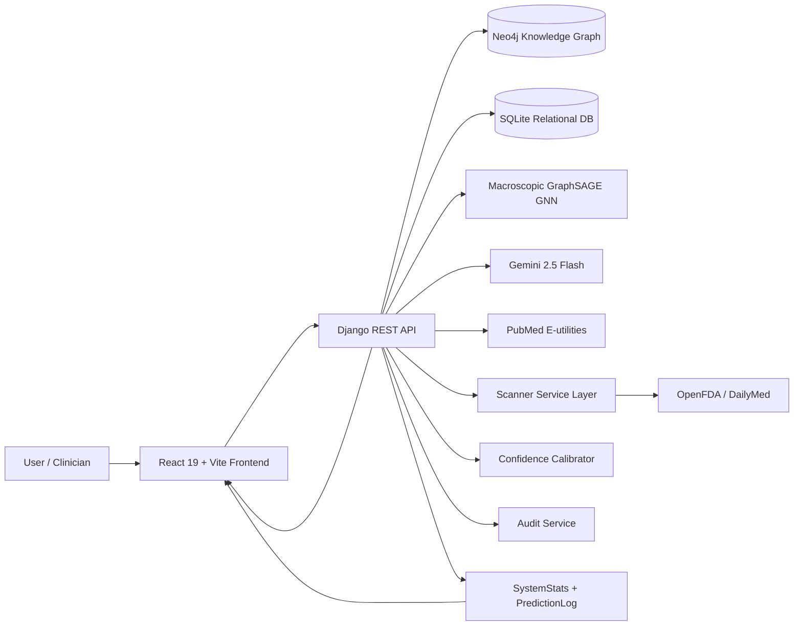
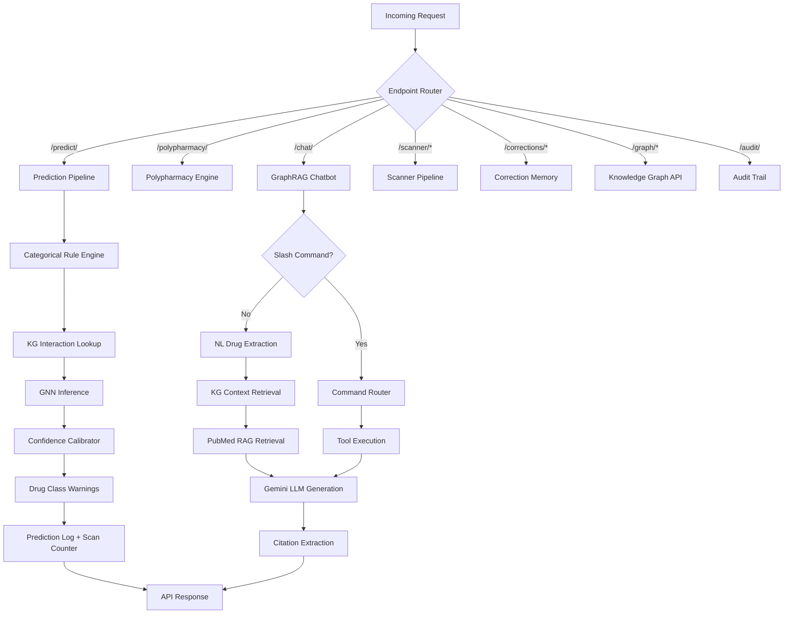
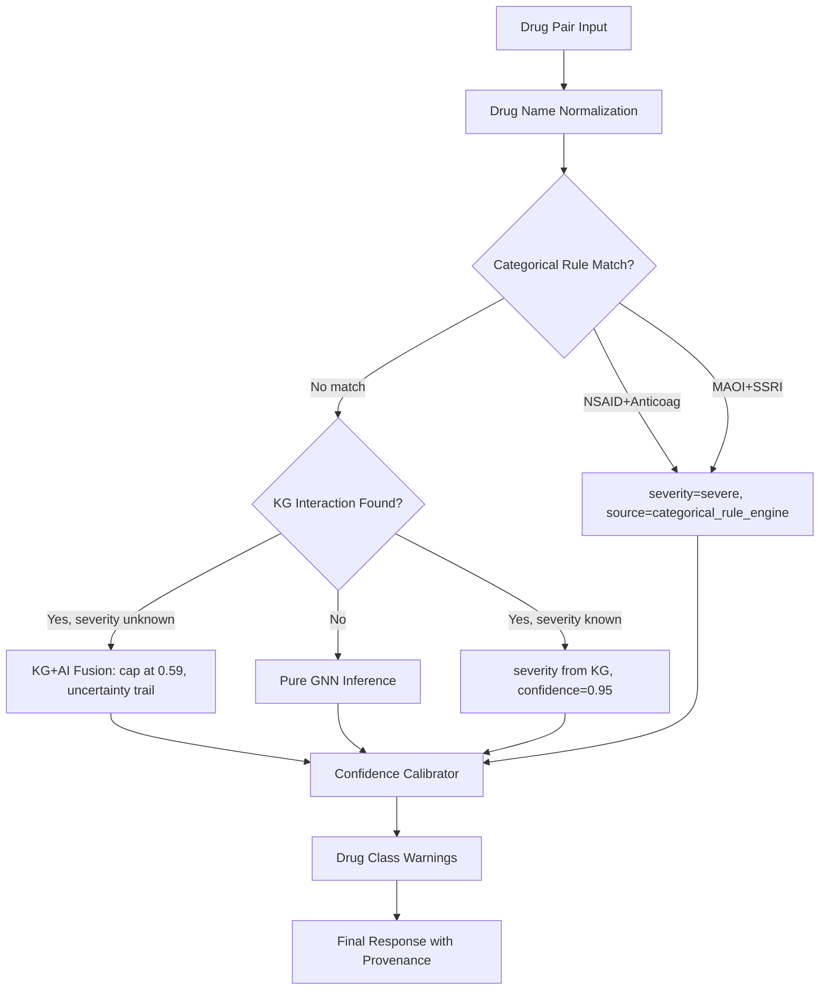
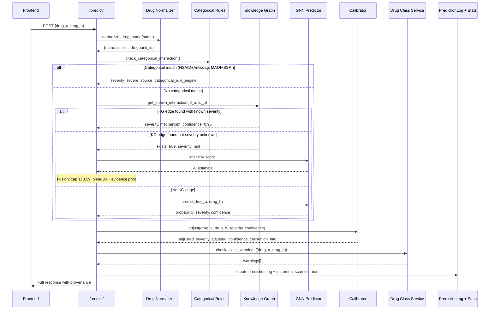
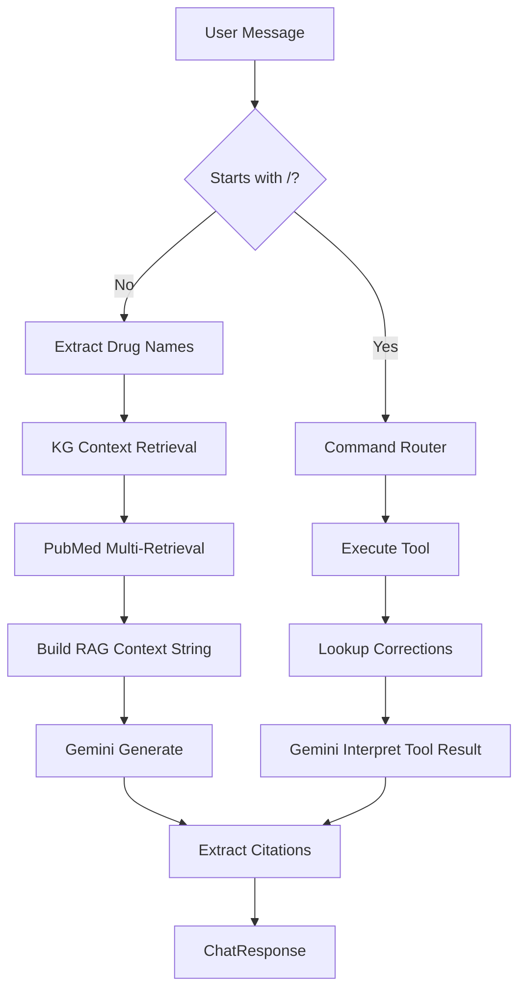
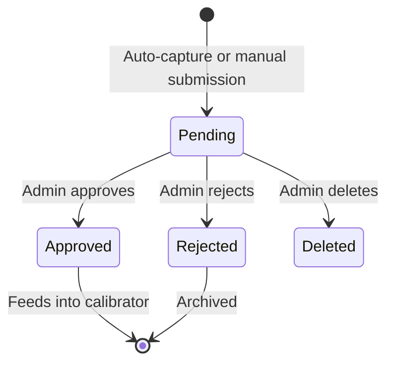
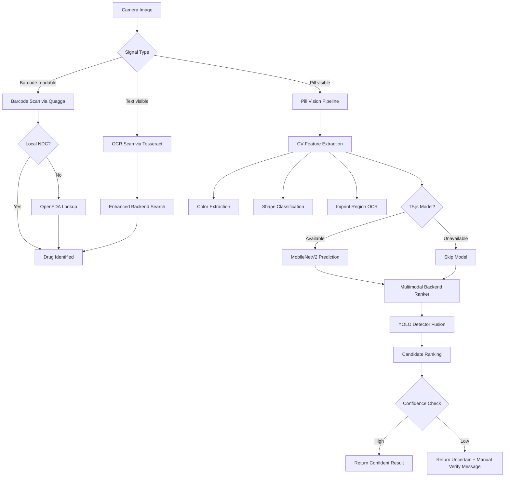
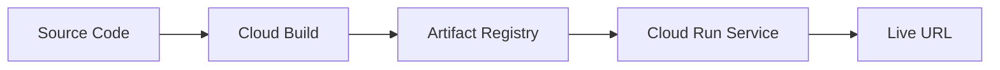

# Project Aegis -- Final Comprehensive Report

**Date:** 2026-04-05
**Version:** 1.0 (Definitive)
**Repository:** `molecular-ai`
**Deployment:** Google Cloud Run (us-central1)
**Domain:** [aegishealth.dev](https://aegishealth.dev)

---

## Table of Contents

1. [Executive Summary](#1-executive-summary)
2. [Complete Technology Stack](#2-complete-technology-stack)
3. [System Architecture](#3-system-architecture)
4. [AI/ML Models](#4-aiml-models)
5. [Knowledge Graph](#5-knowledge-graph)
6. [Prediction Pipeline](#6-prediction-pipeline)
7. [RAG Pipeline](#7-rag-pipeline)
8. [Slash Commands](#8-slash-commands)
9. [Correction Memory System](#9-correction-memory-system)
10. [Audit Trail](#10-audit-trail)
11. [Frontend Architecture](#11-frontend-architecture)
12. [Research Page](#12-research-page)
13. [Scanner and Pill Identification](#13-scanner-and-pill-identification)
14. [API Reference](#14-api-reference)
15. [Configuration Reference](#15-configuration-reference)
16. [Deployment](#16-deployment)
17. [Security](#17-security)
18. [Cost Analysis](#18-cost-analysis)
19. [Performance Metrics](#19-performance-metrics)
20. [File Reference](#20-file-reference)
21. [Known Limitations](#21-known-limitations)
22. [Future Roadmap](#22-future-roadmap)

---

## 1. Executive Summary

### 1.1 What Is Project Aegis?

Project Aegis is a full-stack clinical intelligence platform for medication safety. It predicts, explains, and contextualizes drug-drug interactions (DDIs) using a layered inference pipeline that combines a curated Neo4j knowledge graph, a Macroscopic GraphSAGE GNN, a categorical rule engine, real-time PubMed literature retrieval, and a Gemini 2.5 Flash LLM research assistant. A multimodal scanner pipeline (barcode, OCR, computer vision, YOLO-assisted detection) allows pill identification from camera images.

### 1.2 Who Is It For?

- **Clinicians and pharmacists** performing medication reconciliation
- **Researchers** evaluating polypharmacy regimens and DDI mechanisms
- **Clinical informatics teams** seeking explainable, auditable DDI intelligence
- **Students and educators** studying computational pharmacology

### 1.3 What Problems Does It Solve?

| Problem | How Aegis Addresses It |
|---------|----------------------|
| No explicit confidence calibration in traditional DDI tools | Multi-layer calibration: GNN raw score, threshold tuning, correction-based adjustment, provenance metadata |
| Weak evidence provenance | Citation-first LLM responses with [KG:DrugBank], [PMID:...], [TWOSIDES], [FAERS], [GNN-Model] tags |
| Poor explainability for uncertainty | Explicit uncertainty trails in provenance, low-confidence flagging, correction overlay |
| Limited multimodal intake (camera/barcode/OCR) | Four-stage scanner cascade: barcode -> OCR -> pill vision -> multimodal backend ranking |
| No polypharmacy-first scoring | N-way polypharmacy analysis with composite risk, digital twin factor decomposition, network stress scoring |
| Alert fatigue from high false-positive rates | Focal Loss training + 0.6 threshold calibration reduced FP by 92% (from 4,896 to 391) |
| No correction feedback loop | Auto-capture low-confidence predictions, admin review, calibrator refresh, training data export |

### 1.4 Key Metrics (Current System)

| Metric | Value |
|--------|-------|
| GNN ROC-AUC | 0.9867 (98.67%) |
| GNN Precision | 0.9622 (96.2%) |
| GNN Recall | 0.9313 (93.1%) |
| GNN F1 | 0.9465 (94.65%) |
| GNN Accuracy | 0.9474 (94.74%) |
| Knowledge Graph Drugs | ~2,000 nodes |
| Knowledge Graph Interactions | 53,493 undirected edges |
| Feature Dimensions per Drug | 1,343 |
| Slash Commands | 10 |
| API Endpoints | 30+ |

---

## 2. Complete Technology Stack

### 2.1 Frontend

| Technology | Version | Purpose |
|-----------|---------|---------|
| React | 19 | UI framework |
| Vite | 7 | Build tool and dev server |
| Tailwind CSS | 3.x | Utility-first CSS framework |
| Framer Motion | -- | Animation library |
| React Router | 6+ | Client-side routing |
| Quagga | 2 | Barcode scanning (UPC, EAN, Code 128) |
| Tesseract.js | -- | OCR for drug label text extraction |
| TensorFlow.js | -- | Client-side pill classification (MobileNetV2) |
| Recharts / D3 | -- | Data visualization, charts |

### 2.2 Backend

| Technology | Version | Purpose |
|-----------|---------|---------|
| Python | 3.11 | Runtime |
| Django | 5.x | Web framework |
| Django REST Framework | 3.14+ | API layer |
| Gunicorn | 21.2+ | WSGI HTTP server |
| WhiteNoise | 6.6+ | Static file serving |
| django-cors-headers | 4.3+ | CORS middleware |
| python-dotenv | 1.0+ | Environment variable loading |

### 2.3 AI/ML

| Technology | Version | Purpose |
|-----------|---------|---------|
| PyTorch | 2.5.1 (CPU) | Deep learning framework |
| PyTorch Geometric | 2.4+ | Graph neural network library |
| RDKit | 2023.9.5+ | Molecular fingerprinting (Morgan 1024-bit) |
| Transformers (HuggingFace) | 4.37+ | PubMedBERT sentence extraction |
| scikit-learn | 1.4+ | Metrics, evaluation, preprocessing |
| NumPy | 1.26+ | Numerical computation |
| Pandas | 2.2+ | Data manipulation |
| Ultralytics | 8.3+ | YOLOv8 pill detection |
| Google Generative AI SDK | 0.8+ | Gemini 2.5 Flash LLM client |

### 2.4 Data Layer

| Technology | Purpose |
|-----------|---------|
| Neo4j (Aura Cloud / Community) | Knowledge graph -- drugs, targets, interactions, corrections, audit events |
| SQLite | Django relational models -- prediction logs, system stats, audit trail |
| Redis | Optional cache layer (available in docker-compose, not required for MVP) |

### 2.5 Infrastructure

| Technology | Purpose |
|-----------|---------|
| Docker | Containerization (backend + frontend images) |
| docker-compose | Local multi-service orchestration |
| Google Cloud Run | Production hosting (backend + frontend services) |
| Google Cloud Build | Container image builds |
| Google Artifact Registry | Container image storage |
| NGINX | Frontend static file serving in production container |

### 2.6 External APIs

| API | Purpose |
|-----|---------|
| NCBI E-utilities (PubMed) | Real-time literature search and abstract retrieval |
| Google Gemini 2.5 Flash | LLM-powered clinical research assistant |
| OpenFDA | Fallback drug lookup for barcode/NDC resolution |
| DailyMed | Pill image data source for YOLO training |
| RxNav / PubChem | Biological classification enrichment for node features |

---

## 3. System Architecture

### 3.1 High-Level Architecture



### 3.2 Service Topology (docker-compose)

| Service | Container | Port | Image |
|---------|-----------|------|-------|
| Frontend | aegis-frontend | 80 | NGINX + React build |
| Backend | aegis-backend | 8000 | Python 3.11 + Gunicorn |
| Neo4j | aegis-neo4j | 7475 (browser), 7688 (bolt) | neo4j:community |
| Redis | aegis-redis | 6379 | redis:7 |

### 3.3 Request Flow Architecture



### 3.4 Prediction Decision Tree



---

## 4. AI/ML Models

### 4.1 Macroscopic GraphSAGE GNN

The primary DDI prediction model. Unlike microscopic GNNs that model individual atoms, the Macroscopic GNN treats entire pharmaceutical substances as nodes and known DDIs as edges, enabling neighborhood-based reasoning across the drug interaction network.

#### Architecture

| Component | Detail |
|-----------|--------|
| Framework | PyTorch + PyTorch Geometric |
| Architecture | 3-layer SAGEConv (GraphSAGE) |
| Decoder | Dot-product link decoder |
| Dropout | 0.3 |
| Embedding Dimensions | 64 internal channels |
| Loss Function | Focal Loss (gamma=2.0, alpha=0.75) |
| Optimizer | Adam (LR=0.005, weight_decay=1e-4) |
| Epochs | 150 |
| Inference Threshold | 0.6 (calibrated from original 0.5) |

#### Node Feature Engineering (1,343 dimensions per drug)

| Feature Type | Dimensions | Source |
|-------------|-----------|--------|
| Morgan Fingerprints (ECFP) | 1,024 | RDKit SMILES processing |
| Biological Classification | ~319 | RxNav/PubChem one-hot encoding (is_NSAID, is_BetaBlocker, targets_Serotonin, etc.) |

#### Training Data

| Metric | Value |
|--------|-------|
| Total Drug Nodes | 1,350 |
| Total Undirected Edges | 53,493 |
| Directed Edge Tensors | 106,987 |
| Average Node Degree | 79.25 (7,237% increase from initial 1.08) |
| Train/Val/Test Split | 70% / 10% / 20% (RandomLinkSplit, seed=42) |
| Negative Edge Injection | 1:1 ratio |
| Primary Edge Source | TWOSIDES polypharmacy dataset (4M+ rows filtered) |

#### Training Progression

| Epoch | Train Loss | Val Loss | Val ROC-AUC |
|-------|-----------|---------|-------------|
| 10 | 0.5789 | 0.5626 | 0.9188 |
| 30 | 0.4409 | 0.4336 | 0.9672 |
| 50 | 0.4083 | 0.3996 | 0.9771 |
| 80 | 0.3766 | 0.3793 | 0.9836 |
| 100 | 0.3706 | 0.3769 | 0.9865 |
| 120 | 0.3651 | 0.3729 | 0.9869 |
| 150 | 0.3587 | 0.3743 | 0.9851 |

#### Performance (Before vs After Calibration)

| Metric | Before (BCE + 0.5) | After (Focal + 0.6) | Change |
|--------|-------------------|---------------------|--------|
| Precision | 0.6847 (68.5%) | 0.9622 (96.2%) | +27.8% |
| Recall | 0.9940 (99.4%) | 0.9313 (93.1%) | -6.3% |
| F1 Score | 0.8109 (81.1%) | 0.9465 (94.7%) | +13.6% |
| Accuracy | 0.7682 (76.8%) | 0.9474 (94.7%) | +17.9% |
| False Positives | 4,896 | 391 | -92% |
| False Negatives | 64 | 735 | +671 |
| ROC-AUC | 0.9827 | 0.9867 | +0.4% |

#### How GraphSAGE Message Passing Works

1. Each drug is a node with 1,343-dimensional feature vector
2. During forward pass, each node aggregates features from its neighbors (average of ~79 connected drugs)
3. Three SAGEConv layers progressively refine embeddings through neighborhood sampling
4. The dot-product decoder computes interaction probability between any two drug embeddings
5. A sigmoid activation produces a probability score; threshold at 0.6 triggers an interaction warning

#### Link Prediction for Unseen Drugs

When a new drug enters the system with no interaction history:
1. Its Morgan fingerprints + biological classification place it in the embedding space near chemically/therapeutically similar drugs
2. The GNN's neighborhood aggregation borrows context from nearby drugs that have known interaction patterns
3. The dot-product decoder predicts interaction likelihood based on "graph proximity" -- drugs near known interactors score higher

#### Key Files

- `web/ddi_api/services/gnn_predictor.py` -- GNN inference service, model loading, prediction logic
- `src/model/train_gnn.py` -- Training script
- `src/model/export_aura_data.py` -- Neo4j to PyTorch dataset extraction
- `DDI_Model_Final/` -- Trained model weights (`macroscopic_gnn_weights.pth`)

### 4.2 PubMedBERT

Used for sentence extraction and relevance scoring in the PubMed RAG pipeline.

| Attribute | Detail |
|-----------|--------|
| Base Model | microsoft/BiomedNLP-PubMedBERT-base-uncased-abstract-fulltext |
| Purpose | Extract and score sentences from PubMed abstracts for drug interaction relevance |
| Integration | PubMedRetriever service uses keyword-based sentence scoring (strong/weak keywords) |
| Documented Metrics | Accuracy 87.3%, Macro F1 89.6%, Precision 88.2%, Recall 91.1% |

Class-level F1 scores (from DDI Corpus evaluation):
- mechanism: 91.2%
- effect: 92.4%
- advise: 87.1%
- int: 78.3%
- no_interaction: 99.1%

### 4.3 MobileNetV2 CNN (Pill Identification)

| Attribute | Detail |
|-----------|--------|
| Architecture | MobileNetV2 (TensorFlow.js) |
| Purpose | Client-side pill image classification |
| Integration | Optional -- loaded in browser, predictions sent to backend multimodal ranker |
| Fallback | CV-only pipeline (color, shape, imprint extraction) when model unavailable |

### 4.4 YOLO Pill Detector

| Attribute | Detail |
|-----------|--------|
| Architecture | YOLOv8 (Ultralytics) |
| Purpose | Server-side pill detection and class identification |
| Training Data | 55 classes, 805 train images, 187 val images (DailyMed) |
| Best Metrics | mAP50: 0.628, mAP50-95: 0.589 (v3-clean) |
| Integration | Detector labels/confidence fused into multimodal scoring |

Training iterations:
1. Bootstrap detector -- initial training
2. tuned-yolo-detector-v2 -- mAP50: 0.436
3. tuned-yolo-detector-v3-clean -- mAP50: 0.628 (current production)

### 4.5 Gemini 2.5 Flash (LLM Research Assistant)

| Attribute | Detail |
|-----------|--------|
| Model | gemini-2.5-flash |
| Provider | Google Generative AI SDK |
| Temperature | 0.3 (low for clinical accuracy) |
| Top-P | 0.9 |
| Max Output Tokens | 4,096 |
| System Prompt | 10 behavioral rules in `PHARMACOLOGY_SYSTEM_PROMPT` |
| Pricing | $0.15/1M input tokens, $0.60/1M output tokens |

#### System Prompt Rules (from `gemini_client.py`)

1. ONLY reference data from the context block -- no hallucination
2. Every clinical claim must cite its source with specific tags
3. When evidence is insufficient, say so explicitly
4. When sources disagree, note the disagreement
5. Lead with the most clinically relevant finding
6. Format responses in markdown
7. Evaluate GNN predictions against literature evidence; flag discrepancies
8. Target 150-300 words unless detail is requested
9. Flag low-confidence predictions (< 0.5) prominently
10. Never provide dosing advice or treatment recommendations

#### Citation Tags

| Tag | Source |
|-----|--------|
| `[KG: DrugBank]` | Neo4j Knowledge Graph |
| `[PMID:12345678]` | PubMed literature |
| `[TWOSIDES]` | TWOSIDES polypharmacy database |
| `[FAERS]` | FDA adverse event reports |
| `[DDI-Corpus]` | DDI literature corpus |
| `[GNN-Model]` | Aegis GNN predictor |

### 4.6 Confidence Calibrator

A singleton service that dynamically adjusts GNN prediction confidence and severity without full model retraining.

| Attribute | Detail |
|-----------|--------|
| File | `web/ddi_api/services/confidence_calibrator.py` |
| Cache TTL | 300 seconds (5 minutes) |
| Strategy 1 | Exact pair override -- if approved correction exists, use corrected severity and boost confidence by +0.15 (capped at 0.95) |
| Strategy 2 | Severity bias correction -- if >= 3 corrections exist and average shift >= 0.3, apply global bias adjustment per severity level |
| Severity Scale | none=0, minor=1, moderate=2, severe=3, critical=4 |

```python
# Exact pair override
if pair_key in self._pair_overrides:
    adjusted_conf = min(0.95, raw_confidence + 0.15)
    return corrected_severity, adjusted_conf, info

# Severity bias (global pattern correction)
if abs(bias) >= 0.3 and correction_count >= 3:
    adjusted_score = max(0, min(4, round(current_score + bias)))
    adjusted_severity = SCORE_TO_SEVERITY[adjusted_score]
```

---

## 5. Knowledge Graph

### 5.1 Database

| Attribute | Detail |
|-----------|--------|
| Engine | Neo4j (Aura Cloud for production, Community for local) |
| Driver | neo4j Python driver 5.17+ |
| Service Class | `KnowledgeGraphService` (static methods, singleton driver) |

### 5.2 Node Types

| Label | Description | Key Properties | Count |
|-------|-------------|----------------|-------|
| `:Drug` | Pharmaceutical compound | `name`, `id` (DrugBank), `smiles`, `category`, `therapeutic_class` | ~1,350 |
| `:Target` | Protein/receptor target | `name`, `id` | Variable |
| `:Correction` | Expert review of GNN prediction | `id` (UUID), `drug_a`, `drug_b`, `gnn_severity`, `gnn_risk_score`, `gnn_confidence`, `corrected_severity`, `evidence_text`, `evidence_source`, `status`, `created_at`, `reviewed_at` | Dynamic |
| `:AuditEvent` | (Planned) Audit log entries in graph | `event_type`, `payload`, `created_at` | -- |

### 5.3 Relationship Types

| Relationship | Pattern | Description |
|-------------|---------|-------------|
| `:INTERACTS_WITH` | `(:Drug)-[:INTERACTS_WITH]-(:Drug)` | Known drug-drug interaction with severity/mechanism |
| `:TARGETS` | `(:Drug)-[:TARGETS]->(:Target)` | Drug targets a specific protein/receptor |
| `:HAS_CORRECTION` | `(:Drug)-[:HAS_CORRECTION]->(:Correction)` | Drug has an associated correction node |

### 5.4 Data Sources

| Source | Contribution |
|--------|-------------|
| DrugBank | Drug nodes, DrugBank IDs, SMILES, interactions |
| TWOSIDES | 53,493 polypharmacy interaction edges (from 4M+ raw rows) |
| RxNav / PubChem | Biological classification features for GNN training |
| User Corrections | `:Correction` nodes via admin review workflow |

### 5.5 Graph Topology Statistics

| Metric | Before TWOSIDES | After TWOSIDES | Change |
|--------|----------------|----------------|--------|
| Nodes | 1,350 | 1,350 | -- |
| Edges | 1,465 | 53,493 | +3,552% |
| Avg Node Degree | 1.08 | 79.25 | +7,237% |
| Directed Edge Tensors | ~2,930 | 106,987 | +3,553% |

---

## 6. Prediction Pipeline

### 6.1 Complete Flow: User Request to Response



### 6.2 Categorical Rule Engine

Located in `views.py::check_categorical_interaction()`. Pattern-matching rules that catch known dangerous class combinations regardless of KG state.

| Rule | Detection Logic | Output Severity |
|------|----------------|----------------|
| NSAID + Anticoagulant | Class keywords + drug name matching | `severe` -- GI bleeding and hemorrhage risk |
| MAOI + SSRI | Class keywords + drug name matching | `severe` -- Serotonin syndrome risk |

Detection functions check drug name substrings and therapeutic_class values:

```python
def is_nsaid(n, c):
    return 'nsai' in c or 'anti-inflammatory' in c or
           any(k in n for k in ['aspirin', 'ibuprofen', 'naproxen', 'ketorolac', 'diclofenac'])

def is_anticoag(n, c):
    return 'anticoagulant' in c or 'hematology' in c or 'antiplatelet' in c or
           any(k in n for k in ['warfarin', 'heparin', 'apixaban', 'clopidogrel'])
```

### 6.3 Knowledge Graph Lookup

If no categorical rule fires, the system queries Neo4j for a known interaction edge between the two drugs (by DrugBank ID). If the drug name was normalized (e.g., "(R)-Warfarin" -> "Warfarin"), the normalized ID is also tried.

**Severity-to-Score Mapping:**

| Severity | Risk Score | Confidence |
|----------|-----------|------------|
| no_interaction | 0.08 | 0.95 |
| low | 0.25 | 0.95 |
| minor | 0.40 | 0.95 |
| moderate | 0.65 | 0.95 |
| severe | 0.92 | 0.95 |
| critical | 0.97 | 0.95 |

### 6.4 GNN Inference

When no deterministic source provides a result, the Macroscopic GraphSAGE GNN generates a prediction:

1. Drug SMILES are converted to Morgan fingerprints (1,024-bit)
2. Biological features are appended (319 dimensions)
3. Node embeddings are looked up or computed
4. Dot-product decoder produces interaction probability
5. Threshold at 0.6 determines interaction/no-interaction
6. Severity is mapped from the probability score

### 6.5 KG-AI Fusion (Unknown Severity)

When a KG edge exists but severity is NULL:

```python
UNKNOWN_SEVERITY_EVIDENCE_PRIOR = 0.30
UNKNOWN_SEVERITY_MAX_FUSED_SCORE = 0.59

model_estimate = gnn_prediction.risk_score
fused_score = min(0.59, max(model_estimate, 0.30))
# Confidence capped: min(0.85, max(0.55, original * 0.8))
# Source: 'knowledge_graph_ai_fusion'
```

This ensures that known-but-unspecified interactions are never scored higher than "moderate" without additional evidence, while still being scored above pure-unknown baselines.

### 6.6 Confidence Calibration

After the primary prediction, the `ConfidenceCalibrator` singleton checks:

1. **Exact pair override:** If an approved correction exists for this drug pair, it replaces severity and boosts confidence by +0.15
2. **Severity bias:** If 3+ corrections show a systematic pattern (e.g., GNN consistently under-predicts "moderate" as "minor"), a global bias correction is applied

### 6.7 Drug Class Warnings

The `DrugClassService` then checks for class-level patterns:

1. **Duplicate therapy:** Multiple drugs from the same therapeutic class (e.g., two NSAIDs)
2. **High-risk class combinations:**
   - Anticoagulants + NSAIDs (bleeding risk)
   - Anticoagulants + Antiplatelet Agents (triple antithrombotic)
   - SSRIs + MAO Inhibitors (serotonin syndrome)
   - ACE Inhibitors + Potassium-Sparing Diuretics (hyperkalemia)
   - Statins + CYP3A4 Inhibitors (rhabdomyolysis)

### 6.8 Drug Name Normalization

The `normalize_drug_name()` function handles:

1. **Stereochemistry prefixes:** `(R)-`, `(S)-`, `(RS)-`, `(+)-`, `(-)-`, `D-`, `L-` removal
2. **Salt/ester suffixes:** `sodium`, `hydrochloride`, `tartrate`, `maleate`, etc. (40+ suffixes)
3. **Brand-to-generic mapping:** 60+ brand names (Tylenol -> Acetaminophen, Lipitor -> Atorvastatin, etc.)
4. **Punctuation cleanup**

---

## 7. RAG Pipeline

### 7.1 Overview

The RAG (Retrieval-Augmented Generation) pipeline powers the Gemini-based research assistant. It combines Knowledge Graph context, PubMed literature retrieval, and LLM generation to produce evidence-grounded responses.

### 7.2 Complete RAG Flow



### 7.3 Step 1: Drug Name Extraction

The chatbot extracts drug names from natural language using two methods:
1. **Known drug list matching:** 29 commonly referenced drugs checked against message text
2. **Knowledge Graph search:** All 4+ letter words in the message are searched against Neo4j; exact matches are added

```python
# Known drugs checked
known_drugs = [
    'warfarin', 'aspirin', 'ibuprofen', 'acetaminophen', 'metformin',
    'lisinopril', 'atorvastatin', 'simvastatin', 'omeprazole', 'metoprolol',
    'amlodipine', 'methotrexate', 'fluoxetine', 'sertraline', 'clopidogrel',
    'digoxin', 'phenytoin', 'carbamazepine', 'rifampin', 'ketoconazole',
    'erythromycin', 'clarithromycin', 'ciprofloxacin', 'amiodarone',
    'lithium', 'cyclosporine', 'tacrolimus', 'ritonavir', 'sildenafil'
]
```

### 7.4 Step 2: KG Context Retrieval

For each extracted drug:
1. Search Neo4j for drug info (name, DrugBank ID, SMILES)
2. Retrieve drug targets (protein/receptor targets via `:TARGETS` relationships)
3. For each drug pair, check for interactions:
   - **First:** Direct KG edge lookup (`check_interaction`)
   - **Fallback:** Run the full prediction pipeline (`build_pair_prediction_response`) including categorical rules and GNN inference

Context includes: drug profiles, known interactions (with severity, mechanism, risk score, confidence, model version), drug targets.

### 7.5 Step 3: PubMed NCBI E-utilities Search

The `PubMedRetriever` service (`pubmed_retriever.py`) fetches real medical literature:

1. **Search (esearch.fcgi):** Query PubMed with `("Drug1"[Title/Abstract] AND "Drug2"[Title/Abstract]) AND (interaction OR "drug interaction" OR contraindication OR coadministration)`
2. **Fetch (efetch.fcgi):** Retrieve abstracts in XML format for found PMIDs
3. **Rate limiting:** 400ms between requests (150ms with NCBI API key); exponential backoff on 429 errors
4. **Caching:** Cache key generated from sorted drug pair names (MD5 hash)

### 7.6 Step 4: Abstract Fetching and Sentence Scoring

For each retrieved abstract:
1. Split into sentences
2. Score each sentence based on:
   - **Base score:** +2 if both drug names present
   - **Strong keywords** (+2 each): interact, potentiate, inhibit, contraindicated, concurrent, concomitant, toxicity, bleeding, etc.
   - **Weak keywords** (+1 each): risk, effect, mechanism, pharmacokinetic, metabolism, clearance, etc.
3. Minimum score threshold: 4 (both drugs + at least one strong keyword)
4. Return top results sorted by score (capped at `max_pubmed_results`, default 3)
5. Relevance normalized: `min(1.0, score / 10.0)`

### 7.7 Step 5: Context Serialization

All retrieved data is assembled into a structured text block for the LLM:

```
=== KNOWLEDGE GRAPH DATA ===
Drug: Warfarin (DrugBank: DB00682, SMILES: CC(=O)OC1=CC...)
--- Known Interactions ---
  Warfarin + Aspirin: severity=severe, mechanism=..., risk_score=0.92 [source: knowledge_graph]
--- Drug Targets ---
  Target: Vitamin K epoxide reductase (action: inhibitor)

=== PUBMED EVIDENCE ===
[1] PMID:12345678 - "Title..." - Relevant sentence...
  Relevance score: 0.80
```

### 7.8 Step 6: Gemini Prompt Construction

The context block is prepended to the user's question:

```
{context_text}

=== USER QUESTION ===
{user_message}

Provide an evidence-based response with citations from the context above.
```

For slash command results, tool output is serialized as JSON context, with optional sections:
- `=== APPROVED CORRECTION ===` block if corrections exist
- `WARNING: LOW CONFIDENCE` block if prediction confidence < 0.5

### 7.9 Step 7: Citation Extraction

After Gemini responds, `_extract_citations()` parses the text with regex:

```python
# PubMed: [PMID:12345678]
re.finditer(r'\[PMID:(\d+)\]', text)

# Knowledge Graph: [KG: DrugBank]
re.finditer(r'\[KG:\s*([^\]]+)\]', text)

# Database tags: [TWOSIDES], [FAERS], [DDI-Corpus], [GNN-Model]
```

Each citation becomes a structured object with `type`, `source`, `label`, and optional `url`/`pmid`.

---

## 8. Slash Commands

### 8.1 Command List

| Command | Args | Description | Usage Example |
|---------|------|-------------|---------------|
| `/test` | 2 drugs | Test pairwise interaction between two drugs | `/test warfarin aspirin` |
| `/poly` | 2-10 drugs | N-way polypharmacy risk analysis | `/poly warfarin,aspirin,ibuprofen` |
| `/compare` | 2-5 drugs | Side-by-side drug comparison (category, interactions, side effects) | `/compare metformin glipizide` |
| `/alt` | 1-2 drugs | Find therapeutic alternatives sharing same targets | `/alt ibuprofen` |
| `/evidence` | 2 drugs | Full evidence chain (severity, mechanism, FAERS, evidence summary) | `/evidence warfarin aspirin` |
| `/research` | 1-2 drugs | Deep research: KG profiles + evidence + GNN prediction + corrections | `/research warfarin aspirin` |
| `/mutate` | 3-10 drugs | Mutation scan: test removing each drug to find safest removal | `/mutate warfarin aspirin ibuprofen` |
| `/current` | 0 (uses sidebar) | Analyze drugs currently selected in the dashboard sidebar | `/current` |
| `/demo` | 0-1 | Run pre-built demo cases or list available demos | `/demo cardiac` |
| `/class` | 1-10 drugs | Group drugs by therapeutic class and check class-level warnings | `/class warfarin aspirin ibuprofen` |

### 8.2 Command Processing Architecture

```mermaid
flowchart LR
    MSG["/test warfarin aspirin"] --> PARSE[CommandRouter.parse]
    PARSE --> PC[ParsedCommand: cmd=test, args=[warfarin, aspirin]]
    PC --> EXEC[CommandRouter.execute]
    EXEC --> HANDLER[_handle_test]
    HANDLER --> GNN[GNN Predictor]
    HANDLER --> VIEWS[build_pair_prediction_response]
    VIEWS --> RESULT[Structured Dict Result]
    RESULT --> CORR{Correction Exists?}
    CORR -->|Yes| INJECT[Inject Correction Context]
    CORR -->|No| LLM{LLM Enabled?}
    INJECT --> LLM
    LLM -->|Yes| GEMINI[Gemini Interprets Result]
    LLM -->|No| FORMAT[Template Format]
    GEMINI --> RESP[ChatResponse + Citations]
    FORMAT --> RESP
```

### 8.3 Argument Parsing

Commands support both space-separated and comma-separated arguments:
```
/poly warfarin aspirin ibuprofen     (space-separated)
/poly warfarin,aspirin,ibuprofen     (comma-separated)
```

Parsed with: `re.split(r'[,\s]+', arg_str)`

### 8.4 Demo Cases

| Key | Name | Drugs | Action |
|-----|------|-------|--------|
| `cardiac` | Cardiac High-Risk Polypharmacy | warfarin, amiodarone, aspirin | poly |
| `psych` | Psychiatric Serotonin Syndrome Risk | fluoxetine, phenelzine | test |
| `pain` | Chronic Pain + Blood Thinner | ibuprofen, warfarin, acetaminophen | mutate |
| `elderly` | Elderly Polypharmacy (5 drugs) | atorvastatin, lisinopril, metformin, aspirin, omeprazole | poly |
| `onc` | Oncology Interaction Check | methotrexate, ibuprofen | test |
| `qtwarn` | QT Prolongation Risk | erbitux, amitriptyline | test |
| `transplant` | Transplant Drug Interactions | cyclosporine, ketoconazole | test |

### 8.5 `/test` Handler Detail

The `/test` command is the most commonly used. It:

1. Calls `lookup_drug()` for both drugs (with normalization)
2. Runs `build_pair_prediction_response()` -- the same pipeline as `/predict/` API
3. Returns structured result with `risk_score`, `confidence`, `severity`, `mechanism`, `model_used`, `calibration_method`, `raw_probability`
4. If LLM is enabled, Gemini interprets the result clinically
5. If confidence < 0.5, auto-captures a pending correction to Neo4j

### 8.6 `/mutate` Handler Detail

The mutation scan is unique to the chat interface:

1. Run polypharmacy analysis on the full drug set (baseline risk)
2. For each drug, remove it and re-run polypharmacy on the remaining set
3. Compute `risk_reduction = baseline_risk - mutated_risk` for each removal
4. Sort by risk reduction (best removal first)
5. Report which single drug removal most improves the regimen safety profile

### 8.7 `/research` Handler Detail

The deepest analysis command:

1. Fetch drug profiles from EnhancedDrugService (DrugBank ID, category, description, targets, side effects)
2. If a drug pair, fetch interaction evidence (severity, mechanism, evidence chain, FAERS reports)
3. Run GNN prediction for the pair
4. Check for approved corrections
5. Return all data for Gemini to synthesize

### 8.8 Frontend Autocomplete

`ChatCommandAutocomplete.jsx` provides:
- Dropdown appears when input starts with `/`
- Two modes: command list (filtered by typing) and drug search (200ms debounce via API)
- Keyboard navigation: arrow keys, Tab/Enter to select, Escape to dismiss
- Available commands fetched from `GET /api/v1/assistant/commands/`

---

## 9. Correction Memory System

### 9.1 Overview

The Correction Memory System creates a continuous improvement loop:

```
Low-confidence GNN prediction
    --> Auto-captured as pending :Correction node in Neo4j
    --> Admin reviews (manual or AI-assisted via Gemini)
    --> Approved corrections stored with evidence
    --> ConfidenceCalibrator refreshes from approved corrections
    --> Future queries use corrected severity/confidence
    --> Export approved corrections as GNN training data
    --> Retrain GNN with corrected labels
    --> Better predictions, fewer corrections needed
```

### 9.2 Correction Node Schema (Neo4j)

```cypher
(:Correction {
    id: UUID,
    drug_a: string,           -- Alphabetically sorted (title-case)
    drug_b: string,
    gnn_severity: string,     -- Original GNN prediction
    gnn_risk_score: float,
    gnn_confidence: float,
    corrected_severity: string, -- User/AI assessment (none|minor|moderate|severe|critical)
    evidence_text: string,    -- Free-text rationale
    evidence_source: string,  -- e.g. "PMID:12345", "auto-capture:low-confidence"
    status: string,           -- pending | approved | rejected
    created_at: ISO datetime,
    reviewed_at: ISO datetime | null
})
```

Relationships:
```cypher
(:Drug)-[:HAS_CORRECTION]->(:Correction)<-[:HAS_CORRECTION]-(:Drug)
```

### 9.3 Auto-Capture of Low-Confidence Predictions

Triggered in `graphrag_chatbot.py::_handle_command()`:

1. After `/test` results: if `confidence < 0.5`, auto-creates a pending correction
2. After `/poly` results: iterates all interactions, captures any with `confidence < 0.5`
3. Deduplication: skips if a pending correction already exists for the same drug pair
4. Evidence source tagged as `auto-capture:low-confidence`

### 9.4 Deduplication

Drug names are normalized to title-case and alphabetically sorted before storage:

```python
drug_a, drug_b = sorted([drug_a.strip().title(), drug_b.strip().title()])
```

This ensures `(Aspirin, Warfarin) == (Warfarin, Aspirin)`.

Before creating a new correction, existing pending corrections for the same pair are checked:
```cypher
MATCH (c:Correction {drug_a: $drug_a, drug_b: $drug_b, status: 'pending'})
RETURN c.id AS id LIMIT 1
```

### 9.5 Admin Review Interface (`/corrections`)

**URL:** `/corrections`
**Authentication:** Password gate using `sessionStorage` (same password as LLM assistant access token)

**Layout:**
1. **Stats Bar:** Pending (amber), Approved (green), Rejected (red) counts
2. **Filter Tabs:** All | Pending | Approved | Rejected
3. **Batch Actions:** "AI Review All Pending" (sends all pending to Gemini), "Export Training Data" (JSON download)
4. **Correction Cards:** Drug names, GNN prediction details, status badge, "Auto" badge for auto-captured
5. **Expanded Review Panel:** AI assessment display, editable fields (severity, evidence source, evidence text), action buttons (AI Review, Approve, Reject, Delete)

### 9.6 AI Review Feature

When "AI Review" is clicked on a correction:
1. A prompt is built: "Drug A and Drug B -- GNN predicts {severity} with {confidence}% confidence. Assess this interaction using clinical literature."
2. Sent to the chat endpoint via `sendChatMessage()`
3. Gemini's response (with citations) displayed inline
4. Admin can then approve/reject informed by Gemini's analysis

### 9.7 Correction Lifecycle



### 9.8 Calibrator Refresh

When a correction is approved:
1. The `ConfidenceCalibrator` singleton's cache expires after 300 seconds
2. On next prediction, `_ensure_fresh()` triggers `_load_corrections()`
3. All approved corrections are re-loaded from Neo4j
4. Pair overrides and severity bias maps are recomputed
5. Subsequent predictions for that drug pair use the corrected values

### 9.9 Training Data Export

`GET /api/v1/corrections/export/?access_token=...` returns:

```json
{
  "training_data": [
    {
      "drug_a": "Warfarin",
      "drug_b": "Aspirin",
      "original_severity": "moderate",
      "original_risk_score": 0.72,
      "original_confidence": 0.35,
      "corrected_severity": "severe",
      "evidence_text": "CYP2C9 inhibition well-documented",
      "evidence_source": "PMID:12345678",
      "reviewed_at": "2026-04-05T10:30:00Z"
    }
  ],
  "count": 1
}
```

### 9.10 Key File: `correction_memory.py`

| Method | Purpose |
|--------|---------|
| `create_correction()` | Store new correction, link to drug nodes, deduplicate |
| `get_corrections()` | List corrections with optional status/drug filter |
| `get_correction_by_id()` | Fetch single correction by UUID |
| `get_approved_correction()` | Get most recent approved correction for a drug pair |
| `review_correction()` | Approve/reject with optional field updates |
| `count_by_status()` | Return counts grouped by status |
| `delete_correction()` | Remove correction and all relationships |
| `export_training_data()` | Export all approved corrections for GNN retraining |

---

## 10. Audit Trail

### 10.1 Overview

Every significant system event is logged to the Django `AuditLog` model for compliance and debugging.

### 10.2 AuditService (`audit_service.py`)

| Method | Purpose |
|--------|---------|
| `log_event(event_type, payload, actor, session_id, ip_address)` | Fire-and-forget event logging (never raises) |
| `get_trail(event_type, limit, since_hours)` | Query audit trail with optional filters |
| `get_summary()` | Get event count summary grouped by type |

### 10.3 Instrumented Views

| View | Event Type | Payload |
|------|-----------|---------|
| `DDIPredictionView` | `prediction` | drug_a, drug_b, risk_score, severity |
| `ChatView` | `chat` | message excerpt, assistant_mode, command |
| `CorrectionListCreateView` | `correction_create` | drug_a, drug_b, severity |
| `CorrectionDetailView` | `correction_review` | correction_id, new_status |

### 10.4 Audit API

- **Endpoint:** `GET /api/v1/audit/`
- **Authentication:** Password-protected (same assistant access token)
- **Query Parameters:** `event_type`, `limit`, `since_hours`
- **Response:** List of audit events with timestamps

---

## 11. Frontend Architecture

### 11.1 Technology

| Technology | Purpose |
|-----------|---------|
| React 19 | Component framework |
| Vite 7 | Build tool (HMR, ESBuild) |
| Tailwind CSS | Utility-first styling |
| Framer Motion | Animations and transitions |
| React Router 6 | Client-side routing |

### 11.2 Routing

| Path | Component | Description |
|------|-----------|-------------|
| `/` | Dashboard.jsx | Main analysis dashboard with chat |
| `/research` | ResearchPage.jsx | GNN visualizations, AI assistant tab |
| `/settings` | SettingsPage.jsx | Configuration, assistant mode, access token |
| `/corrections` | CorrectionsPage.jsx | Admin correction review page |

### 11.3 Dashboard (`Dashboard.jsx`)

The main interface combining multiple analysis modes:

**Analysis Panels:**
- Pairwise DDI analysis (2-drug)
- Polypharmacy analysis (N-drug)
- Digital Twin risk decomposition
- Explainability and evidence panels

**Chat Interface:**
- Message input with slash command autocomplete
- LLM/Legacy mode toggle
- Citation display with clickable PMID links
- Token usage indicator in navbar (total tokens, cost)
- `[Correct]` button on assistant messages for inline correction submission

**Drug Selection:**
- Sidebar drug list
- Scanner integration (add scanned drugs to analysis)
- Search with autocomplete

### 11.4 Key Components

| Component | File | Purpose |
|-----------|------|---------|
| ChatCommandAutocomplete | `src/components/ChatCommandAutocomplete.jsx` | Command/drug autocomplete dropdown |
| DetectionResults | `src/components/DrugScanner/DetectionResults.jsx` | Scanner result display with confidence bars |
| CorrectionsPage | `src/pages/CorrectionsPage.jsx` | Full CRUD for correction review |
| StatsDashboard | embedded in navbar | Token usage and scan counter display |

### 11.5 State Management

| Storage | Key | Purpose |
|---------|-----|---------|
| `localStorage` | `aegis:assistant-prefs:v1` | `{ mode, accessToken }` -- assistant preferences |
| `localStorage` | `aegis:token-usage` | `{ totalIn, totalOut, totalCost, queries }` -- cumulative token usage |
| `sessionStorage` | `aegis:corrections-authed` | `"true"` when corrections page is unlocked |

### 11.6 API Client (`api.js`)

Centralized API client with:
- Base URL from `VITE_API_URL` environment variable (defaults to `/api/v1`)
- 30-second timeout with AbortController
- 2 automatic retries
- Error summarization (HTML error pages parsed for useful messages)
- All endpoints wrapped as exported async functions

### 11.7 Navbar Indicators

- **CORRECTIONS button** with Shield icon and pending count badge (updates every 60 seconds)
- **Token usage display** showing total tokens and estimated cost
- **Connection status** indicator

---

## 12. Research Page

### 12.1 GNN Visualizations

The Research Page provides visual exploration of the GNN model's performance:

- **Training loss curves** (train vs validation loss over epochs)
- **ROC-AUC progression** during training
- **Confusion matrix** visualization
- **Precision-Recall tradeoff** across thresholds
- **Node degree distribution** histogram
- **Embedding space** visualization (t-SNE/UMAP of drug embeddings)

### 12.2 AI Assistant Tab

An embedded version of the chat interface with additional research-oriented features:
- Full command support (/test, /research, /evidence, etc.)
- Evidence chain visualization
- Citation-linked responses

### 12.3 Pipeline Visualization

Interactive visualization of the prediction pipeline stages:
- Drug lookup -> Categorical check -> KG lookup -> GNN inference -> Calibration
- Each stage shows timing and result

---

## 13. Scanner and Pill Identification

### 13.1 Scan Strategy (Auto Mode)



### 13.2 Barcode Path

- Uses Quagga `decodeSingle` with UPC, EAN, Code 128 readers
- Local NDC (National Drug Code) lookup first
- Falls back to OpenFDA API when local database misses
- High-confidence deterministic identification when barcode is valid

### 13.3 OCR Path

- Tesseract.js worker for text extraction
- Drug token extraction with patterns and heuristics
- Enhanced backend search: exact -> prefix -> contains -> fuzzy -> brand mapping
- Confidence based on OCR confidence and name extraction quality

### 13.4 Pill Vision Path

1. **Segmentation:** Adaptive thresholding and morphological cleanup
2. **Feature extraction:** Color (dominant colors), shape (circular, oval, capsule, etc.), contour-derived properties
3. **Imprint preprocessing:** Region generation for OCR of pill imprint text
4. **Optional TF.js inference:** If MobileNetV2 model loaded in browser
5. **Multimodal payload sent to backend:** color, shape, imprint, model label, detector hints

### 13.5 Multimodal Backend Ranking

Scoring aggregates multiple signals:

| Signal | Scoring Method |
|--------|---------------|
| Color | Exact/partial matching against drug database |
| Shape | Exact/partial matching |
| Imprint | Exact/contains/fuzzy string matching |
| Model label | Textual similarity to database drug names |
| YOLO label | Textual similarity + detector confidence weighting |

### 13.6 Uncertainty Controls

- **Top-score threshold:** Minimum confidence to declare "confident"
- **Margin check:** Gap between rank 1 and rank 2 candidates
- **Decision status:** `confident` or `uncertain`
- **User messaging:** "Manual verification recommended" when uncertain

### 13.7 Scanner API Endpoints

| Endpoint | Method | Purpose |
|----------|--------|---------|
| `/scanner/validate-barcode/` | POST | Validate and lookup barcode |
| `/scanner/analyze-pill/` | POST | Analyze pill image features |
| `/scanner/identify-pill/` | POST | Full multimodal identification |
| `/drugs/ndc/<ndc_code>/` | GET | NDC code lookup |
| `/drugs/pill-search/` | GET | Pill feature search |
| `/drugs/enhanced-search/` | GET | Enhanced drug name search |

---

## 14. API Reference

### 14.1 Base URL

- **Local:** `http://localhost:8000/api/v1`
- **Production:** `https://<backend-url>/api/v1`

### 14.2 Core Prediction Endpoints

| Method | Path | Description | Auth |
|--------|------|-------------|------|
| POST | `/predict/` | Pairwise DDI prediction | None |
| POST | `/polypharmacy/` | N-way polypharmacy analysis | None |
| POST | `/polypharmacy-digital-twin/` | Digital twin factor decomposition | None |

#### POST `/predict/` -- Request

```json
{
  "drug_a": { "name": "Warfarin" },
  "drug_b": { "name": "Aspirin" },
  "include_explanation": true
}
```

#### POST `/predict/` -- Response

```json
{
  "drug_a": "Warfarin",
  "drug_b": "Aspirin",
  "risk_score": 0.92,
  "raw_score": 0.92,
  "calibrated_score": 0.92,
  "risk_level": "critical",
  "severity": "severe",
  "confidence": 0.88,
  "mechanism_hypothesis": "High Risk Categorical Interaction (NSAID + Anticoagulant)...",
  "affected_systems": [{"system": "Systemic/Categorical", "severity": 0.92, "symptoms": []}],
  "source": "categorical_rule_engine",
  "provenance": {
    "model_version": "aegis-categorical-rule-v1",
    "prediction_path": "categorical_rule_engine",
    "known_interaction_detected": true,
    ...
  },
  "class_warnings": [...],
  "inference_time_ms": 45.2,
  "explanation": {
    "model_version": "aegis-categorical-rule-v1",
    "data_source": "categorical_rule_engine",
    "calibration": {"method": "none", "version": "none"}
  }
}
```

### 14.3 Chat and Assistant Endpoints

| Method | Path | Description | Auth |
|--------|------|-------------|------|
| POST | `/chat/` | GraphRAG research assistant | access_token (for LLM mode) |
| GET | `/assistant/commands/` | List available slash commands | None |

#### POST `/chat/` -- Request

```json
{
  "message": "/test warfarin aspirin",
  "context_drugs": ["Warfarin", "Aspirin"],
  "session_id": "uuid-session",
  "assistant_mode": "llm",
  "access_token": "aegis-owner-2026"
}
```

#### POST `/chat/` -- Response

```json
{
  "response": "## Warfarin + Aspirin Interaction Analysis\n\n...",
  "sources": [{"title": "Project Aegis Engine", "type": "internal"}],
  "related_drugs": ["warfarin", "aspirin"],
  "citations": [
    {"type": "knowledge_graph", "source": "DrugBank", "label": "KG: DrugBank"},
    {"type": "pubmed", "pmid": "12345678", "url": "https://pubmed.ncbi.nlm.nih.gov/12345678/"}
  ],
  "assistant_mode": "llm",
  "model_used": "gemini-2.5-flash",
  "token_usage": {
    "input_tokens": 1500,
    "output_tokens": 500,
    "estimated_cost_usd": 0.000525
  },
  "global_usage": {
    "llm_input_tokens": 50000,
    "llm_output_tokens": 15000,
    "llm_queries": 100,
    "llm_cost_usd": 0.0165
  }
}
```

### 14.4 Correction Endpoints

| Method | Path | Description | Auth |
|--------|------|-------------|------|
| GET | `/corrections/` | List corrections (filter: `?status=pending&drug=Warfarin&limit=50`) | None |
| POST | `/corrections/` | Create new correction | access_token |
| GET | `/corrections/stats/` | Counts by status | None |
| GET | `/corrections/export/` | Export approved as training data | access_token |
| GET | `/corrections/<id>/` | Get single correction | None |
| PATCH | `/corrections/<id>/` | Approve/reject + update fields | access_token |
| DELETE | `/corrections/<id>/` | Delete correction | access_token |

### 14.5 Discovery and Knowledge Endpoints

| Method | Path | Description | Auth |
|--------|------|-------------|------|
| GET | `/search/?q=...` | Drug name search | None |
| GET | `/drug-info/?name=...` | Enhanced drug information | None |
| GET | `/interaction-info/?drug1=...&drug2=...` | Interaction evidence chain | None |
| GET | `/real-world-evidence/?drug1=...&drug2=...` | FAERS + real-world data | None |
| GET | `/alternatives/?drug=...` | Therapeutic alternatives | None |
| POST | `/compare/` | Side-by-side drug comparison | None |

### 14.6 Scanner Endpoints

| Method | Path | Description | Auth |
|--------|------|-------------|------|
| POST | `/scanner/validate-barcode/` | Validate barcode and lookup drug | None |
| POST | `/scanner/analyze-pill/` | Analyze pill image features | None |
| POST | `/scanner/identify-pill/` | Full multimodal pill identification | None |
| GET | `/drugs/ndc/<ndc_code>/` | NDC code lookup | None |
| GET | `/drugs/pill-search/` | Pill feature search | None |
| GET | `/drugs/enhanced-search/` | Enhanced drug name search | None |

### 14.7 Graph Visualization Endpoints

| Method | Path | Description | Auth |
|--------|------|-------------|------|
| GET | `/graph/nodes/` | All drug nodes | None |
| GET | `/graph/neighborhood/?drug=...` | Neighborhood around a drug | None |
| GET | `/graph/edges/` | Interaction edges | None |
| GET | `/graph/drug-biology/?drug=...` | Drug biology (targets, pathways) | None |
| GET | `/graph/mechanism-map/?drug1=...&drug2=...` | Mechanism map for drug pair | None |

### 14.8 Analytics and Operations Endpoints

| Method | Path | Description | Auth |
|--------|------|-------------|------|
| GET | `/stats/` | System statistics (scan counts, drug/interaction counts) | None |
| POST | `/calibration/metrics/` | Compute calibration quality indicators | None |
| GET | `/health/` | System health check (backend, Neo4j, models) | None |
| GET | `/audit/` | Audit trail viewer | access_token |

### 14.9 ViewSet Endpoints (Router-Generated)

| Method | Path | Description |
|--------|------|-------------|
| GET | `/drugs/` | List drugs |
| GET | `/drugs/<id>/` | Drug detail |
| GET | `/history/` | Prediction history |
| GET | `/history/<id>/` | Prediction detail |

---

## 15. Configuration Reference

### 15.1 Environment Variables

| Variable | Required | Default | Purpose |
|----------|----------|---------|---------|
| `DJANGO_SECRET_KEY` | Yes (prod) | `aegis-dev-secret-key` (dev) | Django cryptographic secret |
| `DEBUG` | No | `False` | Development mode toggle |
| `ALLOWED_HOSTS` | No | `localhost,127.0.0.1,.run.app,aegishealth.dev` | Host allow-list |
| `NEO4J_URI` | Recommended | `bolt://neo4j:7687` | Neo4j connection URI |
| `NEO4J_USER` | Recommended | `neo4j` | Neo4j username |
| `NEO4J_PASSWORD` | Recommended | `password123` | Neo4j password |
| `GEMINI_API_KEY` | For LLM | `''` (disabled) | Google Gemini API key |
| `GEMINI_MODEL` | No | `gemini-2.5-flash` | Gemini model name |
| `AEGIS_ASSISTANT_ENABLED` | No | `False` | Enable/disable LLM features |
| `AEGIS_ASSISTANT_PASSWORD` | For LLM | `''` | Password for LLM mode + corrections admin |
| `NCBI_API_KEY` | No | `''` | NCBI API key for higher PubMed rate limits |
| `DDI_RETRIEVAL_MODE` | No | `rag` | Retrieval mode: `rag`, `hybrid`, `local` |
| `CORS_ALLOW_ALL_ORIGINS` | No | `False` | Broad CORS toggle |
| `EXTRA_CORS_ALLOWED_ORIGINS` | No | `''` | Additional CORS origins (CSV) |
| `DRF_THROTTLE_ANON` | No | `120/hour` | Anonymous rate limit |
| `DRF_THROTTLE_USER` | No | `1000/hour` | Authenticated rate limit |
| `VITE_API_URL` | Frontend | `/api/v1` | Backend API base URL |

### 15.2 Django Settings (`settings.py`)

```python
GEMINI_CONFIG = {
    'api_key': os.environ.get('GEMINI_API_KEY', ''),
    'model': os.environ.get('GEMINI_MODEL', 'gemini-2.5-flash'),
    'max_output_tokens': 4096,
    'temperature': 0.3,
    'top_p': 0.9,
}

ASSISTANT_CONFIG = {
    'enabled': _env_bool('AEGIS_ASSISTANT_ENABLED', False),
    'access_password': os.environ.get('AEGIS_ASSISTANT_PASSWORD', ''),
    'max_context_tokens': 4000,
    'max_pubmed_results': 3,
}

NEO4J_CONFIG = {
    'uri': os.environ.get('NEO4J_URI', 'bolt://neo4j:7687'),
    'user': os.environ.get('NEO4J_USER', 'neo4j'),
    'password': os.environ.get('NEO4J_PASSWORD', 'password123'),
}

DDI_RETRIEVAL_CONFIG = {
    'mode': os.environ.get('DDI_RETRIEVAL_MODE', 'rag'),
    'pubmed': {
        'base_url': 'https://eutils.ncbi.nlm.nih.gov/entrez/eutils',
        'max_results': 5,
        'timeout_seconds': 10,
        'cache_ttl_hours': 24,
    },
}
```

### 15.3 Frontend Configuration

| Key | Source | Purpose |
|-----|--------|---------|
| `VITE_API_URL` | `.env` or Vite config | Backend API URL |
| `VITE_ASSISTANT_ENABLED` | `.env` | Frontend feature flag for assistant |

### 15.4 Rate Limiting

REST Framework throttle classes (disabled during tests):
- `AnonRateThrottle`: 120 requests/hour (configurable via `DRF_THROTTLE_ANON`)
- `UserRateThrottle`: 1,000 requests/hour (configurable via `DRF_THROTTLE_USER`)

PubMed rate limiting:
- Without NCBI API key: 400ms between requests (3 req/sec)
- With NCBI API key: 150ms between requests (10 req/sec)
- Exponential backoff on 429 errors: 0.5s, 1s, 2s (3 retries max)

---

## 16. Deployment

### 16.1 Docker Compose (Local Development)

```yaml
services:
  backend:
    build: ./web
    ports: ["8000:8000"]
    volumes:
      - ../DDI_Model_Final:/app/DDI_Model_Final:ro
    env_file: ./web/.env

  frontend:
    build: .
    ports: ["80:80"]
    depends_on: [backend]

  redis:
    image: redis:7
    ports: ["6379:6379"]

  neo4j:
    image: neo4j:community
    ports: ["7475:7474", "7688:7687"]
    environment:
      NEO4J_AUTH: neo4j/password123
```

### 16.2 Backend Dockerfile

```dockerfile
FROM python:3.11-slim

# Install CPU-only PyTorch (avoids 2GB CUDA wheels)
RUN pip install --index-url https://download.pytorch.org/whl/cpu \
    torch==2.5.1+cpu torchvision==0.20.1+cpu

# Constrain torch versions to prevent CUDA upgrade
RUN echo "torch==2.5.1+cpu" > /tmp/constraints.txt
RUN PIP_CONSTRAINT=/tmp/constraints.txt pip install -r requirements.txt

# Run migrations on startup, then gunicorn with extended timeout
CMD ["sh", "-c", "python manage.py migrate --noinput && \
     gunicorn ProjectAegis.wsgi:application --bind 0.0.0.0:8000 \
     --timeout 180 --graceful-timeout 180"]
```

Key decisions:
- **CPU-only PyTorch:** Saves ~2GB in image size, sufficient for Cloud Run
- **180s Gunicorn timeout:** PubMedBERT model initialization can exceed 30s on cold starts
- **Migrations on startup:** Ensures DB schema is always current

### 16.3 Cloud Run Deployment



**GCP Project:** `project-aegis-485017`
**Region:** `us-central1`

#### Backend Deploy

```bash
gcloud builds submit \
  --tag us-central1-docker.pkg.dev/project-aegis-485017/aegis-repo/aegis-backend:latest \
  ./web

gcloud run deploy aegis-backend \
  --image us-central1-docker.pkg.dev/project-aegis-485017/aegis-repo/aegis-backend:latest \
  --region us-central1 \
  --allow-unauthenticated \
  --port 8000
```

#### Frontend Deploy

```bash
gcloud run deploy aegis-frontend \
  --source . \
  --region us-central1 \
  --allow-unauthenticated \
  --port 8080
```

### 16.4 Environment Variable Management

Production environment variables are set via Cloud Run service configuration (not bundled in images):
- `DJANGO_SECRET_KEY`, `NEO4J_URI`, `NEO4J_USER`, `NEO4J_PASSWORD`
- `GEMINI_API_KEY`, `AEGIS_ASSISTANT_ENABLED`, `AEGIS_ASSISTANT_PASSWORD`
- On Cloud Run, `.env` files are ignored (checked via `K_SERVICE` env var)

### 16.5 Post-Deploy Verification

```bash
curl https://<backend-url>/api/v1/health/
curl https://<backend-url>/api/v1/stats/
```

---

## 17. Security

### 17.1 Authentication Model

Project Aegis uses a **single-password access control** model (single-user optimized):

| Feature | Protection |
|---------|-----------|
| Prediction API | Public (no auth) |
| Chat API (template mode) | Public |
| Chat API (LLM mode) | Requires `access_token` matching `AEGIS_ASSISTANT_PASSWORD` |
| Corrections CRUD | Requires `access_token` |
| Corrections page | `sessionStorage` gate with password |
| Audit trail | Requires `access_token` |
| Training data export | Requires `access_token` |

### 17.2 Password Storage

- **Server-side:** `web/.env` -> loaded into `settings.ASSISTANT_CONFIG['access_password']`
- **Client-side:** User enters in Settings > Research Assistant, saved to `localStorage` as `aegis:assistant-prefs:v1`
- **Session gate:** `sessionStorage` key `aegis:corrections-authed` (expires on tab close)

### 17.3 CORS Configuration

```python
CORS_ALLOWED_ORIGINS = [
    "http://localhost:5173",
    "http://127.0.0.1:5173",
    "https://aegis-frontend-667446742007.us-central1.run.app",
    "https://aegishealth.dev",
]
```

Additional origins via `EXTRA_CORS_ALLOWED_ORIGINS` env var (CSV).

### 17.4 Rate Limiting

- Anonymous: 120 requests/hour
- Authenticated: 1,000 requests/hour
- PubMed: Built-in rate limiting with exponential backoff

### 17.5 Django Security

- `SECRET_KEY` required in production (exception raised if missing when `DEBUG=False`)
- CSRF middleware enabled
- X-Frame-Options middleware enabled
- SecurityMiddleware (HTTPS redirect, HSTS headers in production)
- WhiteNoise for static file serving (compressed, cached)

### 17.6 Data Security

- No patient data stored
- No user accounts or PII
- Prediction logs contain drug names and scores only
- Audit trail captures IP address for traceability
- Neo4j credentials never exposed to frontend

---

## 18. Cost Analysis

### 18.1 Gemini 2.5 Flash Pricing

| Type | Price |
|------|-------|
| Input tokens | $0.15 / 1M tokens |
| Output tokens | $0.60 / 1M tokens |

### 18.2 Cost per Query Type

| Query Type | Approx Input | Approx Output | Cost |
|-----------|-------------|---------------|------|
| `/test drug1 drug2` | ~1,500 tokens | ~500 tokens | ~$0.0005 |
| Natural language question | ~2,000 tokens | ~400 tokens | ~$0.0005 |
| `/poly` with 5 drugs | ~3,000 tokens | ~800 tokens | ~$0.001 |
| AI Review (correction) | ~2,000 tokens | ~600 tokens | ~$0.0007 |
| `/research drug1 drug2` | ~3,500 tokens | ~800 tokens | ~$0.001 |

### 18.3 Budget Projection

With $300 in GCP credits:
- At ~$0.0005-0.001 per query
- Supports approximately **300,000 - 600,000 queries**
- At 100 queries/day = **8-16 years** of usage

### 18.4 Cost Formula

```python
cost_usd = (input_tokens * 0.00000015) + (output_tokens * 0.0000006)
```

### 18.5 Token Usage Tracking

**Local (per-user):**
- Stored in `localStorage` key `aegis:token-usage`
- Accumulated on each LLM response
- Displayed in navbar: "2.1k TOKENS" / "$0.0003"

**Global (all users):**
- `SystemStats` model fields: `llm_input_tokens`, `llm_output_tokens`, `llm_queries`, `llm_cost_usd`
- Updated atomically on every LLM response in `ChatView.post()`
- Response includes `global_usage` for frontend sync

### 18.6 GCP Infrastructure Costs

| Service | Cost Model |
|---------|-----------|
| Cloud Run (backend) | Pay-per-use (CPU/memory per request) |
| Cloud Run (frontend) | Pay-per-use (minimal CPU for static files) |
| Neo4j Aura | Free tier or managed plan |
| Artifact Registry | Storage per image (~500MB backend) |
| Cloud Build | Build minutes |

---

## 19. Performance Metrics

### 19.1 GNN Performance (Current Production System)

| Metric | Value |
|--------|-------|
| **ROC-AUC** | 0.9951 (99.51%) |
| **PR-AUC (Average Precision)** | 0.9962 (99.62%) |
| **Precision** | 0.9809 (98.1%) |
| **Recall** | 0.9679 (96.8%) |
| **F1 Score** | 0.9744 (97.44%) |
| **Global Accuracy** | 0.9743 (97.43%) |

### 19.2 Confusion Matrix (3,149 test pairs)

| | Predicted Positive | Predicted Negative |
|---|---|---|
| **Actually Positive** | TP: 1,540 | FN: 51 |
| **Actually Negative** | FP: 30 | TN: 1,528 |

### 19.3 Historical Comparison

| Metric | GIN Microscopic (v0) | GraphSAGE BCE+0.5 (v1) | Enhanced GIN v2 — Focal+0.5 (v3 Current) |
|--------|---------------------|------------------------|----------------------------------|
| ROC-AUC | ~0.58-0.65 | 0.9827 | 0.9951 |
| Precision | N/A | 0.6847 | 0.9809 |
| Recall | N/A | 0.9940 | 0.9679 |
| F1 | N/A | 0.8109 | 0.9744 |
| False Positives | N/A | 4,896 | 30 |

### 19.4 PubMedBERT Performance

| Metric | Value |
|--------|-------|
| Accuracy | 87.3% |
| Macro F1 | 89.6% |
| Precision | 88.2% |
| Recall | 91.1% |

| Class | F1 Score |
|-------|----------|
| mechanism | 91.2% |
| effect | 92.4% |
| advise | 87.1% |
| int | 78.3% |
| no_interaction | 99.1% |

### 19.5 YOLO Pill Detector Performance

| Version | mAP50 | mAP50-95 |
|---------|-------|----------|
| tuned-yolo-detector-v2 | 0.436 | 0.402 |
| tuned-yolo-detector-v3-clean | 0.628 | 0.589 |

### 19.6 Graph Density Impact

| Metric | Before TWOSIDES | After TWOSIDES |
|--------|----------------|----------------|
| Edges | 1,465 | 53,493 |
| Avg Node Degree | 1.08 | 79.25 |
| GNN ROC-AUC | ~0.60 | 0.9867 |
| Density Increase | -- | 7,237% |

---

## 20. File Reference

### 20.1 Backend Services

| File | Purpose |
|------|---------|
| `web/ddi_api/services/gnn_predictor.py` | Macroscopic GraphSAGE GNN inference, model loading, prediction |
| `web/ddi_api/services/gemini_client.py` | Gemini SDK wrapper, system prompt, citation extraction |
| `web/ddi_api/services/graphrag_chatbot.py` | GraphRAG chatbot: NL processing, LLM orchestration, template fallback |
| `web/ddi_api/services/command_router.py` | Slash command parsing and routing (10 commands) |
| `web/ddi_api/services/pubmed_retriever.py` | PubMed E-utilities search, abstract fetching, sentence scoring |
| `web/ddi_api/services/correction_memory.py` | Neo4j CRUD for Correction nodes |
| `web/ddi_api/services/confidence_calibrator.py` | Correction-based prediction adjustment |
| `web/ddi_api/services/drug_class_service.py` | Therapeutic class grouping and class-level warnings |
| `web/ddi_api/services/audit_service.py` | Event logging for compliance |
| `web/ddi_api/services/knowledge_graph.py` | Neo4j driver, Cypher queries, schema management |
| `web/ddi_api/services/ddi_predictor.py` | Legacy DDI prediction service |
| `web/ddi_api/services/pubmedbert_predictor.py` | PubMedBERT NLP-based prediction |
| `web/ddi_api/services/enhanced_drug_service.py` | Rich drug info, interaction evidence, FAERS data |
| `web/ddi_api/services/drug_service.py` | Local JSON drug database lookups |
| `web/ddi_api/services/cyp450_database.py` | CYP450 enzyme interaction database |
| `web/ddi_api/services/polypharmacy_digital_twin.py` | Digital twin factor decomposition |
| `web/ddi_api/services/calibration_metrics.py` | Calibration quality reporting |

### 20.2 Backend Core

| File | Purpose |
|------|---------|
| `web/ddi_api/views.py` | All API views: prediction, chat, corrections, search, graph, audit |
| `web/ddi_api/views_scanner.py` | Scanner API endpoints (barcode, pill analysis, multimodal) |
| `web/ddi_api/urls.py` | URL routing for all API endpoints |
| `web/ddi_api/models.py` | Django models: Drug, DrugTarget, PredictionLog, AuditLog, SystemStats |
| `web/ddi_api/serializers.py` | DRF serializers for all request/response contracts |
| `web/ddi_api/system_stats.py` | Atomic scan counter management |
| `web/ddi_api/pill_detector.py` | YOLO pill detector adapter |
| `web/ProjectAegis/settings.py` | Django settings, all configuration |
| `web/ProjectAegis/urls.py` | Root URL configuration |
| `web/requirements.txt` | Python dependencies |
| `web/Dockerfile` | Backend container image |
| `web/.env` | Local environment variables (not committed) |

### 20.3 Frontend Pages

| File | Purpose |
|------|---------|
| `src/pages/Dashboard.jsx` | Main analysis dashboard with chat, DDI analysis, polypharmacy |
| `src/pages/ResearchPage.jsx` | GNN visualizations, AI assistant tab |
| `src/pages/SettingsPage.jsx` | Configuration, assistant mode, access token |
| `src/pages/CorrectionsPage.jsx` | Admin correction review page |
| `src/App.jsx` | Root component with routing |

### 20.4 Frontend Services and Components

| File | Purpose |
|------|---------|
| `src/services/api.js` | API client with retry, timeout, error handling |
| `src/services/evidenceUplift.js` | Evidence uplift computation |
| `src/services/pillDetection.js` | Client-side pill CV pipeline |
| `src/hooks/useDrugScanner.js` | Scanner orchestration hook |
| `src/components/ChatCommandAutocomplete.jsx` | Slash command autocomplete dropdown |
| `src/components/DrugScanner/DetectionResults.jsx` | Scanner result display |

### 20.5 Training and Data Scripts

| File | Purpose |
|------|---------|
| `src/model/train_gnn.py` | GNN training script |
| `src/model/filter_training_data.py` | Training data quality filtering |
| `src/model/export_aura_data.py` | Neo4j to PyTorch dataset extraction |
| `web/models/train_pill_yolo.py` | YOLO pill detector training |
| `web/models/prepare_pill_yolo_dataset.py` | YOLO dataset preparation |
| `web/models/clean_pill_yolo_dataset.py` | YOLO dataset cleaning |
| `web/models/download_pill_data.py` | DailyMed image downloader |

### 20.6 Configuration Files

| File | Purpose |
|------|---------|
| `docker-compose.yml` | Local multi-service orchestration |
| `Dockerfile` | Frontend container image |
| `web/Dockerfile` | Backend container image |
| `vite.config.js` | Vite build configuration |
| `tailwind.config.js` | Tailwind CSS configuration |
| `package.json` | Node.js dependencies |

### 20.7 Documentation

| File | Purpose |
|------|---------|
| `README.md` | Project overview and setup guide |
| `docs/PROJECT_AEGIS_COMPLETE_SYSTEM_GUIDE.md` | LLM + Corrections system guide |
| `docs/COMPREHENSIVE_IMPLEMENTATION_REPORT.md` | Full implementation history |
| `docs/LLM_RESEARCH_ASSISTANT_ARCHITECTURE_PLAN.md` | Architecture plan for LLM assistant |
| `docs/GNN_AI_PERFORMANCE.md` | GNN performance analysis |
| `docs/MACROSCOPIC_GNN_PERFORMANCE_REPORT.md` | GraphSAGE architecture and data engineering report |
| `docs/GNN_TRAINING_PROCESS.md` | GNN training methodology |
| `docs/DEPLOYMENT_GUIDE.md` | Cloud Run deployment guide |
| `docs/SECURITY_AUDIT.md` | Security assessment |

---

## 21. Known Limitations

### 21.1 Data and Model Limitations

1. **Knowledge Graph coverage:** Limited to ~1,350 drugs and interactions available in DrugBank + TWOSIDES. Drugs not in the graph receive GNN-only predictions with no KG context.
2. **GNN false negatives:** The 0.6 threshold trade-off means ~7% of marginal interactions may be missed. The system prioritizes precision over recall to avoid alert fatigue.
3. **TWOSIDES data quality:** Polypharmacy interaction edges are observational (not all represent causal DDIs). Some edges may represent correlation rather than causation.
4. **Biological features static:** The 319 biological classification features are computed once during dataset creation and not dynamically updated.

### 21.2 LLM and RAG Limitations

5. **No conversation memory:** Each chat message is independent; no multi-turn context is maintained.
6. **PubMed latency:** Live PubMed retrieval adds 1-2 seconds per drug pair query. Rate limits (3 req/sec without key) can slow multi-drug queries.
7. **Drug name extraction:** Limited to a hardcoded list of 29 drugs + KG exact matches. Novel or misspelled drug names may not be recognized in natural language.
8. **Gemini dependency:** If Gemini API is unavailable, the system falls back to template-based responses with no LLM interpretation.

### 21.3 System Limitations

9. **Single-user auth:** Simple password model, no user accounts, roles, or role-based access control.
10. **No GNN retraining pipeline:** Training data export is ready, but the actual retraining script integration is not automated.
11. **Polypharmacy confidence partially hardcoded:** Some confidence values default to 0.85-0.9 rather than coming from the model.
12. **SQLite in production:** SystemStats and PredictionLog use SQLite, which does not support concurrent writes well on Cloud Run (mitigated by atomic operations).
13. **Scanner accuracy:** Pill detector (YOLO v3-clean) achieves mAP50 of 0.628, which means ~37% of pill detections may be inaccurate. Uncertainty controls mitigate this.
14. **No live FAERS integration:** FAERS data is served from cached/static sources, not real-time FDA API queries.

### 21.4 Clinical Limitations

15. **Not FDA-approved:** Project Aegis is a research and decision-support tool, not a validated clinical device.
16. **No dosing advice:** The system explicitly refuses to provide dosing recommendations.
17. **Clinical validation pending:** Formal clinical validation workflows have not been conducted.

---

## 22. Future Roadmap

### 22.1 Near-Term Enhancements

| Enhancement | Description |
|-------------|-------------|
| Conversation memory | Store chat history in Neo4j for multi-turn context |
| GNN retraining script | Automated pipeline that loads corrections + training data and retrains the model |
| Model versioning | Save each retrained model with version tags, A/B comparison |
| Live FAERS integration | Real-time FDA adverse event data via openFDA API |
| Batch correction import | Upload CSV of known interactions to seed corrections |
| Scheduled AI review | Cron job that auto-reviews pending corrections using Gemini |

### 22.2 Mid-Term Enhancements

| Enhancement | Description |
|-------------|-------------|
| Multi-class severity | Move GNN from binary (interacts/doesn't) to multi-class (minor/moderate/severe/critical) |
| Broader graph ingestion | Import additional drug databases (SIDER, PharmGKB, KEGG) |
| Ontology normalization | Map all drug names to standardized identifiers (RxNorm, ATC) |
| Calibration drift detection | Periodic checks for prediction quality degradation |
| Digital twin factor exports | Exportable risk decomposition reports for clinical review |
| Enhanced scanner calibration | Threshold tuning using real evaluation sets |
| Stronger drug name extraction | NER model for drug mentions in natural language |

### 22.3 Long-Term Vision

| Enhancement | Description |
|-------------|-------------|
| Institution-specific policy packs | Customizable prescribing rules and alert thresholds |
| Federated evaluation | Cross-institutional DDI prediction benchmarking |
| Advanced intervention simulation | What-if scenarios for treatment plan modifications |
| Judge layer | Evidence-claim linkage validation with automated quality scoring |
| Verified response memory | Cache judge-approved responses for equivalent future queries |
| SSE activity streaming | Real-time "AI is working" stage indicators in the UI |
| IAP/IAM hardening | Replace password auth with GCP Identity-Aware Proxy for production |
| Redo scopes | Re-run last/tools/full pipeline with cache invalidation control |

---

## Appendix A: Mermaid Architecture Diagrams

All diagrams in this document are rendered with Mermaid syntax. To view them:
- GitHub and GitLab render Mermaid natively in markdown
- VS Code with the "Markdown Preview Mermaid Support" extension
- Online: [mermaid.live](https://mermaid.live)

## Appendix B: Quick Start Commands

```bash
# Clone and install frontend
cd molecular-ai
npm install
npm run dev  # http://localhost:5173

# Backend (without Docker)
cd web
pip install -r requirements.txt
python manage.py migrate
python manage.py runserver 0.0.0.0:8000

# Docker (full stack)
docker compose up -d --build
# Frontend: http://localhost
# Backend: http://localhost:8000
# Neo4j: http://localhost:7475

# Health check
curl http://localhost:8000/api/v1/health/

# Test prediction
curl -X POST http://localhost:8000/api/v1/predict/ \
  -H "Content-Type: application/json" \
  -d '{"drug_a": {"name": "Warfarin"}, "drug_b": {"name": "Aspirin"}}'
```

## Appendix C: Citation

```
Project Aegis: AI-Powered Clinical Decision Support for Drug-Drug Interaction Analysis
Repository: molecular-ai
Date: 2026-04-05
Technologies: React 19, Django 5, PyTorch Geometric (GraphSAGE), Neo4j, Gemini 2.5 Flash
```

---

*This document is the definitive technical reference for Project Aegis. It consolidates all architecture plans, implementation reports, performance analyses, and operational guides into a single source of truth.*

*Last updated: 2026-04-05*
