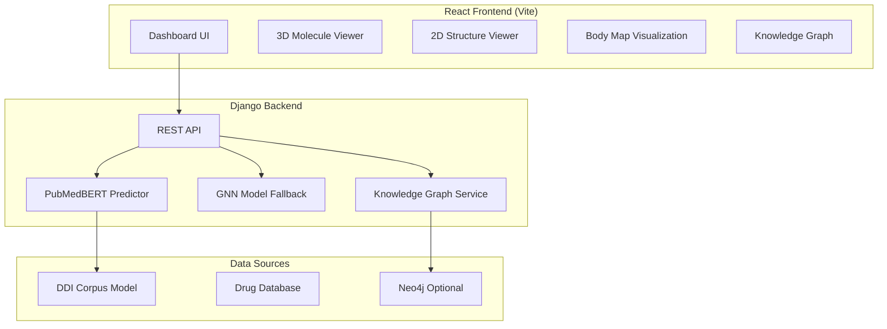

# DDI Project: Complete System Documentation

## Table of Contents
1. [System Overview](#system-overview)
2. [How It Works](#how-it-works)
3. [Current Features](#current-features)
4. [PubMedBERT Explained](#pubmedbert-explained)
5. [Use Cases](#use-cases)
6. [Current Limitations](#current-limitations)
7. [Design Vision: The "Cool Factor"](#design-vision)
8. [Implementation Roadmap](#implementation-roadmap)

---

## System Overview

The DDI Project is an **AI-powered Drug-Drug Interaction prediction platform** that helps healthcare professionals, researchers, and students understand potential risks when combining medications.

### Architecture



---

## How It Works

### Prediction Pipeline

When you select two drugs and click "Run Analysis":

1. **Drug Lookup** → Backend finds drug info from database
2. **Known Interaction Check** → Searches knowledge graph for documented interactions
3. **AI Prediction** → If no known interaction, uses PubMedBERT model
4. **Risk Calculation** → Computes risk score based on interaction type
5. **Visualization** → Displays molecular structures and risk indicators

### The Flow

```
User Selects Drugs → API Request → Knowledge Graph Check
                                         ↓
                          Found? → Return Known Interaction
                                         ↓
                          Not Found? → PubMedBERT Prediction
                                         ↓
                          Generate Context Sentence
                                         ↓
                          "When <e1>Aspirin</e1> and <e2>Warfarin</e2>..."
                                         ↓
                          Model Predicts → mechanism | effect | advise | int | none
                                         ↓
                          Map to Risk Score → 0-100%
```

---

## Current Features

| Feature | Description | Status |
|---------|-------------|--------|
| **Drug Search** | Search medications by name | ✓ Works |
| **DDI Prediction** | AI-powered interaction detection | ✓ Works |
| **3D Molecules** | WebGL molecular visualization | ✓ Works |
| **2D Structures** | Skeletal formula rendering | ✓ Works |
| **Risk Scoring** | Percentage-based risk assessment | ✓ Works |
| **Body Map** | Affected organ visualization | ✓ Works |
| **Knowledge Graph** | Interactive relationship view | ✓ Works |
| **Research Assistant** | AI chat (placeholder) | Partial |

---

## PubMedBERT Explained

> [!IMPORTANT]
> **Your Question:** "Does this now require context from a sentence if we're using PubMedBERT?"

### Short Answer
**Yes, but we generate it automatically.** Your PubMedBERT model was trained on the DDI Corpus, which contains ~5,028 drug-drug interaction sentences from medical literature. The model learned to classify interactions from text context.

### How Your Model Works

**Training Data (DDI Corpus):**
```
"The coadministration of <e1>aspirin</e1> and <e2>warfarin</e2> 
increases the risk of bleeding complications."
→ Label: mechanism
```

**What We Do Now:**
Since we don't have real medical sentences for every drug pair, we **generate template sentences**:

```python
CONTEXT_TEMPLATES = [
    "When {drug1} and {drug2} are taken together, drug interactions may occur.",
    "The combination of {drug1} with {drug2} may lead to pharmacological interactions.",
    # ... more templates
]
```

**The Challenge:**
- Template sentences are generic and lack clinical detail
- The model accuracy is lower on templates vs. real medical text
- This is why Aspirin + Warfarin shows 21% risk instead of higher

### 5 Interaction Types from DDI Corpus

| Label | Description | Example |
|-------|-------------|---------|
| `mechanism` | HOW drugs interact biochemically | "Warfarin inhibits CYP2C9..." |
| `effect` | WHAT happens clinically | "...increases bleeding risk" |
| `advise` | Clinical recommendations | "Monitor INR closely when..." |
| `int` | General interaction mention | "These drugs interact" |
| `no_interaction` | No DDI detected | Safe to combine |

---

## Use Cases

### 1. Clinical Decision Support
> Healthcare professionals checking patient medication lists for dangerous combinations.

### 2. Pharmacy Education
> Students learning about pharmacology and drug interactions through visualization.

### 3. Research Tool
> Researchers exploring potential DDI in drug development.

### 4. Patient Safety Demos
> Demonstrating the importance of medication review to patients.

---

## Current Limitations

| Issue | Impact | Solution |
|-------|--------|----------|
| **Small Drug Pool** | Only ~10 searchable drugs | Expand DrugBank/TWOSIDES data |
| **Template Sentences** | Lower accuracy | Use real medical text or knowledge bases |
| **No Patient Context** | Generic predictions | Add patient profile features |
| **Basic UI** | Functional but not impressive | Major design overhaul |

---

## Design Vision

> [!TIP]
> **Your Goal:** "I want design of how things look work etc, to be the main focus... I want it to be the cool factor"

### Design Philosophy: "Cyberpunk Medical AI"

Inspired by:
- **Cyberpunk 2077** - Neon glows, data overlays
- **Deus Ex** - Holographic interfaces, biometric displays
- **Prometheus** - Clean sci-fi medical aesthetics
- **Iron Man HUD** - Interactive floating data panels

### Current vs. Vision Comparison

#### Current State
- Dark theme with basic cards
- Static elements
- Simple risk indicators
- Generic dashboard layout

#### Design Vision

**1. Glassmorphic Panels with Depth**
```css
/* Enhanced glass effect */
.glass-panel {
  background: rgba(13, 13, 32, 0.85);
  backdrop-filter: blur(40px) saturate(150%);
  border: 1px solid rgba(255, 255, 255, 0.08);
  box-shadow: 
    0 8px 32px rgba(0, 0, 0, 0.4),
    inset 0 0 0 1px rgba(255, 255, 255, 0.05);
}
```

**2. Animated Data Visualizations**
- Heartbeat-style pulsing on risk indicators
- Particle trails between interacting molecules
- Glowing connection lines in knowledge graph
- Animated DNA helix background

**3. Holographic 3D Molecules**
- Floating above a glowing circular platform
- Rotating with subtle bobbing animation
- Electron cloud particle effects
- Atom labels that appear on hover

**4. Risk Meter Redesign**
- Radial gauge with animated fill
- Pulsing glow for high-risk
- Particle explosion for critical
- Floating percentage numbers

**5. Sci-Fi Scan Lines**
- Subtle horizontal scan line overlay
- Typewriter text reveal for results
- Data "downloading" animations
- Matrix-style data rain background

### Specific UI Component Upgrades

#### Drug Cards
Before: Basic list items
After:
- Hexagonal pill shape
- Holographic shimmer effect
- Molecular formula floating text
- Animated chemical bonds

#### Analysis Button
Before: Plain button
After:
- Glowing core with pulse effect
- Particle burst on hover
- "INITIALIZING SCAN..." text
- Progress ring animation

#### Results Panel
Before: Static card
After:
- Terminal-style reveal animation
- AI voice-style status updates
- Risk score with radar sweep reveal
- Glowing severity indicators

### Color Palette Evolution

| Element | Current | Proposed |
|---------|---------|----------|
| Background | `#030712` | Deep space gradient with nebula |
| Accent | Blue `#3b82f6` | Cyan plasma `#00ffff` → `#8b5cf6` |
| Risk Low | Green | Teal with electric glow |
| Risk High | Red | Pulsing crimson with warning particles |
| Text | White/Gray | Holographic with subtle iridescence |

### Animation Library

| Effect | Where | How |
|--------|-------|-----|
| Float | Molecules | `translateY` with sine wave |
| Pulse | Risk indicators | `scale` with glow `box-shadow` |
| Scan | Loading states | `translateX` linear sweep |
| Typewriter | Result text | `width` reveal with typing sound |
| Particle | Interactions | Canvas/WebGL particle systems |

---

## Implementation Roadmap

### Phase 1: Data Expansion (Priority: High)
- [ ] Add 500+ drugs from DrugBank
- [ ] Import known interactions from TWOSIDES dataset
- [ ] Store real DDI descriptions for context

### Phase 2: Visual Overhaul (Priority: High - "Cool Factor")
- [ ] Implement glassmorphism 2.0 with animated gradients
- [ ] Add particle effects to molecule viewers
- [ ] Create animated risk meter component
- [ ] Add scan-line overlay option
- [ ] Typewriter text animations for results

### Phase 3: Enhanced 3D Experience
- [ ] Holographic molecule platforms
- [ ] Interactive atom selection
- [ ] Dynamic bond animations
- [ ] Electron orbital visualization

### Phase 4: Smart Predictions
- [ ] Real medical text context (PubMed lookup)
- [ ] Multi-drug polypharmacy analysis
- [ ] Patient profile integration
- [ ] Severity timeline projections

### Phase 5: Polish & Extras
- [ ] Sound effects (subtle, optional)
- [ ] PDF report generation
- [ ] Mobile responsive design
- [ ] Dark/Light theme toggle

---

## Quick Reference: File Locations

| Component | Path |
|-----------|------|
| Dashboard | `src/pages/Dashboard.jsx` |
| 3D Viewer | `src/components/MoleculeViewer.jsx` |
| 2D Viewer | `src/components/MoleculeViewer2D.jsx` |
| Body Map | `src/components/BodyMapVisualization.jsx` |
| Knowledge Graph | `src/components/KnowledgeGraphView.jsx` |
| API Service | `src/services/api.js` |
| PubMedBERT | `web/ddi_api/services/pubmedbert_predictor.py` |
| Styles | `src/index.css` |

---

## Summary

Your DDI Project has a solid foundation with working AI predictions. The PubMedBERT integration is functioning, but uses template sentences instead of real medical context.

**The main opportunity:** Transform the functional tool into a **visually stunning, sci-fi medical AI experience** that wows users at first glance while maintaining clinical utility.

**Next Steps:**
1. Expand drug database
2. Implement glassmorphic redesign
3. Add particle/animation effects
4. Enhance 3D molecular visualization
