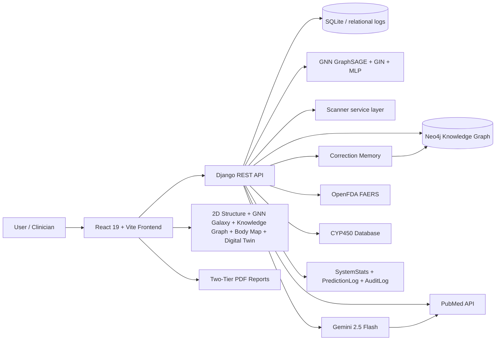
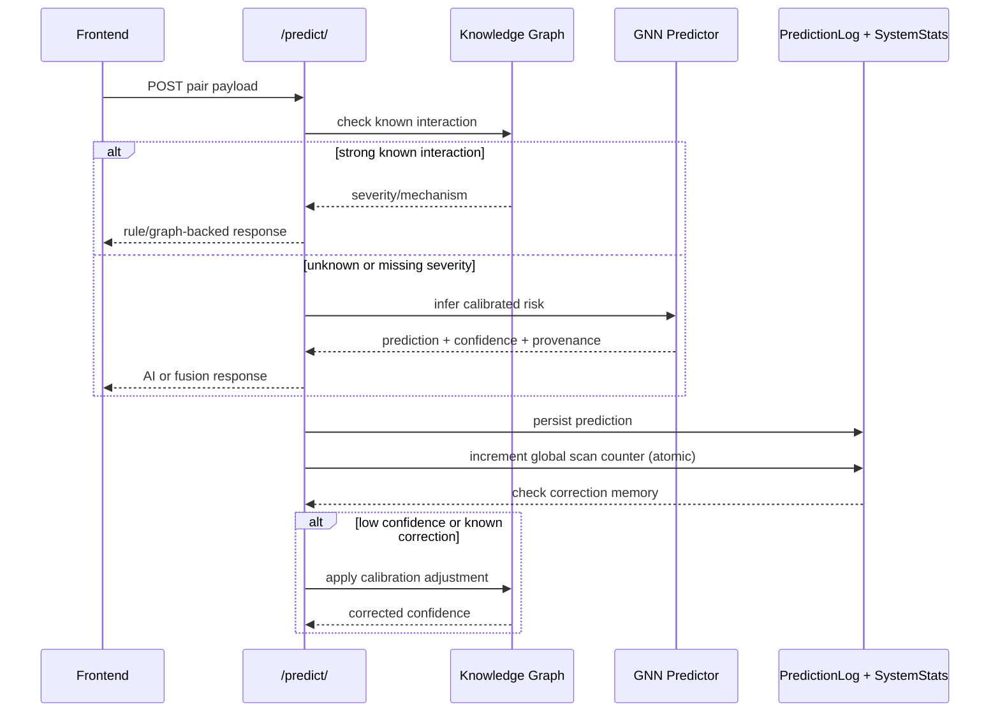
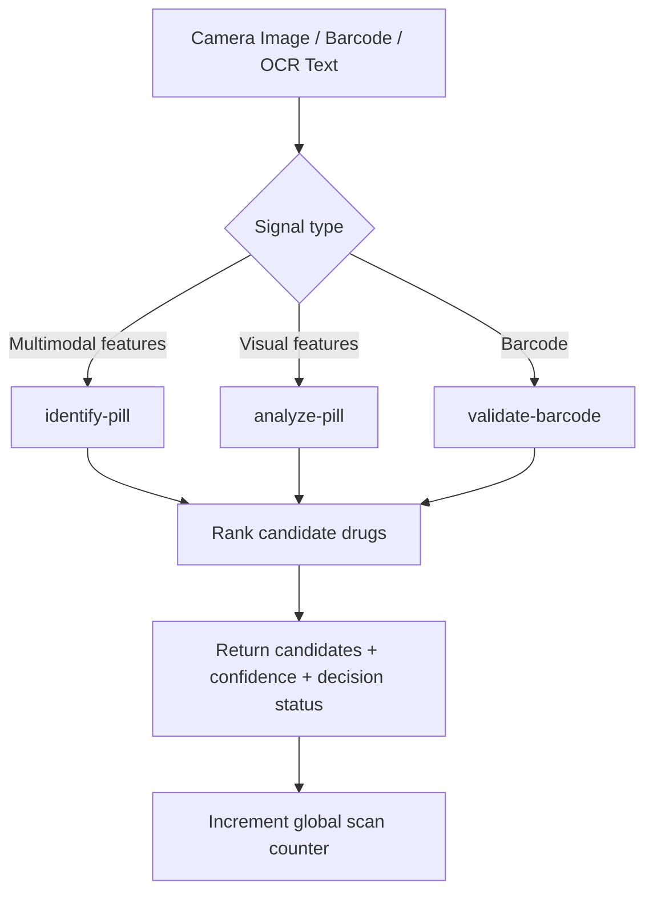
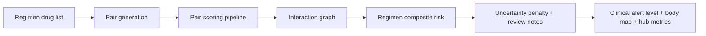

# Project Aegis

AI-powered clinical decision support platform for drug-drug interaction prediction, polypharmacy risk analysis, and explainable pharmaceutical intelligence.


---

## Table of Contents

1. [Overview](#1-overview)
2. [Why This Project Exists](#2-why-this-project-exists)
3. [AI/ML Model Architecture](#3-aiml-model-architecture)
4. [Interactive Visualization Features](#4-interactive-visualization-features)
5. [Core Capabilities](#5-core-capabilities)
6. [End-to-End System Architecture](#6-end-to-end-system-architecture)
7. [Prediction and Explainability Design](#7-prediction-and-explainability-design)
8. [Scanner and Multimodal Identification](#8-scanner-and-multimodal-identification)
9. [Polypharmacy and Digital Twin Design](#9-polypharmacy-and-digital-twin-design)
10. [Two-Tier PDF Report System](#10-two-tier-pdf-report-system)
11. [Research Assistant (Gemini LLM)](#11-research-assistant-gemini-llm)
12. [API Surface](#12-api-surface)
13. [Project Structure](#13-project-structure)
14. [Local Development Setup](#14-local-development-setup)
15. [Docker Setup](#15-docker-setup)
16. [Cloud Deployment](#16-cloud-deployment)
17. [Testing and Validation](#17-testing-and-validation)
18. [Security and Reliability](#18-security-and-reliability)
19. [Current Limitations](#19-current-limitations)
20. [Roadmap](#20-roadmap)

---

## 1) Overview

Project Aegis is a full-stack clinical intelligence platform designed for medication safety. It predicts drug-drug interactions, scores polypharmacy regimen risk, and provides explainable evidence workflows through multiple interactive visualization surfaces.

The platform combines four distinct AI/ML approaches:
- **GNN (Enhanced GIN v2)** — primary model: molecular-level DDI prediction (PR-AUC 0.9962, trained on 25K+ samples from 3 sources)
- **GNN (GraphSAGE)** — secondary model: graph-based drug interaction link prediction on the full knowledge graph
- **PubMedBERT** (NLP-based, now replaced by GNN as primary) for text-derived interaction classification
- **Gemini 2.5 Flash** LLM for research assistance, clinical narrative generation, and RAG-powered evidence synthesis

Five interactive visualization panels provide clinical insight:
- **2D Structure Viewer** renders skeletal molecular formulas from SMILES notation
- **GNN Galaxy** visualizes the entire drug interaction graph in 3D space with real GNN embeddings
- **Knowledge Graph Explorer** maps biological mechanism pathways between drugs
- **Body Map** projects organ-level physiological impact with severity heatmaps
- **Polypharmacy Digital Twin** decomposes multi-drug risk into weighted mechanistic factors

---

## 2) Why This Project Exists

Medication regimens often involve multiple drugs where risk emerges from interaction patterns, not only single pair labels. Traditional drug interaction systems typically fail in one or more of these areas:

- No explicit confidence calibration
- Weak evidence provenance and traceability
- Poor explainability for uncertainty
- Limited support for multimodal intake (camera/barcode/OCR)
- No polypharmacy-first scoring model
- No visual tools for understanding why a risk exists

Project Aegis addresses these gaps with a layered inference architecture: knowledge graph evidence when reliable, AI model fallback when evidence is incomplete, explicit uncertainty tracking, and five distinct visual surfaces that translate risk data into clinical intuition.

---

## 3) AI/ML Model Architecture

### 3.1 Enhanced GIN v2 (Primary Model)

The primary prediction model is an **Enhanced Graph Isomorphism Network (GIN)** that analyzes drug interactions at the molecular structure level. Each drug's SMILES string is converted into an atom-level graph, and the model learns structural patterns that predict interactions:

- **Architecture**: 4-layer Edge-Conditioned GIN with Jumping Knowledge aggregation, 256 hidden dimensions
- **Interaction Head**: Multi-signal fusion — element-wise product, absolute difference, and sum of drug embeddings → 2-layer MLP classifier
- **Training**: Focal Loss (alpha=0.25, gamma=2.0) with label smoothing (0.05) on NVIDIA GPU (Colab)
- **Data**: 25,137 training samples from 3 sources — Neo4j Knowledge Graph (1,214 pairs), DDI Corpus (1,527 pairs), and TWOSIDES (15,000 pairs) — with Tanimoto-similarity hard negative mining
- **Performance** (on 3,149 held-out test pairs):
  - PR-AUC: **0.9962** | ROC-AUC: **0.9951**
  - Precision: **98.1%** | Recall: **96.8%** | F1: **0.9744** | Accuracy: **97.4%**
  - Confusion Matrix: TN=1,528 | FP=30 | FN=51 | TP=1,540

### 3.2 Macroscopic GraphSAGE (Secondary Model)

A Macroscopic Graph Neural Network built on GraphSAGE convolutions serves as a secondary model. Unlike the molecular-level GIN, this model operates on the entire drug interaction network as a graph where nodes represent drugs and edges represent known interactions. Message passing across 3 GraphSAGE layers propagates relationship signals, enabling transitive interaction inference. Trained on 1,500+ drugs and 50,000+ interaction edges from Neo4j.

### 3.3 PubMedBERT (NLP Classifier — Replaced)

The original prediction approach used a fine-tuned PubMedBERT model trained on the DDI Corpus (~19,000 annotated drug interaction sentences). This NLP model classified drug pairs into interaction types: mechanism, effect, advise, int, or no_interaction. While still available as a fallback, PubMedBERT has been replaced by the GraphSAGE model as the primary predictor because the graph-based approach captures network-level drug relationships that text-only models miss.

### 3.4 MLP Fallback

A simple Multi-Layer Perceptron provides a final AI-based fallback when neither GNN model can produce predictions. It uses concatenated molecular feature vectors to produce basic risk estimates.

### 3.5 Heuristic Fallback

When no AI model is available for a drug pair (e.g., missing molecular data), a structural similarity heuristic using molecular fingerprint Tanimoto similarity provides baseline risk estimates with explicitly lower confidence.

### 3.6 Ensemble Predictor

An ensemble layer can combine predictions from all sources (GNN, PubMedBERT, CYP450 database, OpenFDA FAERS, Knowledge Graph) using weighted consensus, providing higher accuracy through model agreement and multiple explainability perspectives.

### 3.7 Molecular Featurization (RDKit)

Drug molecules are featurized from SMILES strings using RDKit:
- **Atom features (40-dim)**: symbol, degree, formal charge, hydrogen count, hybridization, aromaticity, ring membership
- **Bond features (8-dim)**: bond type, conjugation, ring membership, stereochemistry
- **Molecular descriptors**: Morgan fingerprints (2048-bit), molecular weight, LogP, TPSA, rotatable bonds

These features are consumed by both the GNN and MLP models and power the 2D Structure Viewer.

### 3.8 Gemini 2.5 Flash (LLM)

Google Gemini 2.5 Flash provides the large language model backbone for:
- The Research Assistant chatbot with RAG-powered evidence retrieval
- Executive summary generation in advanced PDF reports
- Clinical assessment narrative writing
- Slash command processing for structured clinical queries

### 3.9 Model Routing Chain

Prediction requests follow a deterministic routing chain:

```
Known interaction (explicit severity) → severity-mapped score
  ↓ (no)
Known interaction (unknown severity) → fuse KG evidence prior with AI estimate
  ↓ (no)
Enhanced GIN v2 (molecular-level) → calibrated score
  ↓ (unavailable)
Macroscopic GraphSAGE → calibrated score
  ↓ (unavailable)
MLP fallback → basic score
  ↓ (unavailable)
Heuristic (Tanimoto similarity) → conservative estimate
```

---

## 4) Interactive Visualization Features

### 4.1 2D Structure Viewer

The 2D Structure panel renders organic chemistry skeletal formulas for each drug in the analyzed regimen. Using the SmilesDrawer library, it converts SMILES notation into publication-quality structural diagrams with:

- Heteroatom coloring (oxygen in red, nitrogen in blue, sulfur in yellow, halogens in green/purple)
- Bond length and angle normalization following IUPAC drawing conventions
- Dark and light theme support
- Side-by-side comparison for drug pairs

This gives clinicians and researchers immediate visual recognition of the molecular structures being analyzed, making it possible to identify structural similarity, functional groups, and potential steric/electronic interaction sites at a glance.

### 4.2 GNN Galaxy

The GNN Galaxy is an immersive 3D visualization that renders the entire drug interaction knowledge graph as an interactive space environment. Built with React Three Fiber (Three.js), it displays real GNN-learned embeddings projected into 3D coordinates via t-SNE dimensionality reduction:

- **Nodes** are rendered as luminous spheres, sized by interaction count (hub drugs appear larger) and colored by drug class
- **Edges** connect drugs with known interactions, colored by risk severity (green/yellow/orange/red)
- **Post-processing effects** include Bloom glow, star field backgrounds, and vignette for a cinematic galaxy aesthetic
- **Instanced rendering** (InstancedMesh) enables smooth performance with thousands of nodes and edges
- **Interactive features**: orbit camera controls, node hover tooltips, click-to-select with detail panels, drug search bar, hop slider for neighborhood exploration, shortest path computation
- **Layout modes**: Radial (centered on selected drug), Cluster (grouped by drug class), Path (shortest path between two drugs)
- **Embedding Insights Panel**: displays distance metrics, k-nearest neighbors, and statistical analysis of the GNN latent space — showing why the model groups certain drugs together
- **Filter Panel**: filter by drug class, risk level, node degree, or custom criteria
- **Drug Comparison Panel**: side-by-side comparison of two selected drugs with shared neighbors, risk profiles, and embedding distance
- **Data source**: loads graph data dynamically from Neo4j AuraDB via API, with enrichment from drug info and interaction endpoints

The Galaxy viewer makes the "black box" GNN model interpretable — researchers can literally see how the model organizes drugs in embedding space and why it predicts certain interactions.

### 4.3 Knowledge Graph Explorer

The Knowledge Graph is a 2D biological mechanism explorer that maps the pharmacological relationships between drugs. Using a radial force-directed layout with typed nodes:

- **Drug nodes**: primary entities being analyzed
- **Enzyme nodes (CYP450)**: metabolic enzymes like CYP3A4, CYP2D6, CYP2C19
- **Target nodes**: biological targets and receptors
- **Side Effect nodes**: adverse outcomes and clinical effects

Edges carry typed relationships (substrate_of, inhibits, induces, causes, shares_target) with confidence and source metadata. The explorer provides:

- **Conflict detection**: automatically identifies CYP role collisions (e.g., Drug A is a CYP3A4 substrate while Drug B is a CYP3A4 inhibitor), shared target pressure, and overlapping side-effect burden
- **Conflict Panel**: narrative explanations of why specific conflicts are clinically significant
- **Mechanism Legend**: color-coded edge types with source badges
- **Node Detail Drawer**: connected evidence and properties for any selected node
- **Data retrieval chain**: Biology API → Mechanism API → Drug Info API → Offline CYP fallback, with explicit freshness badges showing which source provided the data
- **Pair Explorer**: navigate between all drug pairs in a multi-drug regimen

### 4.4 Body Map

The Body Map is a layered anatomical visualization that projects drug interaction effects onto organ systems. It renders a full human body silhouette with severity-colored organ highlights:

- **Layered rendering stack**: HeatMapCanvas (severity gradient background) → CirculatoryOverlay (animated circulatory system) → SegmentedBodyFigure (anatomical SVG with organ regions) → interactive overlays
- **Organ Detail Panel**: click any organ to see severity score, contributing side effects, drug contributions, CYP-mediated liver load, and uncertainty decomposition
- **Severity Legend**: continuous color scale from green (low) through yellow/orange to red (critical)
- **Data enrichment pipeline**: combines prediction affected systems, polypharmacy body map signals, generic-system fallback mapping, side effects, FAERS evidence, and CYP liver-load augmentation
- **CYP liver-load heuristic**: calculates additional hepatic burden based on substrate/inhibitor/inducer combinations across CYP enzymes
- **Confidence and uncertainty scores**: each organ shows confidence (based on evidence support, coverage, severity, source reliability) and certainty (based on data completeness), with uncertainty decomposed into data sparsity, source disagreement, recency risk, and cross-source variance

### 4.5 Polypharmacy Digital Twin (Poly Twin)

The Digital Twin is an N-order toxicity explainer for multi-drug regimens. It decomposes the overall polypharmacy risk score into five weighted mechanistic factors, each with explicit formulas and interactive detail expansion:

- **Pairwise Baseline (40%)**: weighted combination of maximum and average pairwise risk across all drug pairs. Formula: `min(1, 0.70 x max_pair_risk + 0.30 x average_pair_risk)`
- **Enzyme Competition (25%)**: CYP450 substrate/inhibitor/inducer conflict analysis. Detects metabolic bottlenecks where multiple drugs compete for the same enzyme
- **Target Overlap (15%)**: measures biological target sharing between drug pairs. Formula: `min(1, 0.70 x overlap_ratio + 0.30 x normalized_avg_shared_targets)`
- **Organ Burden (10%)**: aggregates physiological system stress from interaction edges
- **Network Stress (10%)**: graph-theoretic analysis of edge density, high-risk concentration, and hub pressure. Formula: `min(1, 0.40 x edge_density + 0.35 x high_risk_density + 0.25 x hub_pressure)`

Each factor card shows the raw score, weighted contribution, gradient progress bar, formula, and drill-down detail (e.g., specific CYP conflicts, shared target counts, hub drug identity). The composite toxicity score is `min(1.0, sum(weight_i x factor_i))`.

---

## 5) Core Capabilities

### 5.1 Pairwise Interaction Intelligence
- Endpoint: `POST /api/v1/predict/`
- Returns risk score, severity, confidence, mechanism hypothesis, provenance, calibration fields
- Supports known-interaction paths, AI fallback, and evidence fusion paths
- Drug class warnings: automatic detection of dangerous combinations (NSAID+Anticoagulant, SSRI+MAOI, etc.) and duplicate therapy

### 5.2 Polypharmacy Analysis
- Endpoint: `POST /api/v1/polypharmacy/`
- Evaluates all unordered pairs from N drugs, filters significant interactions (risk >= 0.25)
- Computes regimen composite risk with uncertainty penalty for unknown-severity pairs
- Identifies hub drug (most connected), generates clinical review guidance

### 5.3 Digital Twin Polypharmacy Profile
- Endpoint: `POST /api/v1/polypharmacy-digital-twin/`
- N-order risk decomposition with five weighted mechanistic factors
- Confidence tiers: evidence-backed, graph-supported, heuristic
- Clinical recommendations based on detected risk patterns

### 5.4 Explainability and Evidence
- Endpoints: `/api/v1/interaction-info/`, `/api/v1/real-world-evidence/`, `/api/v1/drug-info/`
- Evidence chain with source weights: Knowledge Graph (1.0), DDI Corpus (0.9), Categorical Rules (0.85), TWOSIDES (0.78), GNN Model (0.7), OpenFDA FAERS (0.62)
- Uncertainty decomposition into actionable signals: data sparsity, source disagreement, recency risk

### 5.5 Drug Scanner and Pill Identification
- Endpoints: `/api/v1/scanner/validate-barcode/`, `/api/v1/scanner/analyze-pill/`, `/api/v1/scanner/identify-pill/`
- Multimodal pipeline: barcode → OCR → CV feature extraction → backend ranking
- CV internals: grayscale conversion, Otsu thresholding, morphological operations, connected component extraction, shape/color/imprint feature derivation
- Conservative uncertainty gates prevent overconfident identification

### 5.6 Correction Memory and Calibration
- Auto-captures low-confidence predictions as Neo4j `:Correction` nodes
- Admin review interface at `/corrections` for approve/reject workflows
- Approved corrections feed back into prediction calibration via `ConfidenceCalibrator` singleton
- Creates continuous improvement loop: prediction → correction → calibration → better prediction

### 5.7 Audit Trail
- Every prediction, correction, and chat event logged to `AuditLog` model
- Password-protected audit viewer at `/api/v1/audit/`
- Full traceability for clinical governance and compliance

---

## 6) End-to-End System Architecture



### Service Topology
- **Frontend**: React 19 app served by NGINX container
- **Backend**: Django + Gunicorn on Cloud Run
- **Graph Database**: Neo4j Aura (cloud) / Neo4j container (local)
- **Cache/Runtime**: Redis service (available in compose)
- **Model Assets**: `DDI_Model_Final` directory mounted into backend container
- **LLM**: Google Gemini 2.5 Flash via API
- **External Data**: OpenFDA, PubMed, PubChem, RxNorm, DailyMed

---

## 7) Prediction and Explainability Design



### Key Design Decisions
- Calibrated vs raw score visibility in every response
- Explicit provenance metadata tracing which model/source produced the prediction
- Fusion mode when KG has a known relationship but uncertain severity
- Confidence clamped to `[0.55, 0.85]` when severity is unknown to prevent overconfidence
- Drug class warnings surfaced automatically alongside pairwise results

---

## 8) Scanner and Multimodal Identification



### Multimodal Scoring Weights
- Color match: exact +0.22, partial +0.12
- Shape match: exact +0.18, partial +0.10
- Imprint: exact +0.45, contains +0.35, subset +0.25, fuzzy +0.20
- Model label: strong +0.25, soft +0.14
- Conservative uncertainty gate: uncertain if top confidence < 0.46 or top-2 margin < 0.08

---

## 9) Polypharmacy and Digital Twin Design



### Composite Scoring
```
pairwise_baseline = min(1.0, 0.70 x max_pair_risk + 0.30 x average_pair_risk)
raw_composite = min(1.0, 0.75 x max_pair_risk + 0.25 x significant_pair_density)
uncertainty_penalty = max(0.60, 1.0 - 0.40 x unknown_severity_density)
regimen_score = min(1.0, raw_composite x uncertainty_penalty)
```

### Digital Twin Factor Weights
```
toxicity_score = min(1.0, 0.40 x pairwise_baseline
                         + 0.25 x enzyme_competition
                         + 0.15 x target_overlap
                         + 0.10 x organ_burden
                         + 0.10 x network_stress)
```

---

## 10) Two-Tier PDF Report System

The platform generates downloadable PDF clinical reports in two tiers:

### Standard Report
Data-only clinical report with risk assessment, mechanism description, interaction statistics, class warnings, provenance metadata, and conclusion. No diagrams or LLM content. Designed for quick reference.

### Advanced Report (Super Report)
Full analysis report with:
- **AI-generated Executive Summary and Clinical Assessment** (Gemini LLM)
- **Visual diagrams**: risk gauge (speedometer), interaction heatmap (NxN grid), organ burden bars, CYP450 enzyme heatmap (colored grid), risk factor contribution bars, evidence source strength bars
- **Per-drug Pharmacology Profiles** with category, description, SMILES, DrugBank ID, and CYP metabolism roles
- **CYP450 Enzyme Metabolism** section with colored interaction grid and conflict detection
- **Regimen Sensitivity Analysis** (mutation testing analog): systematically removes each drug and measures risk delta to identify highest-impact contributors
- **FAERS Real-World Evidence**: post-market adverse event data from OpenFDA
- **Food and Herbal Interaction Warnings**: food-drug and herbal-drug interaction tables
- **Evidence Chain with Source Analysis**: visual bar chart showing evidence source strengths and active status
- **GNN Model Analysis**: model version, raw vs calibrated scores, uncertainty cap
- **Table of Contents and Page Numbers**
- **Unique filenames** incorporating drug names and timestamp

A UI modal allows users to choose between Standard and Advanced tiers when clicking the PDF button.

---

## 11) Research Assistant (Gemini LLM)

### Endpoint: `POST /api/v1/chat/`

The Research Assistant is a RAG-powered chatbot for clinical drug interaction research:

- **LLM**: Gemini 2.5 Flash for low-latency, high-quality generation
- **RAG Pipeline**: queries the Neo4j Knowledge Graph for local drug/interaction context, retrieves supporting literature from PubMed, then generates a cited response via Gemini
- **Citation System**: every claim is traceable to a source (PubMed articles, DrugBank, KG evidence)
- **Correction Loop**: low-confidence or user-flagged responses create `:Correction` nodes for admin review

### Slash Commands
| Command | Description |
|---|---|
| `/test` | Quick interaction test for a drug pair |
| `/poly` | Polypharmacy analysis for a regimen |
| `/compare` | Side-by-side drug comparison |
| `/alt` | Suggest therapeutic alternatives |
| `/evidence` | Evidence summaries for an interaction |
| `/research` | Deep research with extended PubMed retrieval |
| `/mutate` | Explore structural analogs and interaction profiles |
| `/current` | Show current regimen context |
| `/demo` | Run a demo interaction query |
| `/class` | Drug class lookup and warnings |

---

## 12) API Surface

Base: `http://localhost:8000/api/v1` (local) or `https://<backend-url>/api/v1` (cloud)

### Core Prediction
- `POST /predict/` — Pairwise DDI prediction
- `POST /polypharmacy/` — Multi-drug regimen analysis
- `POST /polypharmacy-digital-twin/` — N-order toxicity decomposition

### Discovery and Knowledge
- `GET /search/?q=...` — Drug search
- `GET /drug-info/?name=...` — Drug details
- `GET /interaction-info/?drug1=...&drug2=...` — Interaction evidence
- `GET /real-world-evidence/?drug1=...&drug2=...` — FAERS data

### Graph APIs
- `GET /graph/nodes/`, `/graph/edges/`, `/graph/neighborhood/`
- `GET /graph/drug-biology/`, `/graph/mechanism-map/`

### Scanner
- `POST /scanner/validate-barcode/`, `/scanner/analyze-pill/`, `/scanner/identify-pill/`

### Intelligence
- `POST /chat/` — LLM research assistant
- `POST /report/export/` — PDF report generation (standard/advanced)
- `POST /calibration/metrics/` — Calibration QA
- `GET /alternatives/`, `POST /compare/`

### Corrections and Audit
- `GET/POST /corrections/`, `PATCH /corrections/<id>/`
- `GET /corrections/export/` — Export approved corrections as training data
- `GET /audit/` — Full audit trail

### Operations
- `GET /stats/` — Global telemetry
- `GET /health/` — Service health check

---

## 13) Project Structure

```text
molecular-ai/
  src/                              # React 19 frontend
    pages/                          # Dashboard, Research, Settings, Corrections, Landing
    components/
      GalaxyViewer/                 # GNN Galaxy 3D viewer (Three.js)
      BodyMap/                      # Anatomical body map visualization
      KnowledgeGraph/               # Biological mechanism graph explorer
      PolypharmacyDigitalTwin/      # N-order risk factor decomposition
      DrugScanner/                  # Camera/barcode pill identification
      MoleculeViewer2D.jsx          # 2D skeletal structure renderer
      GNNGalaxyViewer.jsx           # Original galaxy viewer (V1)
      RiskGauge.jsx                 # Circular risk score gauge
      TherapeuticAlternatives.jsx   # Alternative drug suggestions
      DrugComparison.jsx            # Side-by-side drug comparison
      StatsDashboard.jsx            # System telemetry dashboard
    services/api.js                 # API client layer
    model/                          # GNN model definitions and training scripts
      macroscopic_ddi_gnn.py        # GraphSAGE architecture
      gnn_featurizer.py             # RDKit molecular featurization
      gnn_model.py                  # GIN model architecture
      train_gnn.py                  # Training pipeline
      calibrate_gnn.py              # Score calibration
  web/                              # Django backend
    ddi_api/
      views.py                      # API endpoints
      services/
        gnn_predictor.py            # GNN model routing and inference
        ensemble_predictor.py       # Multi-model ensemble
        pubmedbert_predictor.py     # PubMedBERT NLP classifier
        polypharmacy_scorer.py      # Regimen composite scoring
        polypharmacy_digital_twin.py # N-order factor decomposition
        knowledge_graph.py          # Neo4j integration
        graphrag_chatbot.py         # RAG research assistant
        gemini_client.py            # Gemini LLM client
        pubmed_retriever.py         # PubMed literature retrieval
        report_generator.py         # Two-tier PDF report generation
        cyp450_database.py          # CYP enzyme profiles
        faers_service.py            # OpenFDA FAERS queries
        enhanced_data_ingestion.py  # Food/herbal interaction data
        correction_memory.py        # Neo4j correction nodes
        confidence_calibrator.py    # Feedback-driven calibration
        drug_class_service.py       # Class warning detection
        audit_service.py            # Audit trail logging
    ProjectAegis/                   # Django settings
  docs/                             # Documentation
  docker-compose.yml                # Multi-service stack
  Dockerfile                        # Frontend image
  web/Dockerfile                    # Backend image
```

---

## 14) Local Development Setup

### Prerequisites
- Node.js 20+, Python 3.11, pip, Docker Desktop (optional), Git

### Frontend
```powershell
cd molecular-ai
npm install
npm run dev          # http://localhost:5173
```

### Backend
```powershell
cd web
pip install -r requirements.txt
python manage.py migrate
python manage.py runserver 0.0.0.0:8000    # http://localhost:8000
```

### Environment Variables
Set in `web/.env`:

| Variable | Required | Purpose |
|---|---:|---|
| DJANGO_SECRET_KEY | Prod | Django cryptographic secret |
| NEO4J_URI / NEO4J_USER / NEO4J_PASSWORD | Recommended | Neo4j graph database |
| GEMINI_API_KEY | For LLM | Gemini-powered assistant and reports |
| GEMINI_MODEL | No | Defaults to `gemini-2.5-flash` |
| AEGIS_ASSISTANT_ENABLED | No | Enable/disable LLM assistant |
| NCBI_API_KEY | No | Higher PubMed rate limits |
| DDI_RETRIEVAL_MODE | No | `rag` / `hybrid` / `local` |

---

## 15) Docker Setup

```powershell
docker compose up -d --build        # Start full stack
docker compose down                  # Stop
docker compose up -d --build backend # Rebuild backend only
```

Services: Frontend (`:80`), Backend (`:8000`), Neo4j Browser (`:7475`), Redis (`:6379`)

---

## 16) Cloud Deployment

Deployed on Google Cloud Run with Artifact Registry:

```powershell
# Backend
gcloud builds submit --tag us-central1-docker.pkg.dev/project-aegis-485017/aegis-repo/aegis-backend:latest ./web
gcloud run deploy aegis-backend --image <image> --region us-central1 --allow-unauthenticated --port 8000

# Frontend
gcloud run deploy aegis-frontend --source . --region us-central1 --allow-unauthenticated --port 8080
```

---

## 17) Testing and Validation

```powershell
# Backend tests
cd web && python manage.py test -v 2

# Frontend build check
npm run build

# Health check
curl http://localhost:8000/api/v1/health/
```

---

## 18) Security and Reliability

- Production requires explicit `DJANGO_SECRET_KEY`
- CORS and host restrictions configurable per environment
- DRF throttle rates environment-configurable
- Global scan counter uses atomic DB increments for concurrency safety
- Prediction routing continues operating when individual model layers are unavailable
- Scanner returns uncertain state rather than forced overconfident identification

---

## 19) Current Limitations

- Accuracy and coverage limited by training data quality and source completeness
- Some inference pathways are conservative under uncertain severity evidence
- Real-world data provider latency/rate limits can affect enriched responses
- Clinical deployment requires external governance and formal validation workflows
- PubMedBERT model requires HuggingFace Transformers (large dependency)

---

## 20) Roadmap

### Recently Completed
- Two-tier PDF report system (Standard + Advanced with AI narratives and visual diagrams)
- Gemini 2.5 Flash integration for research assistant and report generation
- Correction Memory with Neo4j `:Correction` nodes and admin review
- ConfidenceCalibrator singleton for feedback-driven calibration
- Audit trail logging with password-protected viewer
- Drug class warning system (dangerous combos + duplicate therapy)
- Slash command framework (10+ structured clinical queries)
- PubMed RAG pipeline with citation-first responses
- GNN Galaxy V2 with dynamic Neo4j data loading, layout modes, embedding insights
- Body Map V2 with layered rendering, CYP liver-load heuristic, uncertainty decomposition
- Knowledge Graph explorer with conflict detection and mechanism narratives
- Polypharmacy Digital Twin with five-factor decomposition
- Regimen sensitivity analysis (mutation testing analog) in PDF reports

### Near-term
- Expand scanner confidence calibration and threshold tuning
- Improve uncertainty narratives for clinician-facing explainability
- User-facing correction submission from chat interface
- Multi-turn conversation memory for research sessions

### Mid-term
- Broaden graph ingestion and ontology normalization
- Stronger calibration datasets and drift monitoring
- Cross-surface assistant orchestration (shared context across all visualization panels)
- Batch correction import/export for institutional onboarding

### Long-term
- Institution-specific policy packs for prescribing workflows
- Federated evaluation across diverse medication cohorts
- Fine-tuned domain-specific LLM for pharmacology reasoning
- Multi-language support for international clinical settings
