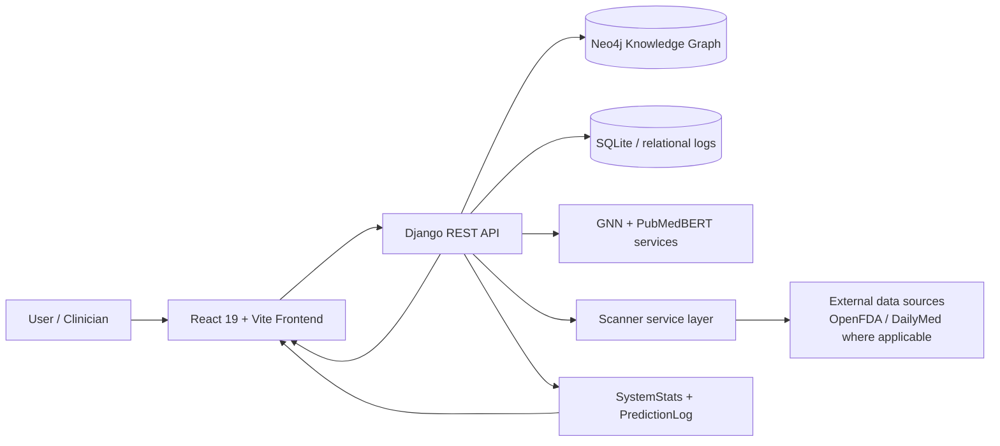
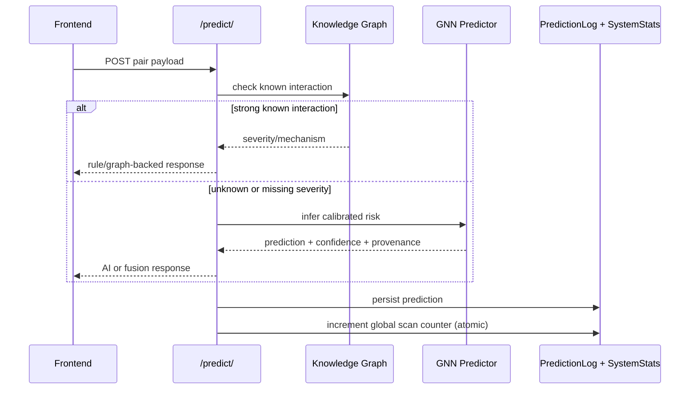
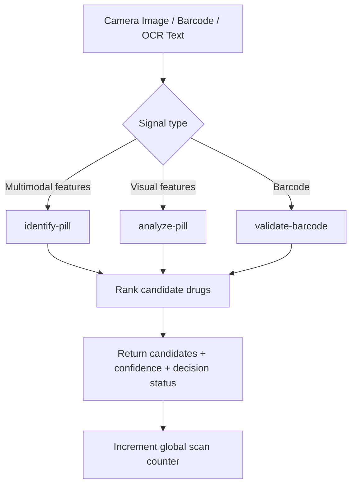
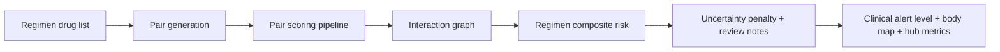
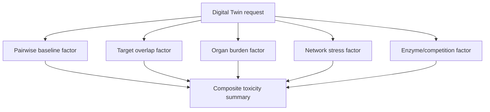
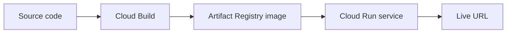

# Project Aegis

AI-powered clinical decision support for drug-drug interaction analysis, polypharmacy risk scoring, multimodal pill scanning, and explainable evidence workflows.


---

## Table of Contents

1. Overview
2. Why This Project Exists
3. Core Capabilities
4. End-to-End System Architecture
5. Prediction and Explainability Design
6. Scanner and Multimodal Identification Design
7. Polypharmacy and Digital Twin Design
8. Feature Deep Dive
9. Real-World Use Cases
10. API Surface
11. Project Structure
12. Local Development Setup
13. Docker Setup
14. Testing and Validation
15. Cloud Deployment (Backend + Frontend)
16. Operations and Monitoring Checklist
17. Troubleshooting
18. Security and Reliability Notes
19. Current Limitations
20. Roadmap
21. Contributing

---

## 1) Overview

Project Aegis is a full-stack clinical intelligence platform focused on medication safety.

It combines:
- Graph-based DDI reasoning
- AI inference for unseen pairs
- Polypharmacy aggregation and digital twin scoring
- Multimodal pill identification (barcode + OCR + CV + detector hints)
- Explainability artifacts designed for clinician review
- Production deployment on Google Cloud Run

The platform is designed for high-clarity interaction intelligence, not just binary alerts.

---

## 2) Why This Project Exists

Medication regimens often involve multiple drugs where risk emerges from interaction patterns, not only single pair labels.

Traditional systems often fail in at least one of these areas:
- No explicit confidence calibration
- Weak evidence provenance
- Poor explainability for uncertainty
- Limited support for multimodal intake (camera/barcode/OCR)
- No polypharmacy-first scoring model

Project Aegis addresses those gaps with a layered inference path:
- Knowledge graph evidence when reliable
- AI model fallback when evidence is incomplete
- Explicit uncertainty tracking
- Operational metrics and scan telemetry for production observability

---

## 3) Core Capabilities

### 3.1 Pairwise Interaction Intelligence
- Endpoint: `/api/v1/predict/`
- Returns risk score, severity, confidence, mechanism hypothesis, provenance, calibration fields.
- Supports known-interaction paths and AI fallback/fusion paths.

### 3.2 Polypharmacy Analysis
- Endpoint: `/api/v1/polypharmacy/`
- Computes pair graph, regimen-level composite burden, alert levels, review guidance, unknown-severity penalties.

### 3.3 Digital Twin Polypharmacy Profile
- Endpoint: `/api/v1/polypharmacy-digital-twin/`
- Provides N-order profile with component factors (pairwise baseline, network stress, burden dimensions) and interpretable summary.

### 3.4 Explainability and Evidence
- Endpoints: `/api/v1/interaction-info/`, `/api/v1/real-world-evidence/`, `/api/v1/drug-info/`
- Integrates structured evidence and source-oriented reasoning for explainability workflows.

### 3.5 Scanner and Pill Identification
- Endpoints:
  - `/api/v1/scanner/validate-barcode/`
  - `/api/v1/scanner/analyze-pill/`
  - `/api/v1/scanner/identify-pill/`
- Supports multimodal ranking using color/shape/imprint/model hints.

### 3.6 Global Scan Telemetry (Production)
- Endpoint: `/api/v1/stats/`
- `total_scans` is persisted on backend and atomically incremented across prediction and scanner pathways for Cloud Run correctness.

---

## 4) End-to-End System Architecture



### Service Topology
- Frontend: React app served by NGINX container
- Backend: Django + Gunicorn
- Graph: Neo4j service
- Cache/runtime helper: Redis service (available in compose)
- Model mount: `../DDI_Model_Final` mapped into backend container at `/app/DDI_Model_Final`

---

## 5) Prediction and Explainability Design



### Key Response Qualities
- Calibrated vs raw score visibility
- Explicit provenance metadata
- Fusion mode when KG has relation but uncertain severity
- Confidence and uncertainty-oriented signaling

---

## 6) Scanner and Multimodal Identification Design



### Multimodal Scoring Inputs
- Color matching
- Shape matching
- Imprint exact/partial/fuzzy similarity
- Model label hints and confidence
- Detector class hints and confidence

### Decision Guardrails
- Returns uncertain/confident state based on top confidence and margin
- Encourages manual verification when uncertainty is high

---

## 7) Polypharmacy and Digital Twin Design





---

## 8) Feature Deep Dive

### 8.1 Dashboard Intelligence Surfaces
- Pairwise analysis
- Polypharmacy analysis
- Digital Twin
- Explainability panels
- Research-oriented calibration tools
- Stats dashboard with live backend telemetry

### 8.2 Knowledge Graph Views
- Node and edge retrieval endpoints
- Neighborhood exploration
- Mechanism map and biology endpoints
- Supports visual graph workflows in the frontend

### 8.3 Calibration and QA
- Endpoint: `/api/v1/calibration/metrics/`
- Computes calibration-quality indicators for research workflows

### 8.4 Alternatives and Comparison
- Endpoints:
  - `/api/v1/alternatives/`
  - `/api/v1/compare/`
- Enables treatment path exploration and side-by-side risk context

### 8.5 Chat/Research Assistant
- Endpoint: `/api/v1/chat/`
- Research assistant pathway for interaction-context querying

### 8.6 Observability Foundations
- Prediction logs persisted with key score fields
- Global `total_scans` persisted in backend stats model
- Stats endpoint for UI and operations visibility

---

## 9) Real-World Use Cases

### Use Case A: Outpatient Medication Reconciliation
- Clinician enters 2 drugs
- System returns pairwise severity + mechanism hypothesis + uncertainty context
- Clinician reviews alternatives if needed

### Use Case B: Complex Regimen Validation (4-8 drugs)
- Pharmacist runs polypharmacy analysis
- Reviews hub drug, highest-risk edges, uncertainty-penalized burden
- Uses Digital Twin panel for decomposed risk factors

### Use Case C: Pill Identification During Intake
- Nurse scans barcode and/or captures pill image
- System ranks likely identities and surfaces uncertainty state
- Candidate selection feeds downstream DDI checks

### Use Case D: Research and QA Workflow
- Team runs calibration metric endpoint on labeled score batches
- Compares raw vs calibrated reliability quality
- Tracks operational scan volume through stats telemetry

---

## 10) API Surface

Base prefix:
- Local backend: `http://localhost:8000/api/v1`
- Cloud backend: `https://<your-backend-url>/api/v1`

### Core Prediction
- `POST /predict/`
- `POST /polypharmacy/`
- `POST /polypharmacy-digital-twin/`

### Discovery and Knowledge
- `GET /search/?q=...`
- `GET /drug-info/?name=...`
- `GET /interaction-info/?drug1=...&drug2=...`
- `GET /real-world-evidence/?drug1=...&drug2=...`

### Scanner
- `POST /scanner/validate-barcode/`
- `POST /scanner/analyze-pill/`
- `POST /scanner/identify-pill/`
- `GET /drugs/ndc/<ndc_code>/`
- `GET /drugs/pill-search/`
- `GET /drugs/enhanced-search/`

### Analytics and Support
- `GET /stats/`
- `POST /calibration/metrics/`
- `GET /alternatives/`
- `POST /compare/`
- `POST /chat/`
- `GET /health/`

### Graph APIs
- `GET /graph/nodes/`
- `GET /graph/neighborhood/`
- `GET /graph/edges/`
- `GET /graph/drug-biology/`
- `GET /graph/mechanism-map/`

---

## 11) Project Structure

```text
molecular-ai/
  src/                          # React frontend
  web/                          # Django backend
    ddi_api/                    # API views, models, services
    ProjectAegis/               # Django settings and app config
  docs/                         # Documentation and implementation reports
  tests/                        # Test harness and helpers
  public/                       # Static frontend assets
  docker-compose.yml            # Local multi-service stack
  Dockerfile                    # Frontend image
  web/Dockerfile                # Backend image
```

---

## 12) Local Development Setup

### 12.1 Prerequisites
- Node.js 20+
- Python 3.11
- pip
- Docker Desktop (optional but recommended)
- Git

### 12.2 Clone

```powershell
git clone <your-repo-url>
cd DDI_PROJECTV2-FRONTEND/molecular-ai
```

### 12.3 Frontend Setup

```powershell
npm install
npm run dev
```

Frontend dev server default:
- `http://localhost:5173`

### 12.4 Backend Setup (without Docker)

```powershell
cd web
..\..\.venv\Scripts\python.exe -m pip install -r requirements.txt
..\..\.venv\Scripts\python.exe manage.py migrate
..\..\.venv\Scripts\python.exe manage.py runserver 0.0.0.0:8000
```

Backend default:
- `http://localhost:8000`

### 12.5 Required/Important Environment Variables

Set in `web/.env` (local) or Cloud Run environment settings (production):

| Variable | Required | Purpose |
|---|---:|---|
| DJANGO_SECRET_KEY | Yes in prod | Django cryptographic secret |
| DEBUG | No | Development mode toggle |
| ALLOWED_HOSTS | No | Host allow-list |
| NEO4J_URI | Recommended | Graph DB URI |
| NEO4J_USER | Recommended | Graph DB user |
| NEO4J_PASSWORD | Recommended | Graph DB password |
| CORS_ALLOW_ALL_ORIGINS | No | Broad CORS toggle |
| EXTRA_CORS_ALLOWED_ORIGINS | No | Extra CORS origins |
| DRF_THROTTLE_ANON | No | Anonymous rate limit |
| DRF_THROTTLE_USER | No | Authenticated rate limit |
| DDI_RETRIEVAL_MODE | No | rag / hybrid / local |

### 12.6 Model Files

For backend model loading and inference paths, ensure model assets exist in:
- Outer workspace `DDI_Model_Final` directory

For Docker compose, this is mounted as:
- `/app/DDI_Model_Final`

---

## 13) Docker Setup

### 13.1 Start Full Stack

```powershell
docker compose up -d --build
```

### 13.2 Services
- Frontend: `http://localhost`
- Backend: `http://localhost:8000`
- Neo4j Browser: `http://localhost:7475`
- Neo4j Bolt: `localhost:7688`
- Redis: `localhost:6379`

### 13.3 Stop

```powershell
docker compose down
```

### 13.4 Rebuild Backend Only

```powershell
docker compose up -d --build backend
```

---

## 14) Testing and Validation

### 14.1 Backend Django Tests

```powershell
cd web
..\..\.venv\Scripts\python.exe manage.py test -v 2
```

### 14.2 Frontend Build Check

```powershell
npm run build
```

### 14.3 Health Check

```powershell
curl http://localhost:8000/api/v1/health/
```

### 14.4 Scan Counter Verification

```powershell
$base = "http://localhost:8000/api/v1"
$before = Invoke-RestMethod -Uri "$base/stats/" -Method Get
Invoke-RestMethod -Uri "$base/scanner/validate-barcode/" -Method Post -ContentType "application/json" -Body '{"barcode":"12345678901"}' | Out-Null
$after = Invoke-RestMethod -Uri "$base/stats/" -Method Get
"before=$($before.total_scans), after=$($after.total_scans)"
```

---

## 15) Cloud Deployment (Backend + Frontend)



### 15.1 Backend Deploy (Cloud Run)

```powershell
gcloud config set project project-aegis-485017

gcloud builds submit --tag us-central1-docker.pkg.dev/project-aegis-485017/aegis-repo/aegis-backend:latest ./web

gcloud run deploy aegis-backend `
  --image us-central1-docker.pkg.dev/project-aegis-485017/aegis-repo/aegis-backend:latest `
  --region us-central1 `
  --allow-unauthenticated `
  --project project-aegis-485017 `
  --port 8000
```

### 15.2 Frontend Deploy (Cloud Run source deploy)

```powershell
gcloud run deploy aegis-frontend `
  --source . `
  --region us-central1 `
  --allow-unauthenticated `
  --project project-aegis-485017 `
  --port 8080
```

### 15.3 Post-Deploy Smoke Tests

```powershell
$api = "https://<backend-url>/api/v1"
Invoke-RestMethod -Uri "$api/health/" -Method Get
Invoke-RestMethod -Uri "$api/stats/" -Method Get
```

---

## 16) Operations and Monitoring Checklist

- Confirm `/api/v1/health/` reports healthy/degraded states as expected
- Confirm `/api/v1/stats/` returns non-null telemetry fields
- Check backend revision and traffic split in Cloud Run
- Verify model mount/availability logs during cold starts
- Validate scanner endpoints and scan telemetry increments
- Monitor response latency for `/predict/` and `/polypharmacy/`

---

## 17) Troubleshooting

### Backend returns 404 for expected endpoint
- Ensure backend is rebuilt and running latest code/revision.
- For Docker local: `docker compose up -d --build backend`.

### Frontend cannot reach backend in local dev
- Run frontend from `molecular-ai` root so Vite config/proxy applies correctly.
- Verify backend URL and CORS settings.

### Model not loading
- Confirm `DDI_Model_Final` files are present and mounted correctly.
- Check backend logs for model-path resolution errors.

### Neo4j connectivity issues
- Validate `NEO4J_URI`, `NEO4J_USER`, `NEO4J_PASSWORD`.
- Verify host/port based on local vs container mode.

### Cloud Run startup timeout
- Backend container uses Gunicorn with increased timeout.
- Confirm service memory/CPU are sufficient for model initialization.

---

## 18) Security and Reliability Notes

- Production requires explicit `DJANGO_SECRET_KEY` when debug is off.
- Restrict CORS and hosts for production domains.
- DRF throttle rates are environment configurable.
- Prediction logging has safe-fallback behavior for schema drift edge cases.
- Global scan counter uses atomic DB increments to avoid race-condition losses under concurrent requests.

---

## 19) Current Limitations

- Accuracy and coverage are limited by available data quality and source completeness.
- Some inference pathways are conservative under uncertain severity evidence.
- Real-world data provider latency/rate limits can affect enriched responses.
- Clinical deployment still requires external governance and formal validation workflows.

---

## 20) Roadmap

### Near-term
- Expand scanner confidence calibration and threshold tuning
- Add richer endpoint-level telemetry and dashboards
- Improve uncertainty narratives for clinician-facing explainability

### Mid-term
- Broaden graph ingestion and ontology normalization
- Add stronger calibration datasets and periodic drift checks
- Extend digital twin factor explainability exports

### Long-term
- Institution-specific policy packs for prescribing workflows
- Federated evaluation across diverse medication cohorts
- Advanced intervention recommendation simulation

---

## 21) Contributing

1. Create a feature branch.
2. Keep changes scoped and test-backed.
3. Run backend tests and frontend build before PR.
4. Include endpoint/contract notes for any API changes.
5. Update this README when behavior or setup changes.

---

If you want, the next enhancement can be adding dedicated architecture PNG/SVG exports from these Mermaid diagrams into the docs folder for report-ready submission packs.
