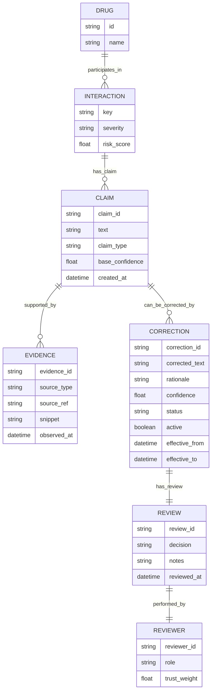
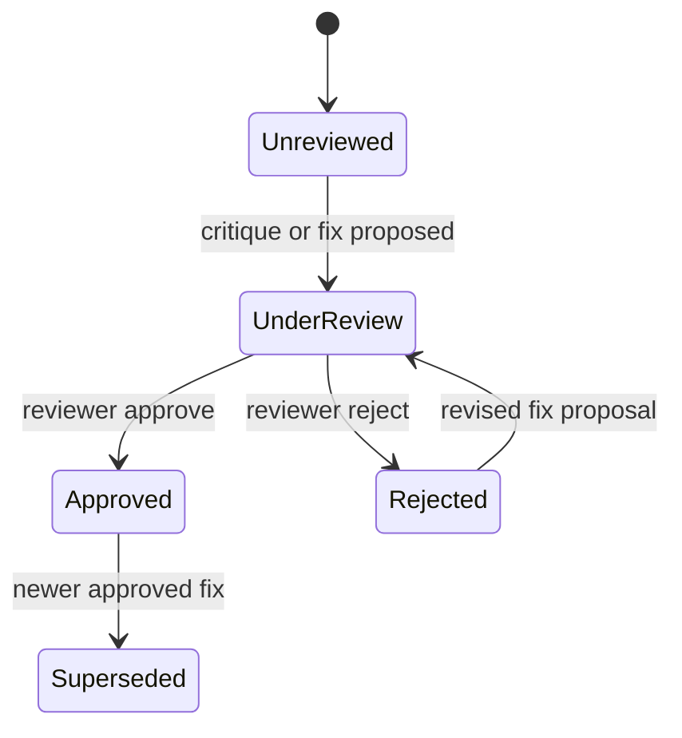
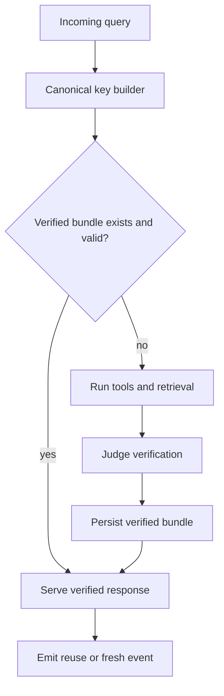

# LLM Research Assistant Architecture Plan

## Status
Draft architecture aligned to current Project Aegis codebase and API surface.

## Goals
1. Keep existing DDI and polypharmacy prediction stack as primary truth source.
2. Add a governed LLM assistant that is citation-first and correction-aware.
3. Persist corrections and reviewer decisions in Neo4j Aura with provenance.
4. Support command-style chat workflows such as `/test warfarin aspirin`.
5. Restrict access so the assistant is not public by default.

## Non-Goals (Phase 1)
1. Replacing current prediction endpoints.
2. Blind autonomous actions that alter patient-facing risk outputs.
3. Public anonymous access.

## Current Integration Points
The architecture intentionally extends existing points rather than replacing them:

- Backend chat endpoint: `/api/v1/chat/` in `web/ddi_api/views.py`.
- Chat request/response contracts in `web/ddi_api/serializers.py`.
- Existing chat service in `web/ddi_api/services/graphrag_chatbot.py`.
- Existing literature retrieval utility in `web/ddi_api/services/pubmed_retriever.py`.
- Existing evidence aggregation in `web/ddi_api/services/enhanced_drug_service.py`.
- Existing prediction tools:
  - `/api/v1/predict/`
  - `/api/v1/polypharmacy/`
  - `/api/v1/polypharmacy-digital-twin/`
  - `/api/v1/interaction-info/`
  - `/api/v1/alternatives/`
  - `/api/v1/compare/`
- Frontend chat UI and submit path in `src/pages/Dashboard.jsx`.
- Frontend API transport for chat and tool routes in `src/services/api.js`.

## Core Design Principles
1. Deterministic first, generative second.
2. Every clinically meaningful claim requires citation evidence object(s).
3. Correction memory is explicit, versioned, and review-gated.
4. Assistant output is a layer, never silent override of core model outputs.
5. Access control defaults to private-by-design.

## Target Architecture

```mermaid
flowchart TD
    A[Dashboard Chat Input] --> B[Command Router]
    B -->|tool command| C[Tool Executor]
    B -->|natural language| D[LLM Orchestrator]

    C --> E[/predict, /polypharmacy, /digital-twin, /compare, /alternatives, /interaction-info]
    E --> D

    D --> F[Retriever Layer]
    F --> G[Neo4j KG facts]
    F --> H[Enhanced evidence summary]
    F --> I[PubMed retrieval]
    F --> J[Correction memory graph]

    D --> K[Judge Layer]
    K --> L[Evidence and claim validator]
    K --> M[Correction precedence resolver]

    M --> N[Response Composer]
    N --> O[Structured answer plus citations plus confidence]
    O --> A
```

## Data Plane and Control Plane

### Data Plane
1. User prompt and context drugs.
2. Command parse or NL parse.
3. Tool retrieval and evidence retrieval.
4. Claim assembly.
5. Judge validation.
6. Response generation with citation payload.

### Control Plane
1. Feature flags.
2. Access policy.
3. Prompt policy versioning.
4. Safety and red-team policy hooks.
5. Telemetry and quality evaluation.

## Command UX Contract

### Syntax Pattern
- Slash commands for deterministic workflows.
- Natural language fallback for exploratory questions.

### Recommended Initial Commands
1. `/test <drugA> <drugB>`
   - Runs pairwise prediction and returns risk, mechanism, provenance, citations.
2. `/poly <drug1,drug2,...>`
   - Runs polypharmacy and summarizes highest-risk pairs and uncertainty notes.
3. `/twin <drug1,drug2,...>`
   - Runs digital twin endpoint and summarizes factor-level burden.
4. `/compare <drug1,drug2,...>`
   - Calls compare endpoint and provides side-by-side matrix summary.
5. `/alt <drug> --with <interactingDrug>`
   - Calls alternatives endpoint and ranks safer options.
6. `/evidence <drugA> <drugB>`
   - Calls interaction-info and returns evidence chain plus conflict summary.
7. `/explain <last>`
   - Re-explains previous result with tighter rationale and citation mapping.

### Command Result Contract (JSON shape)
```json
{
  "mode": "tool|research|hybrid",
  "answer": "string",
  "claims": [
    {
      "claim_id": "string",
      "text": "string",
      "confidence": 0.0,
      "evidence_ids": ["ev_1", "ev_2"],
      "correction_applied": true,
      "correction_id": "corr_123"
    }
  ],
  "citations": [
    {
      "evidence_id": "ev_1",
      "source_type": "knowledge_graph|pubmed|openfda|twosides|internal_rule",
      "title": "string",
      "url": "string",
      "pmid": "string",
      "snippet": "string",
      "freshness": {
        "queried_at": "ISO-8601",
        "update_frequency": "string"
      }
    }
  ],
  "guardrails": {
    "review_required": true,
    "reason_codes": ["UNSPECIFIED_SEVERITY", "SOURCE_DISAGREEMENT"]
  },
  "meta": {
    "session_id": "string",
    "latency_ms": 0,
    "policy_version": "v1"
  }
}
```

## Retrieval and Evidence Strategy

### Tiered Retrieval
1. Tier 1: Internal deterministic outputs
   - Predict, polypharmacy, digital twin, compare, alternatives.
2. Tier 2: Structured evidence chain
   - Enhanced interaction evidence summary and disagreement metadata.
3. Tier 3: Literature support
   - PubMed retrieval sentence candidates with PMIDs and title.
4. Tier 4: Correction memory
   - Human-reviewed corrections and caveats from Aura graph.

### Citation Policy
1. No final medical claim without at least one citation object.
2. If evidence conflict exists, response must include explicit uncertainty block.
3. If citations are insufficient, model must return constrained fallback:
   - "insufficient evidence; manual review required".

## Judge and Correction Layer

### Why
Current assistant behavior is heuristic/template-driven. It does not enforce claim-evidence linkage or correction precedence.

### Judge Responsibilities
1. Validate each claim has linked evidence.
2. Compute claim confidence from source quality, conflict, and recency.
3. Check correction memory overrides and caveats.
4. Enforce output schema and safety policy.

### Correction Precedence Policy
For each claim candidate:
1. Gather base claim from deterministic tools and retriever context.
2. Pull matching active corrections from Aura.
3. Rank corrections by reviewer trust, recency, and scope match.
4. If correction confidence exceeds threshold and status is approved, apply correction.
5. Always disclose correction application in output metadata.

### Suggested Confidence Blend
Define:
- `S` = source support score from evidence summary.
- `D` = disagreement penalty.
- `R` = recency factor.
- `C` = correction confidence (if applied).

Then:

`claim_confidence = clamp(0, 1, 0.5*S + 0.2*R - 0.2*D + 0.3*C)`

If no correction applies, set `C = 0`.

## Aura Correction Memory Model



### Recommended Node Labels and Relationships
- `:Claim`, `:Evidence`, `:Correction`, `:Review`, `:Reviewer`
- `(c:Claim)-[:SUPPORTED_BY]->(e:Evidence)`
- `(c:Claim)-[:CORRECTED_BY]->(k:Correction)`
- `(k:Correction)-[:REVIEWED_AS]->(r:Review)`
- `(r:Review)-[:BY]->(u:Reviewer)`
- `(k:Correction)-[:APPLIES_TO]->(i:Interaction)`

### Correction Status States
- `draft`
- `proposed`
- `approved`
- `rejected`
- `retired`

Only `approved` and `active=true` corrections participate in live precedence.

## Optional Overlay Toggle (Do Not Replace Base)

### UX Requirement
Allow users to switch between:
1. Base deterministic result only.
2. Base result plus LLM interpretation.
3. Base result plus LLM plus correction overlay details.

### Frontend Contract
- Add a mode selector in dashboard chat and result panel.
- Persist user preference per session.
- Default mode should remain deterministic-first.

## Access Restriction Model (Not Public)

### Recommended Option A (Primary)
1. Keep backend Cloud Run private (no unauthenticated invocations).
2. Protect frontend and backend with Identity-Aware Proxy access policy.
3. Grant access only to owner/admin Google accounts or specific group.
4. Disable direct backend public route when behind IAP.

### Recommended Option B (Secondary)
1. Add app-level passphrase or one-time access code for assistant features.
2. Keep APIs still IAM/IAP protected in production.
3. Treat passphrase as feature gate, not primary perimeter.

### Why
A passphrase alone is weak for internet-exposed services. IAM and IAP provide stronger identity-bound controls and auditable access.

## Feature Flags and Rollout Controls

### Backend Flags
- `AEGIS_ASSISTANT_ENABLED`
- `AEGIS_ASSISTANT_COMMANDS_ENABLED`
- `AEGIS_ASSISTANT_CORRECTIONS_ENABLED`
- `AEGIS_ASSISTANT_REQUIRE_REVIEW_BADGE`
- `AEGIS_ASSISTANT_MODEL` (example: `gemini-2.5-flash`)

### Frontend Flags
- `VITE_ASSISTANT_ENABLED`
- `VITE_ASSISTANT_COMMANDS_ENABLED`
- `VITE_ASSISTANT_OVERLAY_DEFAULT`

## Phased Delivery Plan

### Phase 0: Governance and Contracts (1-2 days)
1. Define response schema with claims and citations.
2. Add feature flags and assistant mode switches.
3. Add structured logging for assistant requests.
4. Add policy version and output schema validation.

Deliverables:
- New schema module for assistant response.
- Config wiring in settings and frontend env.

### Phase 1: Tool-Using LLM Orchestrator (3-5 days)
1. Replace direct template chat path with orchestrator service.
2. Add command router and tool adapters to existing endpoints.
3. Enforce citation requirement for output claims.
4. Keep deterministic fallback when LLM path fails.

Deliverables:
- New service module (assistant orchestrator).
- Updated chat endpoint handler with mode routing.
- Updated frontend chat rendering for citations.

### Phase 2: Correction Memory and Judge (4-7 days)
1. Add Aura correction graph schema and CRUD endpoints.
2. Add reviewer workflow endpoints (propose, approve, reject, retire).
3. Implement judge pass for claim-evidence-correction validation.
4. Apply correction precedence with transparent disclosure.

Deliverables:
- Correction API views and serializers.
- Judge module and confidence computation.
- Correction-aware response metadata in chat.

### Phase 3: Restricted Access Hardening (1-2 days)
1. Enforce Cloud Run private invocation.
2. Configure IAP and principal allowlist.
3. Add optional app-level assistant unlock gate.
4. Add audit logs for assistant access events.

Deliverables:
- Infra runbook and policy docs.
- Access middleware for assistant routes.

### Phase 4: Evaluation and Tuning (ongoing)
1. Build benchmark set of high-value clinical prompts.
2. Evaluate correctness, citation grounding, and correction hit-rate.
3. Optimize model choice (latency/cost/quality) and prompt policy.
4. Decide if fine-tuning is needed after retrieval plus correction baseline.

Deliverables:
- Evaluation dataset and scorecard.
- Regression tests for assistant outputs.

## Tuning Strategy Recommendation

Do not start with model fine-tuning first.

Order:
1. Retrieval and tool-use orchestration.
2. Judge and correction memory.
3. Prompt and policy iteration.
4. Only then consider supervised tuning for repetitive failure modes.

Reason:
Most early quality gaps in clinical assistant systems are retrieval quality and governance gaps, not base model capacity.

## Quality Gates

### Must-Pass Before Wider Use
1. Citation coverage >= 95% of medical claims.
2. Unsupported-claim rate <= 2% on evaluation set.
3. Correction application precision >= 98% for approved corrections.
4. P95 latency target under agreed threshold.
5. No public anonymous access in production.

### Safety Response Rules
1. If high uncertainty or source conflict, force manual review badge.
2. If evidence missing, return constrained non-committal answer.
3. Never hide correction application from user.

## Suggested Backend Module Additions
- `web/ddi_api/services/assistant_orchestrator.py`
- `web/ddi_api/services/assistant_command_router.py`
- `web/ddi_api/services/assistant_judge.py`
- `web/ddi_api/services/assistant_citation_builder.py`
- `web/ddi_api/services/correction_memory.py`
- `web/ddi_api/views_assistant_admin.py`
- `web/ddi_api/serializers_assistant.py`

## Suggested Frontend Module Additions
- `src/services/assistantCommands.js`
- `src/components/AssistantCitationPanel.jsx`
- `src/components/AssistantCorrectionBadge.jsx`
- `src/components/AssistantModeToggle.jsx`
- `src/components/AssistantCommandHint.jsx`

## Proposed API Additions
1. `POST /api/v1/assistant/chat/`
   - New orchestrated route (can proxy legacy `/chat/` initially).
2. `POST /api/v1/assistant/corrections/propose/`
3. `POST /api/v1/assistant/corrections/review/`
4. `GET /api/v1/assistant/corrections/history/?claim_id=...`
5. `GET /api/v1/assistant/config/`

## Backward Compatibility Plan
1. Keep existing `/api/v1/chat/` contract for initial adoption.
2. Add optional new fields rather than breaking old response shape.
3. Enable enhanced schema with frontend feature flag.

## Implementation Order Against Current Files
1. Extend `web/ddi_api/views.py` ChatView into mode-based dispatcher.
2. Keep `web/ddi_api/services/graphrag_chatbot.py` as fallback engine.
3. Reuse `web/ddi_api/services/pubmed_retriever.py` for literature evidence.
4. Reuse `web/ddi_api/services/enhanced_drug_service.py` evidence summary in judge.
5. Extend `src/pages/Dashboard.jsx` chat path to command mode and citation rendering.
6. Extend `src/services/api.js` with new assistant/correction endpoints.

## Risks and Mitigations

### Risk 1: Hallucinated medical claims
Mitigation:
- Judge requires evidence links per claim.
- Block unsupported claim output.

### Risk 2: Correction drift or stale overrides
Mitigation:
- Correction lifecycle states and expiry windows.
- Reviewer trust weights and audit trail.

### Risk 3: Overly expensive model usage
Mitigation:
- Command-first tool execution for deterministic tasks.
- Use flash-tier model for routine responses.
- Cache retrieval outputs where safe.

### Risk 4: Security exposure
Mitigation:
- Private Cloud Run plus IAP allowlist.
- Audit logs and optional in-app assistant unlock gate.

## Open Decisions
1. Single-tenant owner-only access or small internal group access?
2. Required reviewer roles for correction approval?
3. Desired latency budget for chat responses?
4. Default assistant mode in dashboard (base-only vs base-plus-llm)?
5. Regional deployment constraints for model and data residency?

## Minimal Next Sprint Scope (Recommended)
1. Phase 0 plus Phase 1 thin slice.
2. One command: `/test <drugA> <drugB>`.
3. Citation panel and mode toggle in dashboard.
4. Deterministic fallback preserved.

This gives immediate value without risking core prediction correctness.

## Extension Pack: Cross-Section Orchestration, Review Actions, Reuse Memory, Redo, and Live Activity

This section expands the base architecture to support full-project impact, section-native critique workflows, query reuse, and user-visible execution state.

### A. Project-Wide Impact and Reuse Map

The assistant should not be a standalone chat silo. It should act as a control plane that powers all major analysis sections.

Primary impact targets:
1. Dashboard chat and result panes.
2. What-If Scenario Builder and Mutation Engine.
3. Knowledge Graph and GNN Galaxy surfaces.
4. BodyMap confidence and uncertainty overlays.
5. Evidence and calibration pathways.

Expected effects by area:
1. Pairwise and polypharmacy cards:
  - Add claim-level citations and correction badges.
  - Add judge confidence and review-required reason codes.
2. Knowledge Graph:
  - Add relationship review status and provenance quality state.
  - Add action rail for critique, approve, fix request, and evidence attach.
3. BodyMap:
  - Add organ-signal review status and uncertainty issue queue.
  - Add source confidence recalc after reviewer actions.
4. Research tools:
  - Reuse the same verified memory records to avoid duplicate tool runs.

### B. Expanded Command System for Section Actions

Yes, commands like `/GNNGalaxy`, `/KnowledgeGraph`, and `/BodyMap` are a good fit if routed as tool-first workflows and not free-form generation.

Recommended canonical command names (lowercase), with case-insensitive aliases:
1. `/gnngalaxy <drugA,drugB,...>`
  - Builds an interaction topology summary and focus-path narrative for Galaxy mode.
2. `/knowledgegraph <drugA> [drugB]`
  - Pulls KG relations, conflict flags, source quality, and recency metadata.
3. `/bodymap <drugA,drugB,...>`
  - Produces organ burden summary with uncertainty decomposition and evidence map.
4. `/review <entity_key>`
  - Opens active review state and pending critiques for that entity.
5. `/approve <entity_key> --reason "..." --ref <citation>`
  - Marks a correction/assertion as approved with mandatory rationale and reference.
6. `/fix <entity_key> --proposal "..." --ref <citation>`
  - Proposes corrected value/state for KG edge or BodyMap signal.
7. `/critique <entity_key> --issue "..." --severity <low|medium|high> --ref <citation>`
  - Submits critique with explicit issue type and support evidence.
8. `/redo <scope>`
  - Re-executes pipeline for `last`, `tools`, or `full` scope (see Redo section).

### C. Section-Native Critique, Fix, Approval Workflow

This is the most important addition for uncertain domains (KG and BodyMap).

#### C.1 Status model

Every reviewable object (KG edge, KG node attribute, BodyMap organ signal, uplift recommendation) receives a review lifecycle state:
1. `unreviewed`
2. `under_review`
3. `approved`
4. `rejected`
5. `superseded`

Required metadata per status mutation:
1. actor identity
2. timestamp
3. reason
4. at least one reference or explicit no-reference justification
5. previous value and proposed value

#### C.2 Suggested review entities

1. Knowledge Graph entity keys
  - `kg:edge:<drugA>|<drugB>|<relation>`
  - `kg:node:<drug>|<field>`
2. BodyMap entity keys
  - `bodymap:signal:<regimen_hash>|<organ_system>`
  - `bodymap:uncertainty:<regimen_hash>|<reason_code>`

#### C.3 Workflow state machine



### D. Judge-Verified Memory and Query Reuse (Do Not Waste Queries)

Your requirement is correct: once judge verification passes, the platform should cache and reuse results for equivalent future interactions.

#### D.1 Two-layer memory strategy

1. Execution cache (short-to-medium TTL)
  - Caches raw tool outputs and retrieval payloads.
  - Useful for latency and cost reduction.
2. Verified response memory (long-lived)
  - Stores judge-approved claim bundles and citations.
  - Reused by default for same semantic interaction key.

#### D.2 Canonical interaction key

For pairwise interactions:
- `pair_key = sort(normalize(drugA), normalize(drugB)).join('|')`

For polypharmacy:
- `regimen_key = sort(unique(normalize(drugs))).join('|')`

For section-specific items:
- append mode key such as `|kg`, `|bodymap`, `|galaxy`.

#### D.3 Verified memory reuse algorithm

1. Compute canonical key.
2. Check verified memory for active, non-expired, policy-compatible record.
3. If found and no invalidation trigger exists, serve cached verified bundle.
4. If missing or stale, run full tool plus judge path.
5. Persist new verified bundle with lineage pointers.

#### D.4 Invalidation triggers

1. New approved correction for same entity key.
2. Source freshness expiry (for example FAERS recency policy window).
3. Model/prompt policy major version bump.
4. User-forced redo with full recomputation.

#### D.5 Suggested storage model in Aura

Nodes:
1. `:VerifiedInteractionMemory`
2. `:VerifiedResponseBundle`
3. `:JudgeVerification`
4. `:ReuseEvent`

Relations:
1. `(m)-[:HAS_BUNDLE]->(b)`
2. `(b)-[:VERIFIED_BY]->(j)`
3. `(b)-[:REUSED_IN]->(r)`
4. `(b)-[:INVALIDATED_BY]->(c:Correction)`

#### D.6 Reuse architecture diagram



### E. Redo Button: Full Semantics and UX Contract

You should add one Redo control with explicit mode choices, not a single ambiguous action.

Redo scopes:
1. `redo_last`
  - Re-renders and re-composes answer from existing latest tool outputs.
2. `redo_tools`
  - Re-runs deterministic tools and retrieval, then judge and compose.
3. `redo_full`
  - Invalidates cached execution and verified bundle, then recomputes all steps.

UI behavior:
1. Primary button label: `Redo`.
2. Dropdown with three scopes.
3. Confirmation required for `redo_full` because it discards caches and costs more.

Backend contract:
1. `POST /api/v1/assistant/redo/`
2. payload:
  - `session_id`
  - `query_id`
  - `scope` in `redo_last|redo_tools|redo_full`

### F. Live "AI Is Working" Header Section

A dedicated live activity panel in header is strongly recommended.

#### F.1 Purpose
1. reduce perceived latency
2. increase trust and transparency
3. expose current stage and blockers

#### F.2 Activity stages to display
1. parsing command
2. running tool calls
3. retrieving evidence
4. judging claims
5. applying corrections
6. composing response
7. done

#### F.3 Data transport options
1. SSE stream from backend (recommended first)
2. WebSocket (optional future for multi-agent richer state)

#### F.4 Event schema
```json
{
  "session_id": "string",
  "query_id": "string",
  "stage": "running_tool_calls",
  "progress": 42,
  "message": "Running polypharmacy analysis on 10 pairs",
  "started_at": "ISO-8601",
  "updated_at": "ISO-8601",
  "details": {
   "tool": "polypharmacy",
   "cache_hit": false
  }
}
```

#### F.5 Header UX behaviors
1. always-visible compact state chip in top header
2. expandable drawer for full trace
3. explicit `waiting on external source` markers
4. completion summary with latency and cache-hit metrics

### G. Cross-Surface Reuse: How Results Feed Other Sections

Once verified, results should not stay in chat only.

1. Knowledge Graph
  - use verified bundle claims to tag edges with confidence and review state.
2. BodyMap
  - use verified organ risk and uncertainty reasons to update signal trust badges.
3. GNN Galaxy
  - use verified interaction paths to precompute highlighted focus routes.
4. What-If and Mutation Engine
  - reuse verified pair assessments to accelerate repeated regimen variants.
5. Evidence panels
  - reuse citation bundles and disagreement narratives directly.

### H. Research and Evaluation Upgrades for This Extension

You asked for improvements strong enough for external AI review. Add these measurable evaluation tracks:

1. Reuse quality metrics
  - reuse hit-rate
  - stale-hit avoidance rate
  - invalidation precision
2. Review workflow metrics
  - critique-to-resolution median time
  - approval precision
  - superseded rate and drift reasons
3. Section confidence drift metrics
  - KG confidence drift pre/post correction
  - BodyMap certainty drift pre/post correction
4. Redo reliability metrics
  - deterministic consistency across redo scopes
  - latency distribution by redo scope
5. User-trust metrics
  - percent responses with visible stage trace
  - percent medical claims with citations

### I. New API Endpoints for This Extension

Additive endpoints beyond earlier proposal:

1. `POST /api/v1/assistant/command/`
  - command parsing and execution entrypoint
2. `POST /api/v1/assistant/review/critique/`
3. `POST /api/v1/assistant/review/fix/`
4. `POST /api/v1/assistant/review/approve/`
5. `GET /api/v1/assistant/review/status/?entity_key=...`
6. `POST /api/v1/assistant/redo/`
7. `GET /api/v1/assistant/activity/stream/`
8. `GET /api/v1/assistant/memory/lookup/?key=...`
9. `POST /api/v1/assistant/memory/invalidate/`

### J. Suggested Additional Modules

Backend:
1. `web/ddi_api/services/assistant_verified_memory.py`
2. `web/ddi_api/services/assistant_activity_bus.py`
3. `web/ddi_api/services/assistant_review_workflow.py`
4. `web/ddi_api/views_assistant_activity.py`
5. `web/ddi_api/views_assistant_review.py`

Frontend:
1. `src/components/AssistantActivityHeader.jsx`
2. `src/components/AssistantRedoControl.jsx`
3. `src/components/AssistantReviewActions.jsx`
4. `src/components/AssistantCommandConsole.jsx`
5. `src/services/assistantActivityStream.js`

### K. Extended Rollout Plan

Phase 1b (commands plus section actions):
1. Add `/gnngalaxy`, `/knowledgegraph`, `/bodymap` command handlers.
2. Add critique/fix/approve actions in KG and BodyMap panels.

Phase 2b (verified memory and reuse):
1. Add canonical key builder and verified response persistence.
2. Add reuse lookup and invalidation rules.

Phase 3b (redo plus activity stream):
1. Add redo endpoint and three redo scopes.
2. Add SSE activity bus and header activity panel.

### L. Minimal Build Sequence Requested by You

If you want this in highest value order with low risk:
1. Ship command router with `/gnngalaxy`, `/knowledgegraph`, `/bodymap`.
2. Ship section-native critique/fix/approve actions for KG and BodyMap.
3. Ship verified memory reuse for pair and regimen keys.
4. Ship redo scopes and activity header streaming.

This sequence maximizes reliability, reuse, and user trust while keeping deterministic behavior as the safety baseline.

